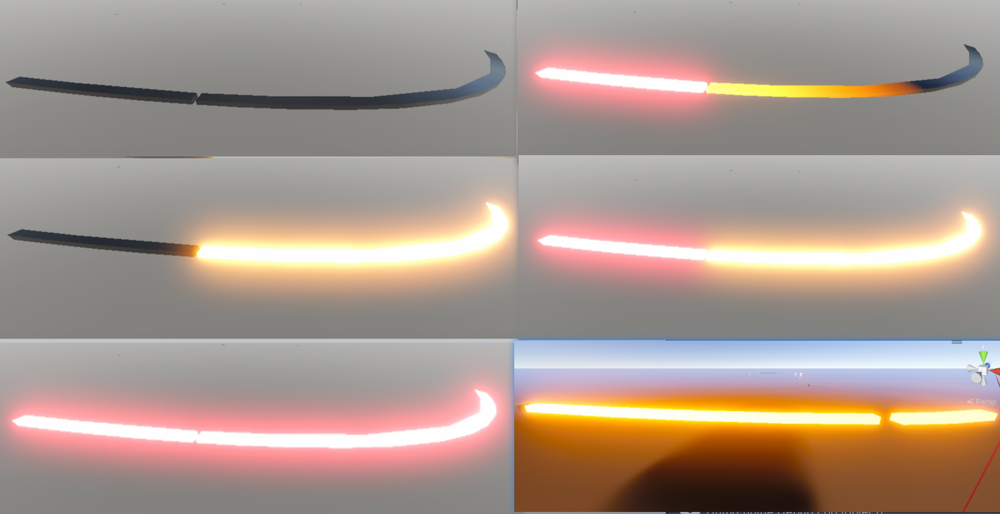

> 上一篇写了感知物尺寸适配，这篇继续翻找细节。做车模的车身状态同步，会做到灯具这块儿，那也真是个麻烦的东西。贯穿式灯带可以是位置灯，也可以是带有扫光效果的转向灯，甚至是刹车灯也可能复用一部分。同一条灯带，至少两种身份，在实现上会有哪些巧思呢？



# 1、复用灯具

先把工程里实际存在的复用场景列一下。车型不同，灯具的设计不同，那么组合复用情况就可能不同。

- 日间行车灯，又叫前位置灯，和前转向灯共用同一组灯珠。前位置灯打开是白色常亮，打转向时切成黄色流水灯。
- 后位置灯和刹车灯复用。刹车踩下去，尾灯从普通的暗红切到更亮的红。
- 后位置灯和后转向灯复用。转向打起来，这条灯从整条红色变成其中一段进行黄色流水灯效果，如文初示意图所示。

三种情况之前都存在过，灯具是复用的，那就意味着同一个 mesh（可能是多个 mesh），上面需要响应多个信号，不同的信号需要这个 mesh 所对应的材质展现出不同的渲染状态。那么首先需要展开讲的就是，逻辑层面怎么去定义和控制。

# 2、CarLightData 与信号优先级

核心思路是给每条灯带（即每一个灯具物体）挂一组数据条目，每个条目描述一种身份，信号变化时，按优先级仲裁出当前需要显示的那个赢家。

## 2.1 数据结构

每条灯带包含一组 CarLightData，大多是一个实例，复用灯具则配置多个实例。

```csharp
public class CarLightData
{
    public LightZone lightZone;        // 灯区，比如后位置灯/刹车灯/转向灯
    [ColorUsage(true, true)]
    public Color lightColor;           // HDR自发光颜色，亮度可以超过1
    public int priority;               // 优先级
    public int lightValue;             // 车控信号值
    public bool IsShow => lightValue == 1;
}

```

`lightZone` 是项目中对不同的灯区的枚举定义。

`lightColor` 用 HDR 颜色是配合 Bloom 后处理出光晕效果。

后续将利用 `priority`，以及必要情况下的特殊逻辑，去控制 `lightValue`

## 2.2 信号优先级

初始化时会对这些 lightData 做一次排序。

```csharp
// Init时一次性排序，priority高的排前面
Array.Sort(lightDatas, (p1, p2) =>
{
    if (p1.priority > p2.priority) return -1;
    if (p1.priority < p2.priority) return 1;
    return 0;
});

```

排序完成后，每次信号变化的处理就只需要"从头找第一个亮灯"：

```csharp
protected virtual void OnLightValueChanged(CarLightData data, int lightValue)
{
    data.lightValue = lightValue;
    var firstLight = FirstLight ?? data;   // FirstLight = lightDatas.FirstOrDefault(x => x.IsShow)
    curMat.SetColor(EmissionColorId, firstLight.lightColor);   // 赢家颜色直接覆盖
    if (firstLight == data)
        firstLight.CarLightStyle.OnLightSwitch(curMat, IsEmission);
    else
        data.CarLightStyle.ResetProperty(curMat);
}

```

三个信号同时亮的时候，数组按优先级降序排列，刹车灯排最前面，转向灯和位置灯都瞬时覆盖，并去执行它们俩的zone锁对应的Style的Reset操作。

> Reset操作是必要的。假设转向灯的流水动画扫到一半，刹车灯信号来了，需要杀掉转向灯的动画。不杀掉的话，可能会在材质上留下参数污染。
>
> 还有一个注意事项。有些车型的灯条材质在熄灭状态并不是纯黑，可能底色是带一点反光板的暗红。初始化的时候需要记录下来，在ResetProperty中去复原。

## 2.3 关于样式 CarLightStyle

CarLightStyle，就是每种灯，都对应的一个样式，这里所谓的样式，就是去重写属于这款灯的亮/灭的动画逻辑，以及复位所需要做的清理工作。

```csharp
// 按灯区分配样式
protected virtual ICarLightStyle GetCarLightStyle(LightZone zone)
{
    if (zone == LightZone.BackLeftTurnSignal)  return BackTurnSignalStyle;   // 车身段转向
    if (zone == LightZone.DoorLeftTurnSignal)  return DoorTurnSignalStyle;   // 车门段转向
    if (zone == LightZone.BackStopSignal)      return BackRearPositionStyle; // 刹车（常亮）
    // ...
}

```

# 3、转向灯的流水效果

## 3.1 Shader

整个流水效果，Shader 里的核心就这一行

```hlsl
// _IsFlowSwitch=0 常亮；=1 时按流水进度乘上扫描窗强度
float flow = max((uv.x - 1.0) + min(_FlowAmount, 2.0), 0.0);
float4 final = _EmissionColor * tex2D(_EmissionMap, uv)
             * ((1.0 - _IsFlowSwitch) + (_IsFlowSwitch * flow));

```

这里设计了一个亮度上的渐变，以 flow 这个值的计算来体现。当 `_FlowAmount` 变化，flow在0到2之间变化，最终影响整个颜色的明度渐变。

整个 Shader 里没有 Time，没有任何靠时间自己跑的动画。它靠的是FlowAmount 的变化。而这个数在逻辑代码中驱动。

## 3.2 用Tween动画控制

车控信号以固定频率在亮灭之间翻转，每次"亮"触发一次流水扫描，"灭"的时候熄灭。

```csharp
public void OnLightSwitch(Material material, bool b)
{
    if (_tweenFlowAni != null) { _tweenFlowAni.Kill(); _tweenFlowAni = null; }
    if (material != null && b)
    {
        material.SetFloat(FlowSwitchId, 1f);             // 打开流水通道
        float number = 0;
        _tweenFlowAni = DOTween.To(() => number, x => number = x, 2.0f, 0.5f);
        _tweenFlowAni.OnUpdate(() => material.SetFloat(FlowAmountId, number));
        _tweenFlowAni.onComplete = () => { _tweenFlowAni.Kill(); _tweenFlowAni = null; };
    }
    else
        material.SetFloat(FlowSwitchId, 0f);             // 关闭流水
    _defaultStyle.OnLightSwitch(material, b);            // 关键字开关（自发光）
}

```

Tween的机制，控制 FlowAmountId，从 0 扫到 2，时长 0.5 秒。每次转向灯亮起，就启动一次扫描，扫完自动 Kill。0.5 秒以内转向灯信号可能又翻转了，所以进入前必须先 Kill 上一次的动画。

# 4、注意事项

## 4.1 双闪的同步

双闪时左右转向灯同时亮，还要求两侧流水严格同拍。

然而，左右转向灯是两个独立的灯条组件，各自有自己的 Tween 动画实例，信号本身接收和处理也会有时差。如果只靠这种分离的信号控制，有可能出现可察觉的动画差异。

所以，要么接受它，要么就考虑只使用一个转向灯持续状态信号。这个信号只表达在闪和不在闪，但是如果使用它，就不能要求和实车的频率相似了。

## 4.2 一条灯带拆成两段

如文首图中最后一张分块图所示，贯穿式尾灯跨了尾门和车身两块钣金，会不会需要担心扫光的动画无法整体表现？

不用担心，这两个灯条是独立的两个物体，但是UV不可以，也不会是独立的。UV从0到1，本质就是从左边灯条的头，到右边灯条的尾。这样，只需要用上述的shader的方式，就可以实现一条扫完，再扫第二条。

# 结语

解决复用灯具的问题，面对的是同一实体、多态表现的本质问题。我们把状态抽象成数据类、把差异抽象成样式类、用优先级排序去解决冲突，最终形成这么一套可扩展的灯光驱动方案。