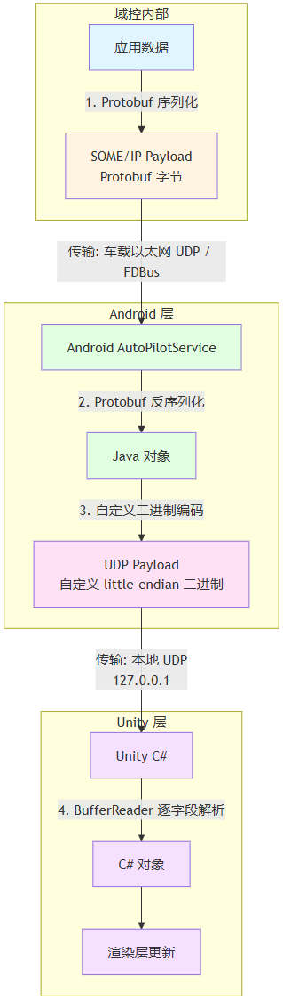

> 在做智驾 SR（Surround Reality）应用开发过程中，起初总是会听到智驾的工程师或是安卓工程师谈到SOME/IP，比如：“**这部分信号走的是SOME/IP协议**”，“那个感知类型在SOME/IP 3.1中没有，要到SOME/IP 3.2里才有”，“这个车型智驾那边要上SOME/IP 3.3，你拉齐一下协议差异，评估下影响”。可是......SOME/IP是什么鬼？我 3D 和 Android 的人不是已经订好了 Protobuf 的协议了吗？和我有什么关系？

SOME/IP（Scalable service-Oriented MiddlewarE over IP）是 AUTOSAR 组织定义的车载以太网中间件协议。在智驾 SR 场景中，它承载了从自动驾驶域控制器到座舱显示单元的全部实时数据。

所以它是一个协议，所谓协议，就是定义了数据的组织方式，可以类比为定义了一种电报报文的内容格式。那我会想先了解这里面是什么格式呢？

---

# 报文结构

## （1）16 字节 Header

标准 SOME/IP 报文头部固定 16 字节，固定使用大端序（Big-Endian）：


| 偏移  | 长度  | 字段                     | 说明                                                                    |
| --- | --- | ---------------------- | --------------------------------------------------------------------- |
| 0   | 4 B | Service ID + Method ID | 合称 Message ID，标识"哪个服务的哪个方法/事件"                                        |
| 4   | 4 B | Length                 | 从此字段之后到报文末尾的字节总数                                                      |
| 8   | 4 B | Client ID + Session ID | 请求标识，服务端回复的时候，带上同样的ID。用来做消息配对的。                                       |
| 12  | 1 B | Protocol Version       | 协议版本，固定 0x01                                                          |
| 13  | 1 B | Interface Version      | 服务接口主版本号                                                              |
| 14  | 1 B | Message Type           | 0x00=Request, 0x01=RequestNoReturn, 0x02=Notification, 0x80=Response… |
| 15  | 1 B | Return Code            | 0x00=E_OK, 其他为各类错误码                                                   |


## （2）Payload

Payload 是紧跟在 Header 的字节之后的，我们可以翻译为 “**数据体**”。这里面装的就是业务数据，也就是高精地图、感知物体、规划轨迹这些数据。

Payload 被定义了一套序列化规范，即应用层的数据如何转换成二进制的字节流是可被定义的。而表达这种接口定义的文件是用一种 ARXML/FIBEX 的“语法”来描述的。

> ARXML（AUTOSAR XML）和 FIBEX（Field Bus Exchange Format）文件写什么？
>
> ·服务定义： Service ID、Method ID、Event ID 的分配
>
> ·数据类型定义： struct、union、array、string 的字段布局
>
> ·序列化配置： 字节序、对齐策略、长度字段位置
>
> ·版本信息： Interface Version 用于向后兼容

我们可以使用相关工具链（比如 Vector CANoe）  + 上述定义的文件 去自动生成序列化/反序列化的C/C++代码。开发者就省去了自己处理二进制的工作。

> 我理解的依附AUTOSAR生态谋生的一种方式，就是上述这种定义协议之后，通过工具链来盈利。

它支持的基础数据类型包括：


| 类型              | 字节长度 | 说明                        |
| --------------- | ---- | ------------------------- |
| boolean         | 1 字节 | 0x00 = false, 0x01 = true |
| uint8 / sint8   | 1 字节 | 无符号/有符号 8 位整数             |
| uint16 / sint16 | 2 字节 | 无符号/有符号 16 位整数            |
| uint32 / sint32 | 4 字节 | 无符号/有符号 32 位整数            |
| uint64 / sint64 | 8 字节 | 无符号/有符号 64 位整数            |
| float32         | 4 字节 | IEEE 754 单精度浮点            |
| float64         | 8 字节 | IEEE 754 双精度浮点            |


默认情况下，Payload 也采用大端序，但接口定义中可以指定为小端序。

### 对齐绘制

我认为这套协议最有特点的就是**自然对齐**策略，为了提高内存访问效率（内存是一个地址块一个地址块访问的，如果字节不对齐，访问完了你还得拼），这里定义的每个字段都必须从你这个字段类型的字节长度的整数倍地址开始。如果它这个字段的前一个字段的结束位置不是整数倍，那么就需要插入填充字节。

比如有一个结构体长这样，我通过注释来解释对齐如下：

```
struct Example {
    uint8_t  a;  // 偏移 0，长度 1，满足偏移是1的倍数即可
    uint32_t b;  // 需从偏移 4 开始（因为uint32_t是4字节类型，4字节对齐），所以偏移 1-3 填充 3 字节
    uint16_t c;  // 偏移 8，长度 2，8是2的倍数，不需要填充
    uint8_t  d;  // 偏移 10，长度 1，10是1的倍数，不需要填充
    // 总长度 11 字节
};

/* 它的二进制布局
偏移 0: a (1B)
偏移 1: padding (3B)
偏移 4: b (4B)
偏移 8: c (2B)
偏移 10: d (1B)
*/
```

### Protobuf？

Payload必须是 ARXML 定义的序列化格式吗？不是的，它是“任意二进制数据”，是个黑盒子。那我们是不是可以用 Protobuf 来做序列化呢？可以！

SOME/IP 协议传输的时候，只看Header，Header 里说明了 Payload 的长度，它把这么长的字节原样传过去，并不管里面是 Protobuf 还是 ARXML 定义的格式。

可为什么我们要换成 Protobuf呢？

- 如前所述，AUTOSAR 工具链是要付费的，Protobuf 却是开源免费的
- 就算不关心钱的事，工具链本身是有学习成本的，而 proto 不同业务领域普及度更高。
- 对 Android/Unity 开发可能更友好，因为它也是可以通过工具（protoc）直接编译生成代码的（C++，Java，C#等）。

---

# 核心机制

只是报文结构的话，看上去也太单薄了，所以这里面应该还有什么？

它还定义了服务发现（Service Discovery）、远程过程调用（RPC）、事件通知（Event Notification）这种服务导向型的通讯协议。这种通讯协议可以使得车内多ECU之间通过 IP 网络以 "请求-响应"或"发布-订阅"模式交换结构化数据。

> 在传统的 CAN 总线时代，ECU 的地址是固定的，谁在哪个 ID 所有人都知道。但是，IP 网络里，ECU 的 IP 地址是可能动态变化的，服务也可能上线或下线。所以服务发现这个机制，就是让 ECU 启动时主动广播自己作为服务提供者的 ID 和 端口信息 + 主动定期广播心跳 + 广播下线通知，来让客户端不用硬编码服务方的信息和逻辑。另外两个特性不赘述，可以看出，就是服务的理念。

它的核心贡献是在 IP 传输层之上，提供了一套**面向服务的通信契约**。客户端不需要知道服务端的具体地址，只需要知道 Service ID；服务端上线后主动广播 Offer，客户端订阅 EventGroup 后自动接收数据推送。

而要落实以上这些机制和理念，其实仍然是使用AUTOSAR的工具链去自动生成的代码，这些代码里面，就自动生成了包含 SD 协议的注册/查询/心跳的代码，包含 RPC 请求/响应序列化和事件通知的代码。

## **必须用工具链吗？**

就像你可能并没有使用 ARXML 而使用了 proto 一样。你在这里，也可能因为工作环境没有配置 AUTOSAR 工具链，不具备自动化代码生成能力的话，怎么做呢？

我觉得首先要看看咱们的情况是否就一定需要面向服务的技术方案？

如果从智驾域的角度，我认为还有可能会去使用其他的开源实现进行修改，比如 vsomeip（大众开源的 SOME/IP 协议栈，C++）。

如果站在座舱的角度，情况可能会更复杂。因为**大概率座舱的 SOME/IP 不是在安卓，而是在 QNX Hypervisor** ，QNX再另起一套通讯中间件（比如 FDBus），让安卓来接 FDBus 的消息。也就是说，对于安卓应用开发来说，数据已经被另一个系统的系统服务给接了，那么怎么被转发就由那个系统的系统服务来主导了。

可**为什么要设计成 QNX 去接 SOME/IP** ，Android 被 QNX 转发呢？我理解下来，本质原因是普遍认为 QNX 的安全和稳定性更适合作为一个安全网关，去负责接 SOME/IP，同时也实现智驾域的一些权限控制和数据过滤。而安卓的定位更偏向于是去做应用展示的，系统本身比较来说更开放，稳定性弱一点。而且安卓的开发大多对 FDBus 的了解更多一些。所以就会选择这个架构上更稳，开发成本更高的技术方案。

---

# 数据流

既然上文已经讲到了通讯的数据链路，那这里就把这块信息做个整理。智驾 SR 应用的数据流，按我接触过的列举为：

**链路 1：**ADCU 发 SOME/IP → 安卓收并转 Protobuf → Unity 收自定义二进制帧并渲染。

**链路 2：**ADCU 发 SOME/IP → QNX 中转（FDBus） → 安卓收

> **ADCU** 是智驾，是 SOME/IP 的 Provider（服务端），持续向车内以太网推送感知融合目标、高精地图、规划轨迹、功能状态等 ADAS 数据。

如果从 3D HMI 的角度来看，那么对这个链路会比较无感。因为安卓和3D之间，还是会通过Socket UDP  或者 JNI+共享内存的方式，将上述 Payload 信息完成传输。**对链路无感，不代表可以对协议也无感**。一堆二进制数输入进来，咱还是得去聊这堆数据是什么个协议。

安卓接收、解析示例代码

```java
// 通路 A：UDP 直收 —— 收包与 Protobuf 反序列化
void receiveMessage() {
    while (isRunning) {
        socket.receive(packet);
        byte[] raw = packet.getData();
        // 精简 SOME/IP 头：前 4B = msgID（小端），后 4B = payload 长度
        int msgId = (raw[3] & 0xFF) << 24 | (raw[2] & 0xFF) << 16
                  | (raw[1] & 0xFF) << 8  | (raw[0] & 0xFF);
        int len   = (raw[7] & 0xFF) << 24 | (raw[6] & 0xFF) << 16
                  | (raw[5] & 0xFF) << 8  | (raw[4] & 0xFF);
        byte[] payload = Arrays.copyOfRange(raw, 8, len + 8);

        switch (msgId) {
            case 0x8015: // HighDefinitionMap
                AdasData.HdMap hdMap = AdasData.HdMap.parseFrom(payload);
                byte[] binary = encodeHdMapToBinary(hdMap);
                udpSender.send(binary, TYPE_HDMAP);
                break;
            // ... 其他消息类型 ...
        }
    }
}
// 通路 B：FDBus 回调 —— Protobuf 反序列化
@Override
public void onReceive(Object bus, int notifyId, int len, byte[] payload) {
    switch (notifyId) {
        case 2401: // HDMap
            AdasMsg msg = AdasMsg.parseFrom(payload);
            byte[] binary = encodeHdMapToBinary(msg.getHdMap());
            udpSender.send(binary, TYPE_HDMAP);
            break;
        // ...
    }
}
```

根据实际的交付经验举例，将数据流中的**序列化格式转换串联**起来，可能会是这个样子：



---

# 结语

回到引言里那句常听见的话："那个感知类型在SOME/IP 3.1中没有，要到SOME/IP 3.2里才有"。这里说的版本，其实不是通信协议本身的规范，而是指 Payload 二进制数据部分的序列化/反序列化协议。那么如果版本迭代，就意味着 Payload 协议里可能加入更多的数据结构种类，需要应用层有能解析的能力。