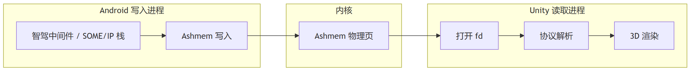

> As intelligent driving capabilities keep iterating, more features come along, bringing bigger data volumes and more frequent updates. I remember that at the very beginning, plain Socket UDP was enough to satisfy SR's visual expression and interaction needs for ACC/LCC. But as APA/AVP/OCC arrived one after another, using Sockets to forward these data hits a performance bottleneck.

What do the bottlenecks look like when you use JNI or Socket to handle lane lines, obstacles, and trajectory lines—**high-frequency, structured** binary data streams that need real-time rendering?

- High CPU usage: the Socket receive thread packs in packets constantly, and the main thread's logic processing takes long.
- Rising GC frequency: byte arrays created over and over, discarded right after use.
- Frame stutter/drops: consumption rate < production rate—processing can't keep up.

How data is moved determines how fast the data consumer can run, and these communication methods (Socket/JNI) involve multiple copies of the data in transit, leaving them unable to cope with this "keep pouring in, consume frame by frame" streaming scenario.

> Take Socket:
>
> 1. The Android process calls the send function; data is copied from the application-layer buffer into the kernel's socket send buffer (1st copy)
> 2. The kernel protocol stack packetizes it and transfers it from the send buffer to the receive buffer
> 3. The Unity process calls the receive function; data is copied from the kernel socket receive buffer into an application-layer managed array (2nd copy)
> 4. On the C# side, to hand it to `SomeipHandler`, it may need another `Marshal.Copy` or `Buffer.BlockCopy` (3rd copy)

Therefore, we need to switch to a cross-process transport with fewer copies—and the shared-memory approach comes into view.

---

# Shared Memory

On Android, each app process has its own independent virtual address space. Processes **cannot directly access each other's heap memory**, so that if one goes out of bounds, it won't blow a hole through the neighboring process. Passing data between processes must go through IPC: Binder, Socket, shared memory, etc.

### Ashmem Shared Memory (Android)

**Ashmem** (Android Shared Memory) is Android's own shared-memory implementation. Its idea is to cut the flow above down to a single copy—or even zero copies.

> Allocate a block of physical pages in the kernel, then have multiple processes each call `mmap` to map it into their own virtual address space. When the Android process writes the byte at offset 0x100 and the Unity process reads offset 0x100, what it sees **is the very same byte**.

### **Typical Steps**:

1. The **creator** (Android app/middleware) creates the Ashmem region and gets a file descriptor (fd);
2. Pass the fd to the **reader** (the native layer inside the Unity process) via Binder / AIDL / Intent;
3. After the reader calls `mmap(fd)`, the kernel maps the physical pages into Unity's virtual address space; reading/writing bytes is **zero-copy shared** with the creator.



> In cross-process shared memory, the fd plays the role of a key: passing the fd is the authorization. Since driving data is sensitive, the QNX side usually receives the SOME/IP data first and applies a layer of filtering, and it decides which fd—containing which data—gets handed to which process.

### The Benefits

The benefits shared memory brings:

- Fast data transfer: the number of copies drops to 0–1;
- Low call overhead: once the address mapping is established, there's no system overhead;
- High memory utilization: a fixed allocated mapping region can be reused;

But there are inconveniences too. Debugging is awkward: to know what's stored inside the memory, you need extra dump capability. And if something goes wrong on the writer side, the data may end up scrambled.

---

# MMKV

Raw shared memory is awkward to use: data structures will change, and once they change, the data offsets you fixed earlier must be recalculated, with synchronized modifications on both ends. So if you could build a key-value index layer on top of shared memory, things would be far more convenient. Developers wouldn't need to care which specific byte each piece of data sits at.

MMKV is Tencent's open-source, high-performance key-value storage library. It has two rather important capabilities:

- **Multi-process mode**: the same MMKV instance can be opened and read/written by multiple processes simultaneously.
- **Ashmem mode** (Android only): the storage doesn't land on disk files but is built on Ashmem shared memory. Written content never goes through the file system, triggers no disk I/O—pure in-memory operations.

> 3D HMI can understand MMKV as an inter-process `Dictionary<string, byte[]>`. One and the same Dictionary: Android puts things in, Unity takes things out. All the underlying offset management, resizing, and concurrency control—MMKV handles it itself.

### The MMKV Approach

MMKV's Ashmem mode puts both the key index (a hash table) and the actual value data inside this shared memory region. The key usage patterns:

- **Data key-value**: name the keys by message type, e.g. `"ObjectList"`, `"LaneList"`, `"OccGrid"`. The value is the binary package already assembled on the Android side (the SOME/IP payload, or your own Protobuf serialization output).
- **Sequence-number key-value**: use this group of key-value pairs to poll whether data has updated. Each time, fetch e.g. the `"ObjectList_Seq"` key; if the value read differs from last time, go read the `"ObjectList"` value.

### Sample Code

Created on the Android side

```java
MMKV.initialize(context);

// Name the shared-memory region; creator and reader use the same name
String mmapId = "vehicle_sr_data";
// Pre-allocate the Ashmem size; a good estimate is "largest single message × key count × 2"
int ashmemSize = 4096 * 64;

MMKV mmkv = MMKV.mmkvWithAshmemID(
    mmapId,
    ashmemSize,
    MMKV.SINGLE_PROCESS_MODE
);

// Write after the driving data arrives
byte[] payload = buildOccGridPayload(...);
mmkv.putBytes("OccGrid", payload);
mmkv.putInt("OccGrid_Seq", seq++);

// Take out the fd to pass to Unity; usually passed only once at Unity startup
ParcelFileDescriptor dataFd = mmkv.ashmemFD();
ParcelFileDescriptor metaFd = mmkv.ashmemMetaFD();
// dataFd.getFd() and metaFdVal are passed to Unity via JNI
```

Opening the shared memory on the Unity side:

```csharp
// Called once at process startup
SharedKvBridge.Initialize(
    Application.persistentDataPath,
    Application.temporaryCachePath
);

// Open after receiving the fd passed over from Android via JNI
var store = SharedKvBridge.OpenWithAshmemFD(
    mmapId: "vehicle_sr_data",
    fd: receivedFd,
    metaFd: receivedMetaFd
);

// Afterwards, read the needed data key-values in the polling thread
byte[] occData = store.GetBytes("OccGrid");
int occSeq  = store.GetInt("OccGrid_Seq", -1);
```

### Preparation on the 3D Side

**1. A dedicated .so package**

When the 3D side wants to call MMKV's methods, one option is:

- C# → Java → libmmkv.so (no MMKV .so of the 3D app's own needed)

> 1. C# calls the Java method through AndroidJavaClass
> 2. The Java method then calls libmmkv.so

This way, every read/write goes through the Java layer, with JNI call overhead.

Another option is:

- C# → lib3d-mmkv.so → libmmkv.so

> 1. C# calls lib3d-mmkv.so directly via [DllImport]
> 2. lib3d-mmkv.so is a wrapper built on top of the C++ interface of MMKV's official libmmkv.so

This way bypasses the Java layer and goes through native method calls, so performance can be better.

**2. Editor debugging tool**

The [SR replay tool](https://mp.weixin.qq.com/s/NdT3XnN_FsSoYUPt1K5lEQ) described in an earlier article also needs its code adapted for the MMKV channel. When a frame of data needs to go through the MMKV channel: 1. create the MMKV instance, 2. pass the fd to the 3D side, 3. during replay, write the relevant data into MMKV.

# Common Issues

1. **Opening the shared memory fails**: usually an invalid fd, a mismatched mmapId, or a permission problem. I suggest printing the mmapId and fd in the logs, and confirming that the fd is passed after MMKV is created; if it still fails, check whether AndroidManifest.xml declares the correct shared-memory permission.
2. **CPU still high**: if shared memory is enabled but CPU usage hasn't dropped, most likely you're not using sequence-number detection, so Unity keeps parsing the same frame of data every millisecond.

# Closing Thoughts

High-frequency intelligent-driving data transport over Socket/JNI runs into performance bottlenecks. The shared-memory approach, by reducing the number of copies and combined with MMKV's key-value indexing, achieves smooth cross-process communication, and is generally used for large data payloads. Whether you use MMKV is optional, but the shared-memory approach is a road every cockpit 3D HMI SR application must travel during development.

