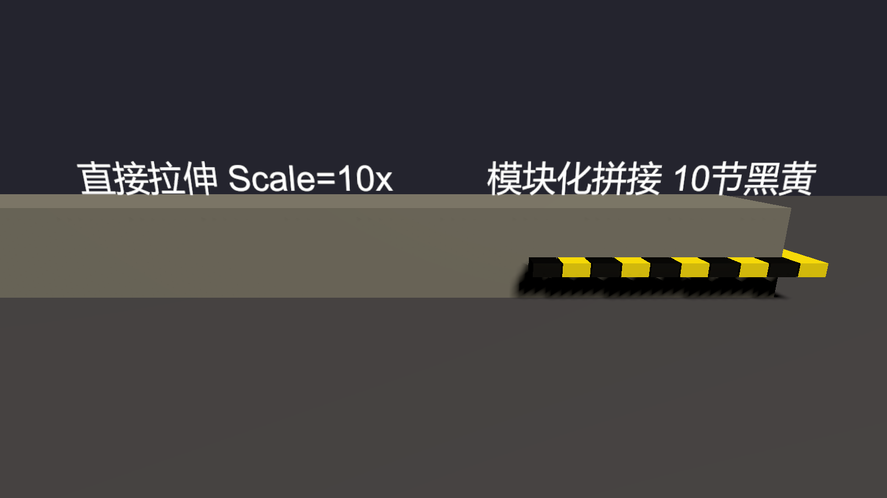
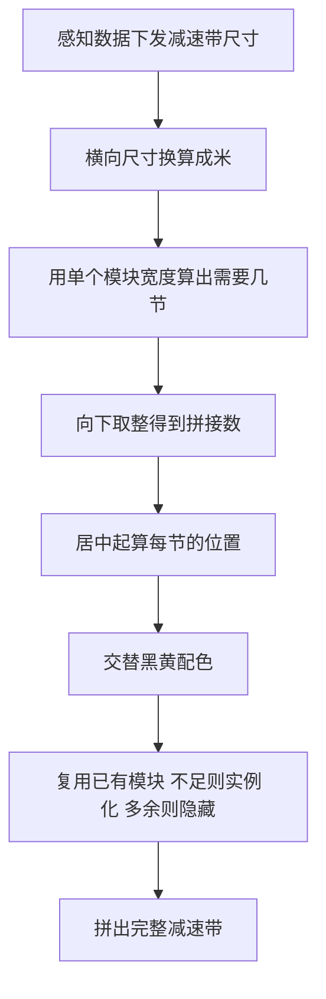
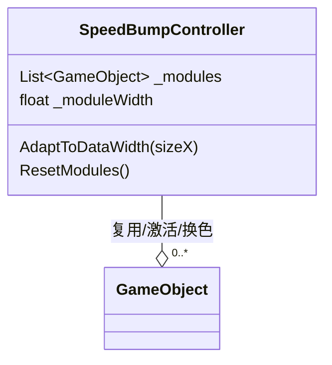

# 智驾 SR 开发：减速带的模块化拼装，三维物体怎么做到"拉长不拉伸"

> 上一篇写了感知物轨迹平滑的卡尔曼滤波实践，在数据层把抖动的轨迹抹平了。今天换个方向，聊一个渲染层的细节问题：感知下发一个"减速带"，它是固定宽度的三维模型，但每条减速带的实际长度不一样，宽度任你怎么拉，模型一拉伸就会糊。怎么让同一份素材拼出任意的长度？



> 上图：左边是直接拉伸单个模型的减速带，色块被拉宽、圆角失真；右边用"单模块重复 + 原子换色"拼出来的减速带，任意长度下每个色块都保持原样。

---

## 1、问题：为什么减速带不能直接拉长

SR 场景里，感知系统会下发"路面物体"，其中有一类叫**减速带**。它和车、锥桶不一样，车可以整体缩放比例，减速带的特征是**横向宽度固定、纵向长短可变**。感知下发的 `SizeX` 就是这条减速带的真实长度。

拿到长度后，直接把这个三维模型沿横向拉长行不行？看起来最省事，但一拉就出问题：

- **贴图拉伸**：模型表面的纹理（黑黄条纹）是烘焙在 UV 上的，把模型拉长，UV 不变，条纹就被横向拉开了，色块变宽、糊掉
- **模型失真**：减速带的两端是圆角倒边，整体拉伸后圆角的弧度被拉成椭圆，棱角变得很怪
- **碰撞/阴影错位**：投射的 AO、阴影贴图是按原始长度做的，拉长后对不上

简单说，直接 scale 改变的是"模型的骨架"，而减速带的质感是"重复的色块"。骨架可以变，色块的节奏不能变。

```csharp
// 直接拉长：色块 UV 被拉宽，条纹糊掉
transform.localScale = new Vector3(width, 1, 1);
```

## 2、解决思路：把"拉长"换成"拼"

既然问题出在"一个整体被拉伸变糊"，那就不要拉伸这个整体。把减速带拆成一节一节的**模块**，每一节是固定宽度、独立完整的一截条纹，然后按需要的长度，把若干节**并排拼在一起**换色。这样每一节都不变形，拼出来的总长度就是减速带的长度。

这个思路就是工程里 `SpeedBumpController` 的做法。



## 3、源码拆解：怎么算"要几节"

单个模块的宽度是固定已知的，比如 `_moduleWidth = 0.25` 米。下发的是横向总宽度，那么需要几节，直接除法：

```csharp
// 横向总宽度（毫米换算成米）除以单节宽度
float width = SizeX * 0.001f;
int count = Mathf.FloorToInt(width / _moduleWidth);  // 向下取整
```

这里有个细节：用 `FloorToInt` 向下取整，而不是 `CeilToInt`。意思是如果总宽度是 1.6 米，单节 0.25 米，算出来 6.4 节，就只取 6 节。多出来的 0.4 米怎么处理？直接丢。

**丢尾巴会不会短？** 会短一点点，但减速带不是精密的工业件，视觉上一节短 0.4 米看不出问题。如果改用向上取整去补满，反而会出现一节被挤压得特别细，或者多到视觉突兀。工程上宁可少一截，也不点那一截被压变形。

## 4、源码：居中排布 + 交替配色

数量定了，开始排。起点设在负半轴（`-width/2`），从中间往两边铺，这样减速带整体中心对齐，而不是贴在边缘。

```csharp
// 居中：从 -width/2 开始，每节 +0.25 米
float startPos = -(width / 2) + (_moduleWidth / 2);
for (int i = 0; i < count; i++)
{
    obj.localPosition = new Vector3(0, 0, startPos + i * _moduleWidth);
}
```

配色用最简单的方式：奇数节一个颜色，偶数节一个颜色，交替出现黑黄条纹：

```csharp
// 交替黑黄：i 奇数染黑、偶数染黄
var mesh = obj.transform.Find("bumpMesh").GetComponent<MeshRenderer>();
mesh.material.color = (i % 2 == 0) ? Color.black : Color.yellow;
```

## 5、模块池化：不要每帧 Instantiate 重新建

减速带的位置和长度每帧都在变（车在移动，感知持续下发）。如果每帧都 `Instantiate` 一排新模块，再 `Destroy` 掉旧的，那会产生大量创建/销毁开销，招来 GC。

工程里的做法是维护一个 `模块池`：



```csharp
// 第一次不够用才 Instantiate 新模块
if (_modules.Count <= i)
{
    var go = Instantiate(_singleModule);
    go.transform.SetParent(transform);
    go.transform.localEulerAngles = new Vector3(0, 90, 0);
    _modules.Add(go);
}
// 每帧先把上一帧的所有节隐藏
void Reset() {
    foreach (var m in _modules) m.SetActive(false);
}
// 再用到的节逐个复用、显示
```

整个过程：先 `Reset()` 把所有旧节隐藏，再走一遍"算数量 → 排位置 → 配色"的循环，需要多少节就把对应编号的模块激活、摆好、换色。不需要的一直藏在池里。这一帧和上一帧之间模块是复用的，没有反复 Instantiate/Destroy。

## 结语

减速带拼起来看似简单，其实是"三维物体拉长而不拉伸"这类问题的一个典型。解决问题的关键是分清"模型的骨架"和"纹里的质感"两个维度：整体 scale 只能动骨架，而质感（条纹、圆角、AO）绑死在贴图和 UV 上，拉骨架就会毁质感。于是换个思路，用固定节宽度的模块一段段去拼，配色用奇偶原子化地拼出黑黄相间。模块池化顺带把重建开销也削掉了。这个"拆模块、按需拼接、池化复用"的思路不止适用减速带，凡是长度可变的线性三维资产，都值得这么处理。