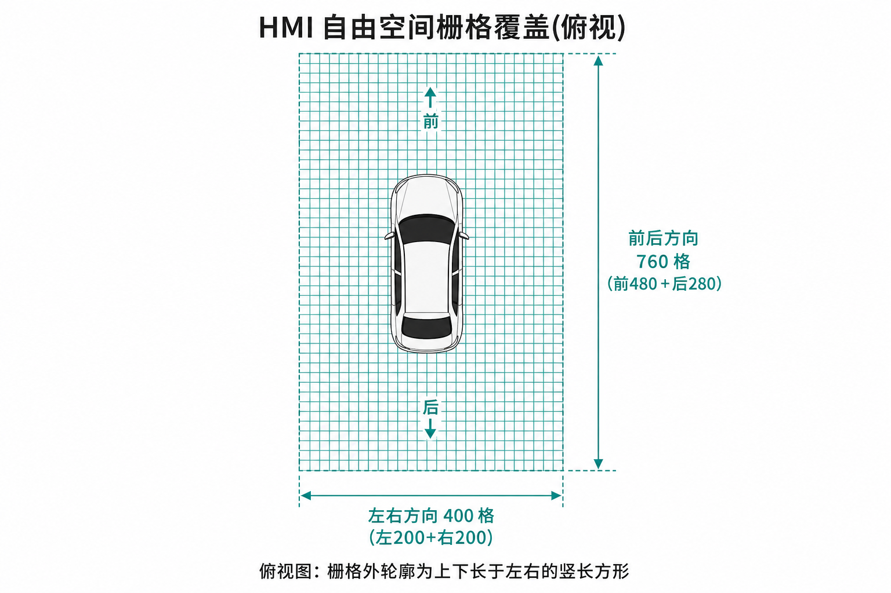
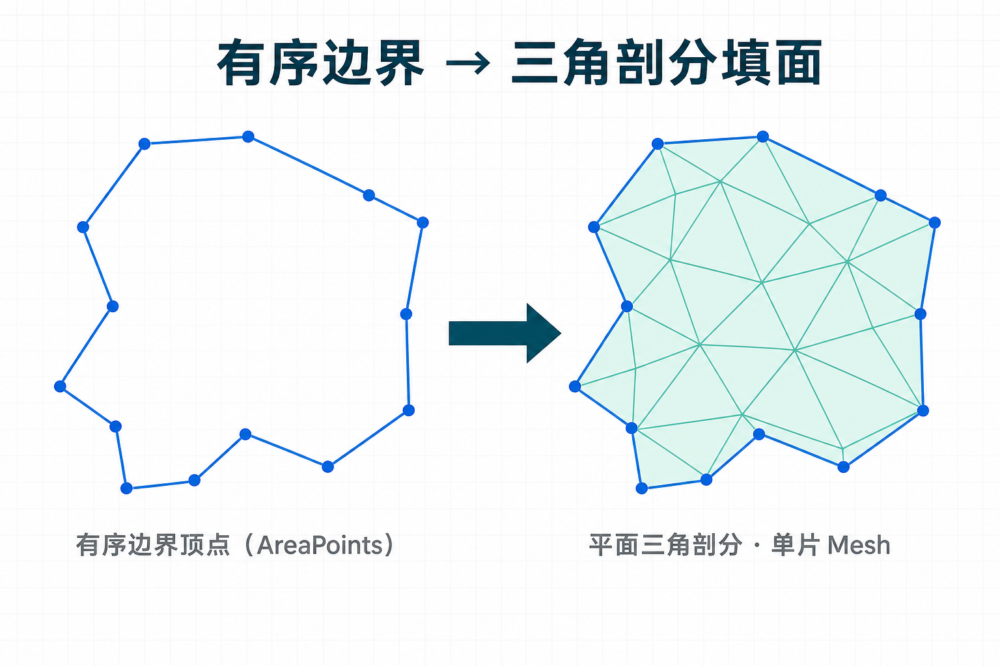

> 在智驾座舱SR（Surround Reality）开发中，把感知/规划输出的可行驶区域渲染成半透明图案铺在路面上，几乎是任何SR应用必备的能力。可行驶区域的绘制是OCC（占用网格）技术的典型表现形式，它不仅能够丰富SR界面的表现力，而且能让用户构建起对感知的基础信任。

本文整理座舱SR里最常见的三种可通行区域实现方案：**棋盘格bitmask、左右双边界条带、区域边缘有序顶点列表**，把每种方案的实现逻辑、工程优化点和常见坑梳理出来，帮你快速对应到项目场景选型。

---

## 1. bitmask 棋盘格

这是常见的一类数据输入的形式，适用于协议约定以 **bitmask** 数据来下发的情况。

### 1.1 数据形式

可以把车身周边想象成一张 **固定大小的方格纸**：每个格子只占 **1 bit**。这个bit表达**是或不是**可行驶的区域。然后会把所有方格的bit按照协定，比如从方格纸的右下角的格子开始，从右往左，从下往上的方式组装进 **字节数组** 发给应用层，也有可能转换成 base64 字符串传输。

（俯视栅格排布参考下图：一般以车为中心，前长后短左右对称👇）



### 1.2 实现步骤

我们不需要给每个格子都单独建三角面，工程上只用 4个顶点（大Quad） 就能搞定整个可通行区域：

1.**空间网格**：在车身下方路面摆一张大矩形网格，网格的大小与智驾供应商所框定的OCC范围严格一致，需要稍微抬高一点点，避免和地面模型产生 Z-fighting 闪烁。

2.**纹理准备**：提前创建一张和可行驶区域 宽×高 分辨率一致的 RenderTexture，用来存每个格子是否可通行的透明度信息。

3.**GPU并行解码**：用 Compute Shader 开并行线程，每个线程对应一个栅格像素，按照协议约定从字节流里取出对应位置的bit，把结果写到 RenderTexture 里（可通行就设半透明，不可通行就完全透明）。

4.**最终上色**：普通片元Shader里只需要采样这张蒙版纹理，乘上对应颜色和透明度就好，根据设计需求，一般还需要加边缘模糊、日夜模式响应的效果。

*[配图见公众号原文]*

### 1.3 优化经验

- **重复判断**：每次收到occ的数据，根据数据的特征先判断和上一次数据是否一样，如果一样就不做解码以及后续的计算绘制流程。  
- **资源复用**：只要栅格分辨率不变，RenderTexture 和 ComputeBuffer 只需要创建一次，每次只更新内容就行，避免反复申请释放。

- **降频更新**：当协议推送频率 **明显高于** 画面必要刷新节奏时，可在效果可接受前提下做隔帧更新或合并刷新，减轻解码与 GPU 写入压力。  
- **效果优化：**边缘柔和，避免锯齿。

### 1.4 示例代码

**外层调度**

```csharp
using UnityEngine;
using UnityEngine.Rendering;

/// <summary>仅演示「上传→调度→绑材质」</summary>
public sealed class LatticeMaskHost : MonoBehaviour
{
    public ComputeShader bitUnpackCs;     // 真实项目可能是别的资产名
    public Material groundTintMat;
    public int cols = 240;
    public int rows = 440;

    RenderTexture _occupancyAtlas;
    ComputeBuffer _gpuWords;
    byte[] _freezeForDiff;

    public void OnNewBlob(byte[] blob)
    {
        if (blob == null || blob.Length == 0) return;
        if (_freezeForDiff != null && _freezeForDiff.Length == blob.Length && BytesLikelySame(_freezeForDiff, blob))
            return;

        _freezeForDiff = (byte[])blob.Clone();

        PrepareTargets(blob.Length);
        var packed = PackLittleEndianWords(blob); // 虚构：真实 endian / 对齐规则听协议的
        _gpuWords.SetData(packed);

        int handle = bitUnpackCs.FindKernel("Cs_ScribbleLattice"); // 虚构 kernel 名
        bitUnpackCs.SetBuffer(handle, "_WordHeap", _gpuWords);
        bitUnpackCs.SetTexture(handle, "_ScratchAtlas", _occupancyAtlas);
        bitUnpackCs.SetInts("_LatticeDims", cols, rows);

        int tgX = (cols + 15) / 16;   // 与真实线程组分档无关，仅示意
        int tgY = (rows + 15) / 16;
        bitUnpackCs.Dispatch(handle, tgX, tgY, 1);

        groundTintMat.SetTexture("_LatticeAlpha", _occupancyAtlas);
    }

    static bool BytesLikelySame(byte[] x, byte[] y)
    {
        for (int i = 0; i < x.Length; i++)
            if (x[i] != y[i]) return false;
        return true;
    }

    void PrepareTargets(int blobBytes)
    {
        if (_occupancyAtlas == null || _occupancyAtlas.width != cols || _occupancyAtlas.height != rows)
        {
            _occupancyAtlas?.Release();
            _occupancyAtlas = new RenderTexture(cols, rows, 0, RenderTextureFormat.ARGB32)
            {
                enableRandomWrite = true,
                filterMode = FilterMode.Bilinear
            };
            _occupancyAtlas.Create();
        }

        int wordSlots = (blobBytes + 3) / 4;
        if (_gpuWords == null || _gpuWords.count != wordSlots)
        {
            _gpuWords?.Release();
            _gpuWords = new ComputeBuffer(wordSlots, sizeof(uint));
        }
    }

    /// <summary>示意：四字一组 Little-endian 填 word；与量产打包未必一致。</summary>
    static uint[] PackLittleEndianWords(byte[] blob)
    {
        int wordCount = (blob.Length + 3) / 4;
        var words = new uint[wordCount];
        for (int w = 0; w < wordCount; w++)
        {
            uint acc = 0;
            for (int b = 0; b < 4; b++)
            {
                int idx = w * 4 + b;
                uint octet = idx < blob.Length ? blob[idx] : 0u;
                acc |= octet << (8 * b);
            }
            words[w] = acc;
        }
        return words;
    }

    void OnDestroy()
    {
        _gpuWords?.Release();
        _occupancyAtlas?.Release();
    }
}

```

**Compute（bit 提取逻辑用占位函数）**

```hlsl
#pragma kernel Cs_ScribbleLattice

StructuredBuffer<uint> _WordHeap;
RWTexture2D<float4> _ScratchAtlas;
uint2 _LatticeDims;

[numthreads(16, 16, 1)]
void Cs_ScribbleLattice(uint3 tid : SV_DispatchThreadID)
{
    if (tid.x >= _LatticeDims.x || tid.y >= _LatticeDims.y) return;

    // 虚构映射：行列 → 线性像素号 → 假定的 word/bit（量产必须与协议表对齐）
    uint linear = tid.y * _LatticeDims.x + tid.x;
    uint wordIx = linear >> 5;
    uint bitIx = linear & 31u;
    uint chunk = _WordHeap[wordIx];
    bool passable = (chunk & (1u << bitIx)) != 0;

    float feather = 1;
    _ScratchAtlas[tid.xy] = passable ? float4(1, 1, 1, 0.55 * feather) : 0;
}

```

**片元（虚构 uniform；兼容 Built-in 采样写法的一种）**

```hlsl
sampler2D _LatticeAlpha;
half4 _DryPalette;
half4 _WetPalette;
half _NightMix;

half4 FragTint(float2 uv : TEXCOORD0) : SV_Target
{
    half mask = tex2D(_LatticeAlpha, uv).a;
    half4 baseCol = lerp(_DryPalette, _WetPalette, saturate(_NightMix));
    return half4(baseCol.rgb, baseCol.a * mask);
}

```

---

## 2. 左右双边界条带

适用于 **左、右两条独立边界曲线** 的场景，是座舱SR交付里带状可通行区域的另一种比较局限的形式。

### 2.1 数据形式

协议下发左右两条边界的曲线系数，应用层采样后得到两条折线路径，每一条路径都是一串有序三维顶点。

### 2.2 实现步骤

1. **弧长重采样对齐**：先分别计算两条边界的总弧长，按固定步长重新采样，保证每一对顶点都对应道路同一个里程位置。
2. **构建三角Mesh**：把重采样后的左右顶点配对，按相邻索引连成四边形，再剖分成两个三角形；UV坐标建议跟着弧长同步累计，避免贴图条纹拧麻花。 

（对齐后效果参考下图👇）

*[配图见公众号原文]*

### 2.3 常见问题

大S弯不能盲信**原始索引硬配对**：同一原始索引的左右点在空间里可能相距很远，会产生横穿弯道内部的细长三角面，效果完全错误。

*[配图见公众号原文]*

处理方式需要查阅《智驾 SR 开发：画线的五个“避坑”指南》的第五章关于弧长重采样的描述。

### 2.4 优化经验

- 弧长重采样步长随车速与相机距离联动：远处用大步长少采样，近处用小步长密采样，平衡效果和性能。
- 如果项目同时存在栅格和双边方案，提前写死优先级，避免重复渲染。
- 所有网格统一微抬贴地高度，避免和地面模型Z-fighting闪烁。

### 2.5 示例代码

```csharp
using System.Collections.Generic;
using UnityEngine;

/// <summary>虚构：把两条独立折线按「近似弧长参数」重新取样。</summary>
public static class CorridorResampler
{
    public static void StretchRailsUniform(
        IReadOnlyList<Vector3> polyWest,
        IReadOnlyList<Vector3> polyEast,
        float chopLength,
        List<Vector3> westOut,
        List<Vector3> eastOut)
    {
        westOut.Clear();
        eastOut.Clear();

        float spanWest = MeasurePolyline(polyWest);
        float spanEast = MeasurePolyline(polyEast);
        float runway = Mathf.Max(spanWest, spanEast);

        int slices = Mathf.Max(1, Mathf.CeilToInt(runway / Mathf.Max(chopLength, 1e-4f)));
        for (int slice = 0; slice <= slices; slice++)
        {
            float mileage = Mathf.Min(runway, slice * chopLength);
            westOut.Add(LocateAlong(polyWest, Mathf.Min(mileage, spanWest)));
            eastOut.Add(LocateAlong(polyEast, Mathf.Min(mileage, spanEast)));
        }
    }

    static float MeasurePolyline(IReadOnlyList<Vector3> pts)
    {
        float acc = 0f;
        for (int i = 1; i < pts.Count; i++)
            acc += Vector3.Distance(pts[i - 1], pts[i]);
        return acc;
    }

    /// <summary>在折线上按弧长找位置：线性扫描示意，量产可换二分。</summary>
    static Vector3 LocateAlong(IReadOnlyList<Vector3> pts, float mileage)
    {
        if (pts.Count == 0) return default;
        if (pts.Count == 1) return pts[0];

        float walked = 0f;
        for (int i = 0; i < pts.Count - 1; i++)
        {
            float seg = Vector3.Distance(pts[i], pts[i + 1]);
            if (walked + seg >= mileage - 1e-5f)
            {
                float u = seg > 1e-6f ? Mathf.Clamp01((mileage - walked) / seg) : 0f;
                return Vector3.Lerp(pts[i], pts[i + 1], u);
            }
            walked += seg;
        }
        return pts[^1];
    }
}

```

---

## 3. 区域边缘有序顶点列表

这是针对整块闭合可通行区域设计的方案，和前两种方案核心差异清晰：只输入**一圈环绕区域的有序顶点**，最终目标是填出完整的区域内部网格，而非仅生成边缘条带。

适用于： 协议下发 一圈有序顶点（面积点列表），语义为 可行驶区域或 OCC 多边形边界（通常闭合、同一平面内可视化）。与第 2 章「左右两条独立曲线」不同：此处 只有一条边界环，目标是 **区域内部的平面三角网格**，不是沿路径挤出的条带。

### 3.1 数据形式

输入为 **一条有序闭合边界** 的三维顶点序列，约定：

- **绕向一致**：沿边界顺时针或逆时针保持一致；顺序反了会导致三角形法线翻转，可出现整块不显示或背面剔除。
- **闭合语义**：首尾是否重复第一个点取决于协议；工程上要统一成「闭合环」再送进剖分。
- **投影到行驶平面**：车载 SR 多在路面可视化，通常把顶点 **压平到 XZ（或约定水平面）**，固定统一高度，避免与地面网格 Z-fighting；剖分在等价 2D 多边形上进行。
- **脏数据**：自交、重复点、共线尖角、窄缝会引起剖分失败或退化三角形，需要在解析或预处理阶段收敛。

### 3.2 实现步骤

1. **第一步：获取边界顶点**，首先我们从智驾的通信协议里，把可通行区域的边界顶点数据解析出来，拿到一串**按顺序排列的顶点坐标**（要么是相对于车体的坐标系，要么是全局世界坐标系）。  
这里必须提前和协议约定清楚：这串顶点本身已经是闭合环（第一个点和最后一个点是同一个点），还是需要我们应用层自己补一个点，把首尾连起来形成闭合环。
2. **第二步：投影到路面压平**，因为可通行区域是铺在路面上的，我们不需要保留三维起伏信息，所以做两个处理：
  1. 把所有三维顶点**投影到路面所在的二维平面**：我们通常用X-Z平面代表水平面（Y轴代表高度），所以只保留顶点的X、Z坐标参与后续的几何计算
  2. 统一把Y坐标（高度）设置成**略高于路面**的值，这样可以避免可通行区域的网格和路面模型互相穿插，出现画面闪烁（也就是常说的Z-fighting问题）
3. **第三步：清理脏数据**，原始数据里可能有脏数据，会导致后续剖分失败，所以依次做清理：
  1. 去掉距离太近的重复顶点：两个点几乎挨在一起，保留一个就行，减少计算量
  2. 规范闭合状态：如果原始数据首尾已经重复了同一个点，去掉多余的那个，保证一个闭合环里没有重复的顶点
  3. 可选简化共线点：如果三个点在同一条直线上，去掉中间那个点，同样减少不必要的计算
  4. 统一环绕方向：要么全部顺时针、要么全部逆时针，方向反了会导致三角形法线翻转，整个区域都不显示  
  经典耳切法的输入模型是**平面简单多边形**（无自交、无孔）。若边界来自多条轨迹拼接等场景而出现自交，则不再满足该前提，须改用支持非简单拓扑的剖分实现，或由上游保证输出为简单闭合环。
4. **第四步：生成三角形网格**，我们拿到了干净的二维闭合多边形，接下来要把它拆成一个个小三角形（只有三角形才能被引擎渲染），这一步叫三角剖分：
  1. **凹凸判断的小技巧**：因为我们投影到了XZ平面，路面法线是朝上（Y轴方向）的，所以计算多边形顶点凹凸的时候，只需要取三维叉积结果的Y分量，就等价直接在XZ平面做二维计算，不用额外转换坐标。
  2. **输出格式**：剖分结果会输出一串索引序列，总长度是三角形个数 ×3，每三个索引对应一个三角形的三个顶点；一般优先用 共享顶点+索引 的方式存网格，这样更省内存。
  3. **靠谱性建议**：如果遇到带孔洞的多边形、多个连通域、非常窄的缝隙、或者超大坐标带来的浮点误差，直接交给成熟的第三方剖分库处理就好；手写的耳切法只能用在协议已经保证轮廓非常干净的场景，复杂场景手写基本都会出问题。
5. **第五步：导入引擎渲染（写入Mesh）**把剖分好的结果，按照你使用的引擎（比如Unity/Unreal）要求，组装成引擎可识别的Mesh资源：
  1. 结构就是 顶点列表 + 三角形索引列表 
  2. 法线方向统一设置为朝上（如果路面有坡度就设置为局部路面法线方向）
  3. 如果只需要纯色填充，UV坐标可以暂时都填(0,0)，不影响显示
6. **可选：做边界渐变效果（边界渐变）**如果产品要求可通行区域的边缘是自然淡出（不是硬边缘），就需要额外处理：
  1. 在CPU侧计算每个顶点到区域边界的距离，把距离信息存在顶点色或者第二套UV里
  2. 或者单独做一圈窄的箍边几何，或者生成一张小蒙版RenderTexture存距离信息
  3. 最后在片元Shader里用smoothstep函数，根据距离信息调整透明度，就能实现自然的边界淡出效果。

（三角剖分填面效果参考下图👇）



### 3.3 示例代码

```csharp
using System.Collections.Generic;
using UnityEngine;

/// <summary>闭合可行驶区域：预处理 → XZ 平面三角剖分 → Unity Mesh（共享顶点 + 索引）</summary>
public sealed class ClosedLoopDriveAreaBuilder
{
    readonly float _dedupeEpsilon;
    readonly float _roadYOffset;

    public ClosedLoopDriveAreaBuilder(float dedupeEpsilon = 0.05f, float roadYOffset = 0.02f)
    {
        _dedupeEpsilon = dedupeEpsilon;
        _roadYOffset = roadYOffset;
    }

    public bool TryBuildMesh(IReadOnlyList<Vector3> boundaryWorld, Mesh targetMesh)
    {
        if (boundaryWorld == null || boundaryWorld.Count < 3)
            return false;

        var ring3 = new List<Vector3>(boundaryWorld.Count);
        for (int i = 0; i < boundaryWorld.Count; i++)
            ring3.Add(boundaryWorld[i]);

        StripClosingDuplicate(ring3);
        DedupeAdjacent(ring3, _dedupeEpsilon);
        if (ring3.Count < 3)
            return false;

        float avgY = 0f;
        for (int i = 0; i < ring3.Count; i++)
            avgY += ring3[i].y;
        avgY /= ring3.Count;
        float liftY = avgY + _roadYOffset;

        var poly2 = new List<Vector2>(ring3.Count);
        for (int i = 0; i < ring3.Count; i++)
            poly2.Add(new Vector2(ring3[i].x, ring3[i].z));

        EnsureWindingForUpFacing(poly2);

        var indices = new List<int>();
        if (!EarClipTriangulation.TryTriangulate(poly2, indices))
            return false;

        var verts = new List<Vector3>(ring3.Count);
        for (int i = 0; i < ring3.Count; i++)
            verts.Add(new Vector3(ring3[i].x, liftY, ring3[i].z));

        var normals = new List<Vector3>(ring3.Count);
        var uvs = new List<Vector2>(ring3.Count);
        for (int i = 0; i < ring3.Count; i++)
        {
            normals.Add(Vector3.up);
            uvs.Add(Vector2.zero);
        }

        targetMesh.Clear();
        targetMesh.SetVertices(verts);
        targetMesh.SetNormals(normals);
        targetMesh.SetUVs(0, uvs);
        targetMesh.SetTriangles(indices, 0);
        targetMesh.RecalculateBounds();
        return true;
    }

    static void StripClosingDuplicate(List<Vector3> ring)
    {
        if (ring.Count >= 2 && (ring[0] - ring[^1]).sqrMagnitude < 1e-8f)
            ring.RemoveAt(ring.Count - 1);
    }

    static void DedupeAdjacent(List<Vector3> ring, float eps)
    {
        float sq = eps * eps;
        for (int i = ring.Count - 1; i >= 1; i--)
        {
            if ((ring[i] - ring[i - 1]).sqrMagnitude <= sq)
                ring.RemoveAt(i);
        }
        while (ring.Count >= 2 && (ring[0] - ring[^1]).sqrMagnitude <= sq)
            ring.RemoveAt(ring.Count - 1);
    }

    /// <summary>使多边形在 XZ 投影上为逆时针（从 +Y 俯视），与朝上法线、默认正面剔除常见约定一致。</summary>
    static void EnsureWindingForUpFacing(List<Vector2> xzPoly)
    {
        if (SignedAreaXZ(xzPoly) < 0f)
            xzPoly.Reverse();
    }

    static float SignedAreaXZ(IReadOnlyList<Vector2> p)
    {
        double s = 0;
        int n = p.Count;
        for (int i = 0; i < n; i++)
        {
            var q = p[(i + 1) % n];
            s += (double)p[i].x * q.y - (double)p[i].y * q.x;
        }
        return (float)(0.5 * s);
    }
}

/// <summary>简单多边形耳切（无孔）。顶点较少时可作占位；复杂数据请换库。</summary>
public static class EarClipTriangulation
{
    public static bool TryTriangulate(IReadOnlyList<Vector2> poly, List<int> outTriangles)
    {
        outTriangles.Clear();
        int n = poly.Count;
        if (n < 3) return false;

        var ring = new List<int>(n);
        for (int i = 0; i < n; i++) ring.Add(i);

        int guard = n * n;
        while (ring.Count > 3 && guard-- > 0)
        {
            bool clipped = false;
            int m = ring.Count;
            for (int i = 0; i < m; i++)
            {
                int ip = ring[(i + m - 1) % m];
                int ic = ring[i];
                int inext = ring[(i + 1) % m];

                if (!IsConvexCorner(poly[ip], poly[ic], poly[inext]))
                    continue;

                if (!IsEar(poly, ring, ip, ic, inext))
                    continue;

                outTriangles.Add(ip);
                outTriangles.Add(ic);
                outTriangles.Add(inext);
                ring.RemoveAt(i);
                clipped = true;
                break;
            }
            if (!clipped)
                return false;
        }

        if (ring.Count == 3)
        {
            outTriangles.Add(ring[0]);
            outTriangles.Add(ring[1]);
            outTriangles.Add(ring[2]);
            return true;
        }
        return false;
    }

    /// <summary>沿边界行走 prev→curr→next，左转则为凸顶点（适用于已规范为 CCW 的多边形）。</summary>
    static bool IsConvexCorner(Vector2 prev, Vector2 cur, Vector2 next)
    {
        Vector2 eIn = cur - prev;
        Vector2 eOut = next - cur;
        return eIn.x * eOut.y - eIn.y * eOut.x > 1e-8f;
    }

    static bool IsEar(IReadOnlyList<Vector2> poly, List<int> boundary, int ia, int ib, int ic)
    {
        Vector2 a = poly[ia], b = poly[ib], c = poly[ic];
        for (int k = 0; k < boundary.Count; k++)
        {
            int iv = boundary[k];
            if (iv == ia || iv == ib || iv == ic) continue;
            if (PointInTriangle(poly[iv], a, b, c))
                return false;
        }
        return true;
    }

    static bool PointInTriangle(Vector2 p, Vector2 a, Vector2 b, Vector2 c)
    {
        float c1 = Cross2(a, b, p), c2 = Cross2(b, c, p), c3 = Cross2(c, a, p);
        bool neg = (c1 < 0) || (c2 < 0) || (c3 < 0);
        bool pos = (c1 > 0) || (c2 > 0) || (c3 > 0);
        return !(neg && pos);
    }

    static float Cross2(Vector2 a, Vector2 b, Vector2 c)
    {
        return (b.x - a.x) * (c.y - a.y) - (b.y - a.y) * (c.x - a.x);
    }
}
```

片元示例（顶点色 `.r` 存归一化距边，CPU 侧另行写入）

```hlsl
half4 FragArea(half4 vtxColor : COLOR) : SV_Target
{
    half d = saturate(vtxColor.r);
    half a = _AreaAlpha * smoothstep(0.0h, _Feather, d);
    return half4(_FillRgb, a);
}
```

---

## 总结


| **方案**      | **典型输入**                 | **要点**                         |
| ----------- | ------------------------ | ------------------------------ |
| bitmask 棋盘格 | 字节流 / base64 组建的二维栅格 bit | GPU 解码写 RT，Quad 采样；映射与分辨率须对齐协议 |
| 左右双边界条带     | 左、右两条独立折线（或采样曲线）         | 弧长参数对齐后再配对三角化，忌索引硬配对           |
| 区域边缘有序顶点列表  | 有序闭合顶点环                  | 投影成简单多边形后剖分；孔洞/自交须换算法或上游约束     |


---

## 结语

行车 OCC 随供应商不同，协议形态差异很大。**在同等可选的前提下**，bitmask 栅格往往对应用层更省事：解码规则清晰，较少遇到顶点拓扑类难题（例如顶点暴增、复杂凹陷轮廓、边缘尖刺与剖分稳定性）。

