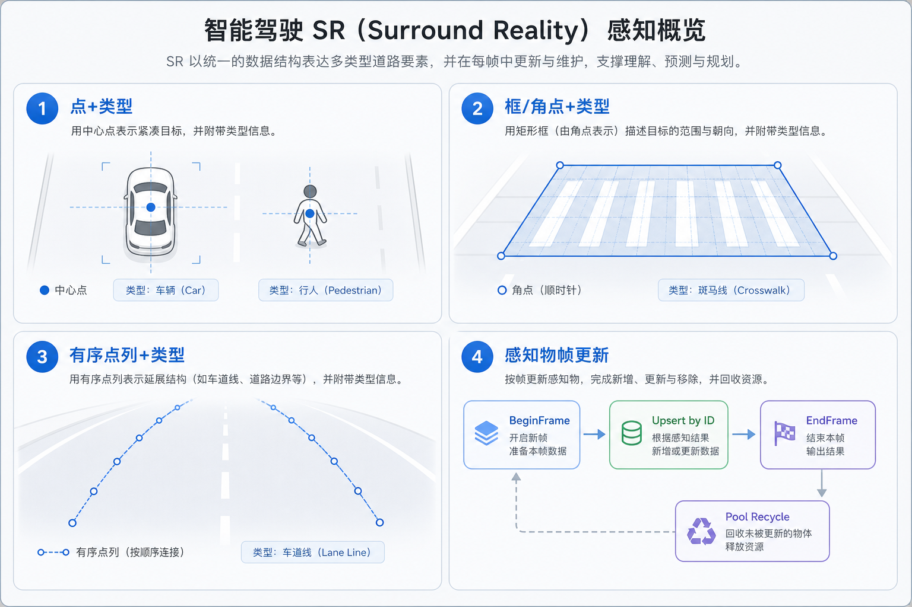
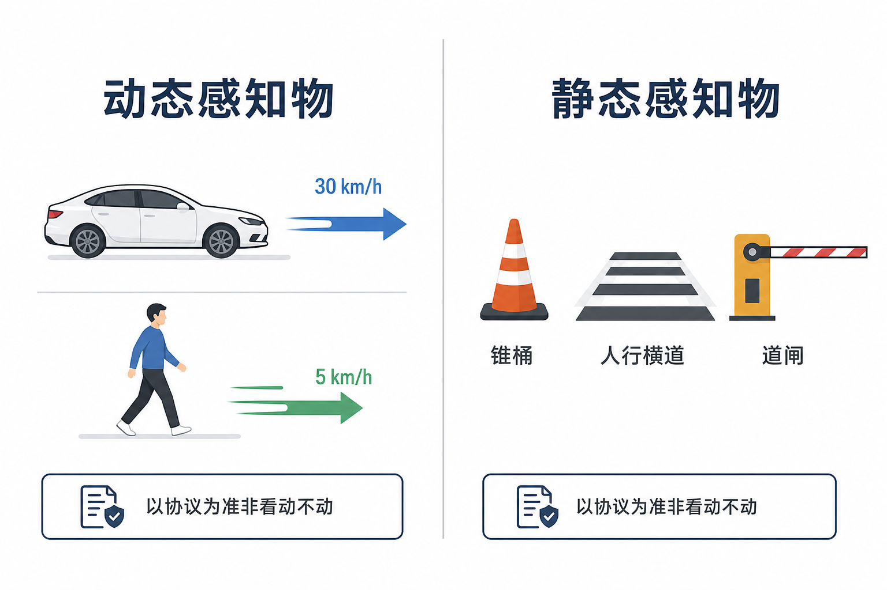
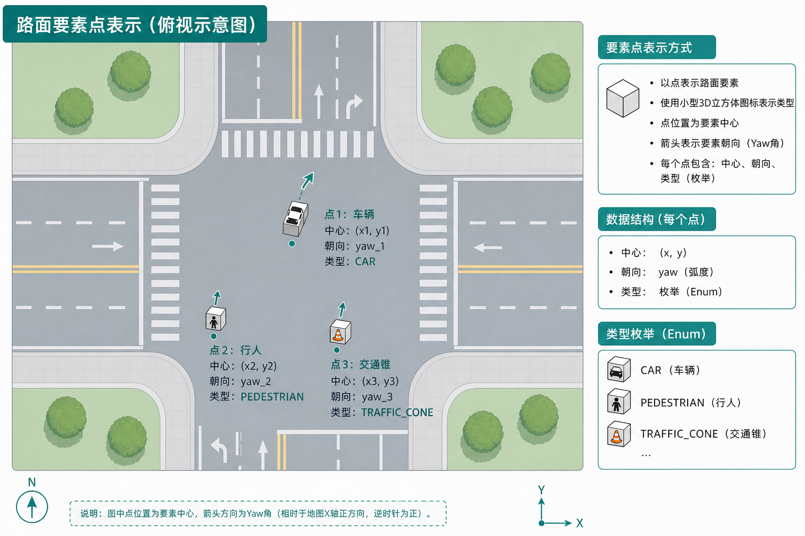
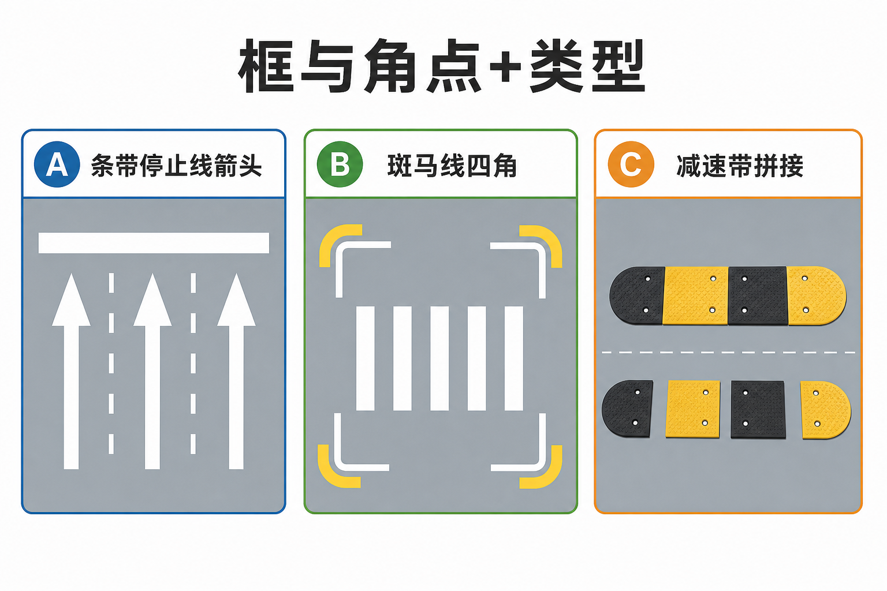
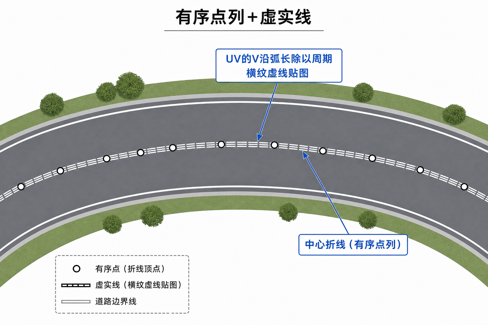

> The most common perception objects in SR are objects predefined by type. These don't require complex rendering, because their appearance only needs to convey three things: a visual hint, spatial occupancy, and state.

This article organizes the three common data representations of perception objects in ADAS SR development: point + type, box/corner points + type, and ordered point list + type, plus a multi-frame update scheme. For each form, I've clearly laid out the applicable scenarios, input fields, processing steps, and reusable reference code, so you can integrate against your protocol quickly using this as a reference.



---

## 1. Dynamic vs. Static Perception Objects

**Dynamic perception objects**: the protocol treats these as targets that participate in traffic behavior and whose state changes over time. Beyond pose and type, the data usually carries **velocity** plus fields related to motion or interaction such as **light states, highlight flags, and riding/walking semantics**. In the cockpit, the typical examples are motor vehicles, non-motorized vehicles, and pedestrians:

**Static perception objects**: the protocol treats these as fixed presences relative to the road, such as facility-type obstacles, road markings, zebra crossings, stop lines, and gate barrier states. The data emphasizes **position, orientation, size, or corner-point outlines** rather than a full set of dynamic obstacle semantics. On the client side, the common approaches are placing prefabs, building geometry on the road surface, or applying decals.

Whether an object is dynamic or static is ultimately determined by the **protocol type**, not by whether it changes every frame.



---

## 2. Point + Type

That is: a ground-level center point + orientation + an object type enum.

### Applicable Scenarios

Covers most independent-entity perception objects:

- Dynamic objects: motor vehicles, pedestrians, cyclists
- Static objects: traffic cones, static traffic signs, fixed obstacles



### Input Fields

Generally includes the following core information:


| Field           | Meaning                                                                                    |
| --------------- | ------------------------------------------------------------------------------------------ |
| `planeX/planeY` | Plane reference point coordinates in the vehicle-body coordinate system                    |
| `yaw`           | Heading angle around the vertical axis (in degrees or radians)                             |
| `kind`          | Object type enum (car/pedestrian/cone, etc.)                                               |
| Dynamic extras  | `velX/velY` (planar velocity components), `brake/leftTurn/rightTurn` (brake/turn signals) |


### Parsing Steps

1. **Coordinate conversion**: convert protocol plane coordinates to engine world coordinates. The common approach is to swap components + negate + raise to display height, ensuring the heading matches the real direction.
2. **Instantiation**: match the type enum to the corresponding prefab, place it at the converted coordinates, and rotate to align with the heading angle.
3. **Dynamic state updates**: for pedestrians and cyclists, you can drive the animation playback speed with velocity, or simply give everything a constant animation speed that plays whenever the velocity is nonzero. Traffic lights update their material appearance through the light state.
4. **State transition handling**: movable static objects such as gate barriers usually have different prefabs prepared for different state animations. When the ID stays the same but the type switches, you need to release the old instance first, then swap in the corresponding prefab and replay the animation.

### Reference Code

```csharp
// Core enum and packet definition (illustrative: if the protocol provides radians,
// multiply by Mathf.Rad2Deg before passing into yawDeg)
public enum ObstacleKind { Car, Pedestrian, Cyclist, Cone, GateOpen, GateClosed }
public struct ObstaclePacket
{
    public long Id;              // Matches the frame-sync dictionary key in Section 5; hash or use a lookup table if the protocol uses strings
    public ObstacleKind Kind;
    public float planeX, planeY, yawDeg;
    public float velX, velY;
}

// Coordinate conversion utility (consistent with "swap components + negate + raise" in the text;
// the exact axis convention should follow your real vehicle / engine forward axis)
public static class VehicleFrameToWorld
{
    public static Vector3 Position(float planeX, float planeY, float displayHeight)
    {
        return new Vector3(-planeY, displayHeight, planeX);
    }
    /// <summary>The Y unit of Quaternion.Euler is degrees, not radians.</summary>
    public static Quaternion Orientation(float yawDeg)
    {
        return Quaternion.Euler(0f, yawDeg, 0f);
    }
}

// Dynamic object application logic
public sealed class DynamicObstacleView : MonoBehaviour
{
    public Animator animator;
    public float displayHeight = 0.35f;
    public void Apply(in ObstaclePacket p)
    {
        transform.SetPositionAndRotation(
            VehicleFrameToWorld.Position(p.planeX, p.planeY, displayHeight),
            VehicleFrameToWorld.Orientation(p.yawDeg));
        
        if (animator != null) {
            bool isLegPowered = p.Kind is ObstacleKind.Pedestrian or ObstacleKind.Cyclist;
            float speed = isLegPowered ? Mathf.Sqrt(p.velX*p.velX + p.velY*p.velY) : 0f;
            animator.SetFloat("MoveSpeed", speed);
        }
    }
}
```

---

## 3. Box + Type

### Applicable Scenarios

For perception objects that occupy road surface areas: stop lines, zebra crossings, road arrows, speed bumps, and work zones occupying a lane.

### Input Fields

Two common formats:


| Form               | Fields                                    | Applicable scenario                       |
| ------------------ | ----------------------------------------- | ----------------------------------------- |
| Box + type         | Center coordinates + length/width + heading + subtype | Regular rectangular areas (stop lines, arrows) |
| Corner points + type | Four ordered corner coordinates + subtype | Irregular quadrilaterals (a full zebra crossing) |



### Parsing Steps

1. **Scheme selection**: when the corner point count is insufficient, fall back to the "center + length/width + heading" rectangle scheme. When corner points drift, use default length/width to avoid stretching the model out of shape.
2. **Mesh generation**:
  - **Strip types (stop lines/arrows)**: offset the center polyline by half-width on both sides to get edge lines, tessellate into quad meshes, and repeat the texture UV along the polyline direction
  - **Quad types (zebra crossings)**: sort the corner points counterclockwise, split into two triangles, and set the texture repeat along the long edge
3. **Special handling for speed bumps**: a speed bump is a variant of point + type; it's grouped here because visually it needs to appear as a raised patch of road surface. Some protocols provide corner point information, but the application layer doesn't necessarily use it; usually an extra total transverse width parameter is supplied as well.

### Reference Code

```csharp
// Strip mesh from a polyline (shared by stop lines/arrows; ExpandLine / BuildMesh handle
// normal-direction offsetting and writing the Mesh, omitted here)
public static class StripMeshBuilder
{
    public static void RebuildStripMesh(Mesh mesh, IReadOnlyList<Vector3> centerLine, float halfWidth, float uvRepeat)
    {
        mesh.Clear();
        if (centerLine.Count < 2) return;

        var left = ExpandLine(centerLine, -halfWidth);
        var right = ExpandLine(centerLine, halfWidth);
        BuildMesh(mesh, left, right, uvRepeat);
    }
}

// Zebra crossing mesh from four corners (SortCorners / GenVertices sort the corners
// and lift them onto the XZ plane as a Vector3[])
public static class ZebraQuadBuilder
{
    public static void RebuildQuad(Mesh mesh, Vector2[] cornersXZ, float tileAlongLongSide)
    {
        mesh.Clear();
        var ordered = SortCorners(cornersXZ);
        mesh.vertices = GenVertices(ordered);
        mesh.triangles = new[] { 0, 1, 2, 2, 3, 0 };
        mesh.RecalculateBounds();
    }
}

// Speed bump tiling logic (illustrative only: assumes all children under root are module
// segments; moduleWidth must be greater than 0)
public void RebuildSpeedBump(Transform root, float totalWidth, float moduleWidth, GameObject prefab)
{
    if (moduleWidth <= 0f || prefab == null || root == null) return;
    foreach (Transform c in root) c.gameObject.SetActive(false);
    int count = Mathf.FloorToInt(totalWidth / moduleWidth);
    float start = -totalWidth * 0.5f + moduleWidth * 0.5f;
    for (int i = 0; i < count; i++) {
        Transform seg = i < root.childCount ? root.GetChild(i) : Instantiate(prefab, root).transform;
        seg.gameObject.SetActive(true);
        seg.localPosition = new Vector3(0, 0, start + i * moduleWidth);
    }
}
```

---

## 4. Ordered Point List + Type

### Applicable Scenarios

This category describes **a geometric object that extends along the road**, with its shape expressed as **a sequence of ordered vertices** plus **a line style or facility type** (color, dashed/solid, curb/lane semantics, etc.). The difference from "point + type" is that a single reference point can't summarize an entire line. The difference from "box / corner points" is that it is usually **not** a closed rectangular road patch, but an **open polyline** or a strip extruded along the polyline.

For example: **lane lines and curbs**.



### Input Fields


| Field idea         | Meaning                                                                      |
| ------------------ | ---------------------------------------------------------------------------- |
| Ordered point list | A sequence of `(x,y)` or 3D points in vehicle-body or world plane; order = path along the line |
| Line style / type  | Dashed/solid, color, single/double line, curb material, etc. — enums or per-segment attributes |
| (Optional) per-segment attributes | A long polyline can be split into multiple segments, each with its own type or width |


### Parsing Steps

1. **Coordinate conversion and vertex order**: apply the same plane-to-world conversion as point + type to the entire point sequence. During processing, strictly preserve the original vertex order — a reversed vertex order will flip the strip's normal direction or invert the texture stretch direction.
2. **Strip mesh extrusion**: build polyline segments from adjacent vertices, offset them to both sides along the normal according to line width, and generate a continuous quad strip mesh. The overall approach is identical to the stop-line strip generation described earlier; the difference is that the polyline here is longer and supports switching line attributes across multiple segments.
3. **Edge-case handling and vertex optimization**: when the vertex count is too small, skip rendering or degrade to a short line segment. If the vertices are too dense, resample by the polyline's arc length to control the final mesh vertex count.

### Reference Code

1. Basic mesh generation: first follow the stop-line strip generation logic from Section 3 — offset the ordered input points to both sides of the normal, extrude to get the left and right boundaries, and stitch them into a complete quad strip mesh. This step is exactly the same as ordinary road marking generation.
2. Solid vs. dashed lines: there's no need to draw dashed segments piecewise through logic branches in code. Instead, unify everything with a texture + UV approach:
  1. Dashed lines: use a horizontal-stripe texture with gaps directly. Set the V coordinate to "the current point's accumulated arc length along the polyline ÷ the actual dash cycle (in meters)". This way, the gaps and solid segments in the texture repeat along the road at true physical lengths automatically.
  2. Solid lines: just swap in a flat solid-color texture. The V axis can keep using the same accumulated-arc-length calculation without affecting the display; no special handling is needed.
3. Double lines: if you need a double lane line, simply multiply the original half-width parameter by 2 and repeat the same extrusion process — no other logic needs to change.

```csharp
using System.Collections.Generic;
using UnityEngine;

public enum LaneStroke { Solid, Dashed }

/// <summary>The stroke type only picks which stripe texture to use; the cycle in meters controls dash density on the road.</summary>
static void BindStrokeMaterial(Material mat, LaneStroke stroke)
{
    string key = stroke == LaneStroke.Dashed ? "lane_dashed" : "lane_solid";
    var tex = Resources.Load<Texture2D>(key);
    if (tex == null || mat == null) return;
    // URP/Lit typically uses _BaseMap; Built-in Standard mostly uses _MainTex — pick per pipeline
    if (mat.HasProperty("_BaseMap")) mat.SetTexture("_BaseMap", tex);
    else if (mat.HasProperty("_MainTex")) mat.SetTexture("_MainTex", tex);
}

/// <summary>Core: center polyline → left/right offsets → strip; V = arc length / cycle. left/right must be equal length and in the same order.</summary>
static void FillStripUvAndTris(
    IReadOnlyList<Vector3> left, IReadOnlyList<Vector3> right,
    List<Vector3> verts, List<Vector2> uv, List<int> tris, float dashCycleM)
{
    verts.Clear(); uv.Clear(); tris.Clear();
    if (left.Count != right.Count || left.Count < 2) return;
    float unit = Mathf.Max(dashCycleM, 1e-3f);
    float acc = 0f;
    for (int i = 0; i < left.Count; i++)
    {
        if (i > 0) acc += Vector3.Distance(left[i], left[i - 1]);
        verts.Add(left[i]);  uv.Add(new Vector2(0f, acc / unit));
    }
    acc = 0f;
    for (int i = 0; i < right.Count; i++)
    {
        if (i > 0) acc += Vector3.Distance(right[i], right[i - 1]);
        verts.Add(right[i]); uv.Add(new Vector2(1f, acc / unit));
    }
    int n = left.Count;
    for (int i = 0; i < n - 1; i++)
    {
        int a0 = i, a1 = i + 1, b0 = n + i, b1 = n + i + 1;
        tris.Add(a0); tris.Add(b0); tris.Add(a1);
        tris.Add(a1); tris.Add(b0); tris.Add(b1);
    }
}

// Usage order: protocol points to world → expand halfWidth along vertex normals to get left/right columns
// → FillStripUvAndTris → mesh.SetVertices / SetUVs / SetTriangles
// → BindStrokeMaterial(mat, LaneStroke.Dashed) or Solid
```

---

## 5. Perception Frame Update Scheme

To display perception objects stably, you need to reason about whether this frame's object is the same one as last frame's — for add/remove/update, object pool reuse, and avoiding ghost objects. Each frame, the upstream provides a list of **currently visible** objects, each entry carrying an ID and the latest geometry/state; the client must compute the **diff between this frame's set and its cache** to reclaim stale entries.

### Implementation Steps

1. Frame start: clear the set of IDs seen this frame.  
2. For each input entry: look up the instance by ID in the cache; if absent, create one or borrow from the object pool; if present, update the geometry info.  
3. Frame end: any ID in the cache that didn't appear this frame gets reclaimed and removed.

### Reference Code

```csharp
public sealed class PerceptionFrameSync : MonoBehaviour
{
    private Dictionary<long, ObstacleView> _alive = new();
    private HashSet<long> _currentFrame = new();
    private List<long> _toRemove = new();

    public void BeginFrame() => _currentFrame.Clear();

    /// <param name="id">Consistent with the protocol's stable ID; ObstaclePacket.Id should match it.</param>
    public void Upsert(long id, ObstacleKind kind, in ObstaclePacket p, ObstacleViewPool pool)
    {
        _currentFrame.Add(id);
        if (!_alive.TryGetValue(id, out var view) || view == null) {
            view = pool.Borrow(kind);
            view.Attach(transform);
            _alive[id] = view;
        } else if (view.CurrentKind != kind) {
            pool.Release(view.CurrentKind, view);
            view = pool.Borrow(kind);
            view.Attach(transform);
            _alive[id] = view;
        }
        view.Apply(p);
    }

    public void EndFrame(ObstacleViewPool pool)
    {
        _toRemove.Clear();
        foreach (var kv in _alive)
            if (!_currentFrame.Contains(kv.Key)) _toRemove.Add(kv.Key);
        foreach (var id in _toRemove) {
            pool.Release(_alive[id].CurrentKind, _alive[id]);
            _alive.Remove(id);
        }
    }
}
```

---

## 6. Summary


| Perception data       | Typical objects                | Minimum upstream output                          | Core client work                       |
| --------------------- | ------------------------------ | ------------------------------------------------ | -------------------------------------- |
| Point + type          | Independent entities: cars, pedestrians, cones, etc. | Planar pose, type (plus velocity, light states for dynamic objects) | Coordinate conversion, prefabs, animation and light states |
| Box/corner points + type | Stop lines, zebra crossings, road arrows, etc. | Center + length/width + heading and/or corner points, subtype | Rectangle or quad meshes, UVs          |
| Ordered point list + type | Lane lines, curbs              | Ordered vertex list, line style/type             | Polyline strip extrusion, ordering and continuity |


From what I've seen in production so far, since the detection range of ADAS perception itself is limited, as long as you handle polygon-count optimization and object pool reuse well, frame rates in everyday scenarios stay under control. That said, frame rate drops can still occur in extreme moments — such as passing through large, vehicle-and-pedestrian-dense intersections, or when a large batch of new perception objects enters the network within the field of view during a sharp turn of the ego vehicle. Performance optimization for these extreme scenarios remains a direction worth continued investment and refinement.
