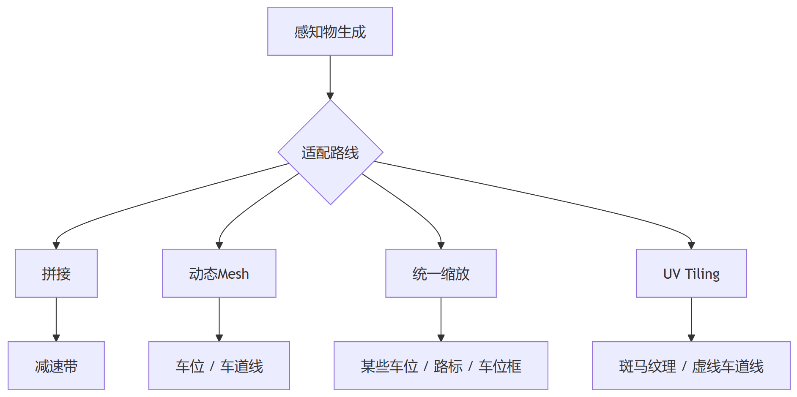
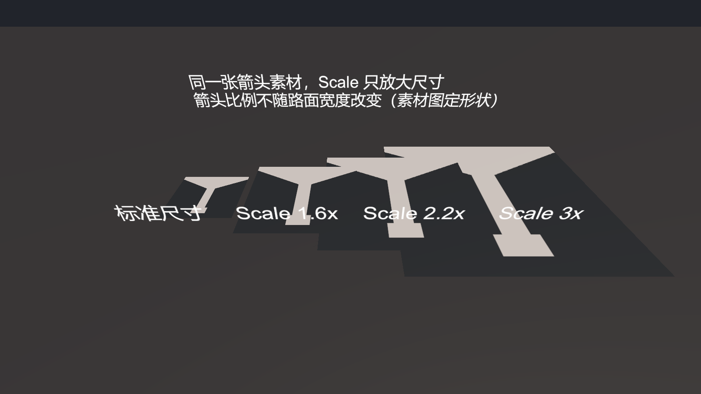
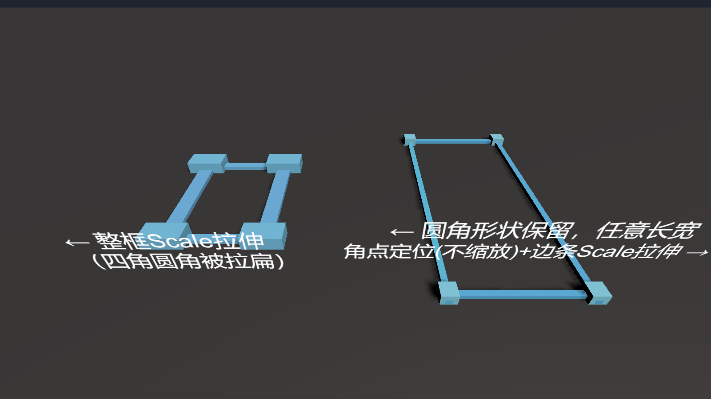
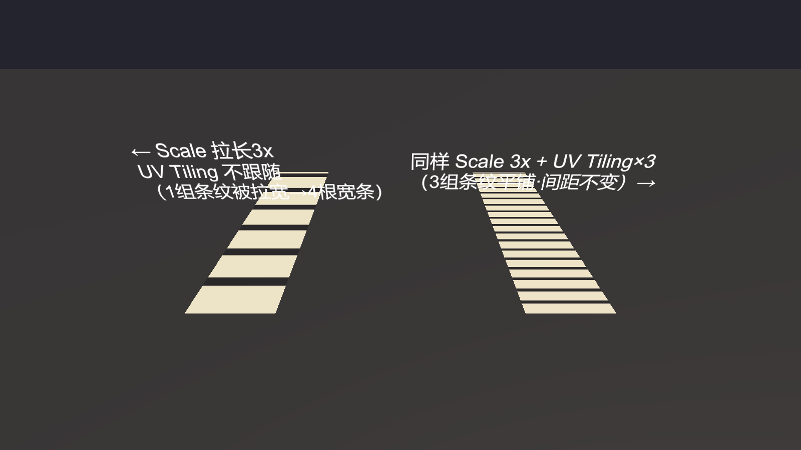

> Today, while browsing the project, I came across the speed bump and remembered that we once did dedicated scaling handling for speed bumps, because of their varying lengths and aspect ratios. That got me thinking: maybe I could write a summary of the handling approaches for all such cases where changing perception data demands the shrink/stretch of an object's shape. Starting from this angle might make an interesting topic.

In SR perception data, we deal with speed bumps, parking-slot base surfaces, parking-slot frames, zebra crossings, and so on. These perceived objects differ from other perceived objects in one respect: they need to be scaled according to the data. Perceived vehicles, traffic cones, and pedestrians, however, are not required to change their size according to the perceived dimensions (if any).

But on the art production side, there's no way we can prepare multiple assets for different sizes. So the situation is usually: one and the same asset, whose form can be adjusted, must ultimately grow longer, wider, and reorient itself according to the perception data.

Below I'll list some cases I've encountered.



---

# 1. Module Assembly

This looks like the most "laborious" handling scheme, suited to **objects that are themselves composed of regular, standard unit pieces**. A speed bump is inherently segment after segment of alternating black and yellow, so we simply make a single segment into a fixed module, compute "how many segments" from the perceived length, and assemble them side by side:

*[Figures omitted; see the original WeChat article]*

The key thing to watch is **reuse**: the speed bump's position and length data can change every frame, and recreating a row of objects every frame and then destroying the old ones carries heavy GC and instantiation costs. So here you can use the object pool written earlier to obtain the unit objects.

Sketch code:

```csharp
// Perceived width (mm converted to m) divided by single-segment width, floored to get the segment count
float width = SizeX * 0.001f;
int count = Mathf.FloorToInt(width / _moduleWidth);   // 0.25 m per segment

// Start from the center, alternating black and yellow unit objects
float startX = -(width / 2) + (_moduleWidth / 2);
for (int i = 0; i < count; i++)
{
    var go = _modules.Count <= i ? NewModule() : _modules[i];  // instantiate only when not enough
    go.transform.localPosition = new Vector3(startX + i * _moduleWidth, 0, 0);
    go.GetComponent<Renderer>().material.color = (i % 2 == 0) ? Color.black : Color.yellow;
    go.SetActive(true);
}

```

---

# 2. Dynamic Mesh Generation

More general than module assembly is to **build the mesh directly from the data**, suited to objects whose shapes can't be regularized and whose textures have almost no image-content variation. This approach is common on parking-slot base surfaces, lane lines, guide lines, and similar objects.

**Parking slots**

A parking slot is expressed with at least one base quad; sometimes it's gray, sometimes light blue. But it's never striped, so stretching has a negligible visual impact on it. Overall, we need to solve three problems: (1) slot length and width differ greatly—some are 6 m × 2.5 m, some may be 12 m × 4 m, etc. (2) We must fit both horizontal and vertical parking slots at the same time—the data's meaning is "depth" and "face width", but the object's Scale carries no such semantics. (3) Angled parking slots—these simply cannot be solved by varying one object's Scale.

*[Figures omitted; see the original WeChat article]*

So we can rely on the coordinates of the 4 corners given by the perception data to draw a simple Mesh, then apply a solid-color semi-transparent material—this way it always matches the actual perception. Such a base quad doesn't care about the slot type, nor the opening direction.

> Here I have to mention the car-front/car-rear parking-direction images: on top of the base quad there's this additional layer to display, but once it's stretched, it certainly won't look like the original image. So it needs a Mesh created according to the corner ordering—on the basis of keeping the UV 0-to-1 direction correct—and the texture is chosen according to the slot type.

**Lane lines / guide lines / stop lines**

Simply put, the mesh generator widens the point array to both sides into a ribbon Mesh, and **lays the UVs by the accumulated arc length along the road**. I've written about how to create this type in a previous article, so I won't repeat the details here.

---

# 3. Scaling

Although scaling looks like the dumbest, most "brute-force" method, I've found it does get used. It applies to cases where **deformation simply doesn't matter**—for example, slots where angled parking can be accepted with just a rotated rectangle, and roadmarks.

**Parking-slot quad**

After receiving the perceived corners:

1. **Compute width and length**: width = the perpendicular distance from a corner to the opposite side; length = the average of the two pairs of opposite sides
2. **Determine the direction**: `width > length` means a horizontal slot; otherwise vertical
3. **Scale + rotate**: for horizontal, `scale=(length/2.5, 1, width/5)` and rotate `-90°`; for vertical, `scale=(width/2.5, 1, length/5)` with no rotation. Ignore the angled case—just use a rectangle.

Sketch code:

```csharp
bool isHorizontal = width > length;                 // just pick horizontal / vertical, one of the two
Vector3 s;
if (isHorizontal) { s = new Vector3(length/2.5f, 1, width/5f); rotY = -90f; }
else              { s = new Vector3(width/2.5f, 1, length/5f); rotY = 0f;  }
slotBase.localScale  = s;                            // the quad's local scale only handles the strip direction
slotBase.localEulerAngles = new Vector3(0, rotY, 0);
// Angled: parent rotation = Atan2 heading from the perceived corners; the quad ignores the angle, only handles horizontal/vertical
transform.rotation = Quaternion.Euler(0, Atan2Angle(corners), 0);

```

**Roadmarks**

Why do road markings (straight-ahead / turn arrows / U-turn marks, etc.) also "dare" to use scaling? Because these things are **standard-sized** in the real world; non-standard roadmark patterns rarely appear. So as long as the asset images are drawn to the national standard, you just scale them to the perceived size.

> Later we even stopped doing the scaling, as shown in the code.



```csharp
// Type delivered by perception → pick asset image + set scale ratio (one fixed ratio per type)
var type = (RoadmarkType)data.roadMarkTypeSeN;
Vector3 scale = new Vector3(1, 1, 4);                 // default
switch (type)
{
    case RoadmarkType.LEFT_RIGHT_TURN:   scale = new Vector3(1.8f, 1, 4); break;
    case RoadmarkType.STRAIGHT_LEFT_TURN:scale = new Vector3(2, 1, 4);     break;
    case RoadmarkType.U_TURN:            scale = new Vector3(1.5f, 1, 4); break;
}
if (!_textures.TryGetValue(type.ToString(), out Texture tex)) return;  // the asset must be findable

// Position = center of the perceived corners; orientation = perceived direction
Vector3 pos = (corners[0] + corners[1] + corners[2] + corners[3]) / 4;
Quaternion rot = Quaternion.Euler(0, -data.heading * 0.0573f - 90, 0);

go.transform.SetPositionAndRotation(pos, rot);
go.transform.localScale = scale;              // the scale comes from the type, not from the size
mat.SetTexture("_BaseMap", tex);
```

---

## Combined Usage: Parking-Slot Frame = Corner Positioning + Edge-Bar Scaling

I once encountered a type of parking slot that required drawing a ring of frame—a border actually presented as 3D objects—while also showing the opening direction. That's when I used the combined approach: it's neither just a single Quad like the base surface, nor a fully re-drawn Mesh like lane lines, but a combination of **assembly (the corner objects)** and **scaling (the edge bars)**.

> The prefab's hierarchy is arranged like this: the slot root node carries a frame-management component, which manages 4 corner objects + 4 edge objects beneath it.



Each frame, after receiving the perceived corners: **compute width and length** -> **place the corners (the "assembly" part)**: put the 4 corner objects at the four corners of the standard rectangle `(±width/2, ±length/2)`; the corner objects themselves don't scale and keep a fixed size -> **stretch the edge bars (the "scaling" part)**: each edge is dynamically lengthened via `localScale` by `(width - 2*corner radius) * scale factor`.

Sketch code:

```csharp
// Bottom edge: centered placement, stretched along the width direction by (perceived width - 2*corner radius) * scale factor
Edge_32.localPosition = new Vector3(0, 0, -length/2f);
Edge_32.localScale    = new Vector3((width - cornerR*2f) * H_STICK_PARAM, 1, 1);

// Left/right edges: centered placement, stretched along the length direction likewise
Edge_30.localPosition = new Vector3(width/2f, 0, 0);
Edge_30.localScale    = new Vector3(1, 1, (length - cornerR*2f) * V_STICK_PARAM);

```

---

# 4. UV Tiling

The last one is the most performance-friendly—just rely on the material's own capability. The scenario it handles resembles the assembly of method 1, and it applies when **you can put the "repetition" into the UVs**. For example, the white-stripe spacing of zebra crossings and the dash density of lane lines are regular, repeating textures. Let the UV tile by physical length while the model itself scales linearly, and the repeating unit automatically fills the space in multiples—no need to touch the Mesh or material instances.



What you control is the material property `_MainTexST`:

- `y`: tiles N times along the model's length direction, spacing unchanged.
- `x`: tiles along the width direction.
- `Offset`: moves the texture origin, e.g. to animate the offset motion of dashes.

```
// _MainTex_ST.x = Tiling X, _MainTex_ST.y = Tiling Y
// _MainTex_ST.z = Offset X,  _MainTex_ST.w = Offset Y
float4 _MainTex_ST;

float2 transformedUV = uv.xy * _MainTex_ST.xy + _MainTex_ST.zw;
half4 color = tex2D(_MainTex, transformedUV);
```

---

## Closing Thoughts

What the above shows is the process of facing one small problem after another and using clever engineering methods (decomposition, compromise...) to satisfy the requirements. I hope you find it interesting too, and that you'll feel confident when facing similar problems in the future.

