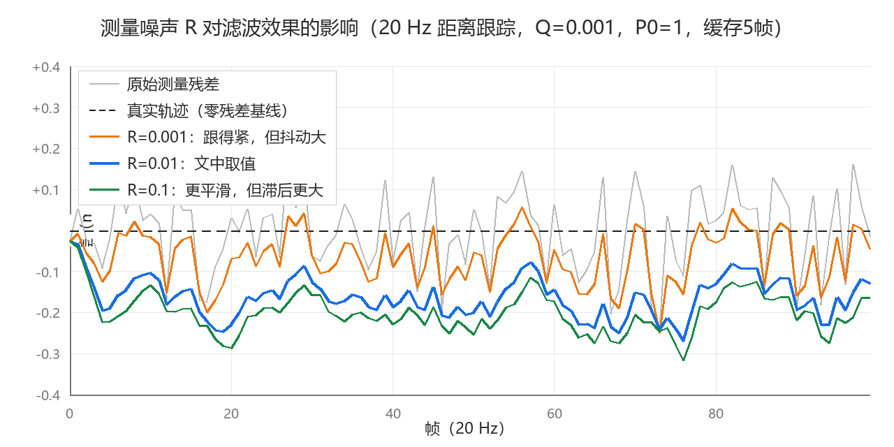
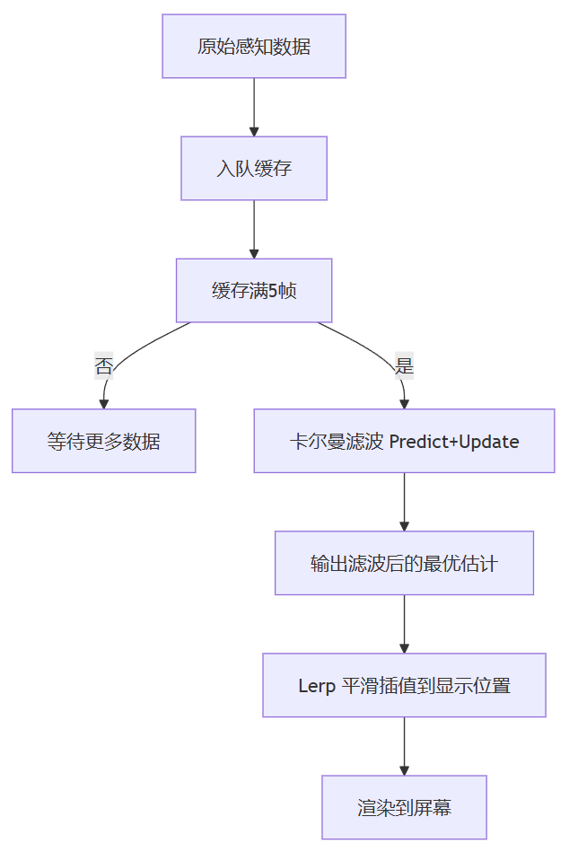

> As I recall, perception-object position jumps appeared in every previous project. And it was an ephemeral kind of problem: looking back now, some instances stopped being watched after a small fix simply never reproduced, while others reproduced constantly during the fixing until—maybe performance improved, maybe the project got merged away—the problem slipped out of sight. Even so, I still think smoothing rendering on top of unsmooth data is an interesting thing to do (though dull from a delivery standpoint). So I'd like to write up a summary based on the effort I once put in.

*[Figures omitted; see the original WeChat article]*

---

# The Phenomenon

**Perceived vehicle positions jump around while driving; judging by the road-line animation, the rendering itself doesn't stutter**.

Playing back SR replay data shows that the received data itself contains jumps. Possible causes: **the perception itself is noisy**—small fluctuations in the object positions detected by radar or vision; **the communication link fluctuates**—either performance jitter in the ADC, or data dropped during the forwarding process after the QNX receives it; or **the fact of emerging from occlusion**: a vehicle in the second lane occludes a faster-moving vehicle in the third lane, and the moment the third-lane vehicle reappears, some jumping occurs.

In any case, if you display the raw data directly, perception objects jitter or teleport across the screen. From an experience standpoint, that's a small thing that erodes user trust.

I've come across two ways of handling it (Gaussian convolution comes later—not the one I used back then):

- **Lerp interpolation**: interpolate from the current position toward the target position every frame, forever chasing.
- **Kalman filtering**: predict a value and obtain an optimal estimate.

---

# The Kalman Filter

The core logic of the Kalman filter: you have a measurement (the position data the ADAS system outputs) and a prediction (where the object should be now, inferred from its previous motion trend). Neither is fully accurate, but they can be fused with weights. The coefficient K deciding which value to trust more is itself computed and varies: leaning toward the measurement makes the response more pronounced and prone to jumping; leaning toward the prediction makes it smoother and more lagged.

## Preset Three Parameters:

One is R, the measurement noise: it represents the sensor's measurement precision. For a millimeter-wave radar, assume measurement precision of ±0.1 m; then take its square as R, R = 0.01 m². In other words, R roughly equals the precision variance.



One is Q, the process noise: it represents the error between your judgment of the trend of change and the actual change. It's rather a gut call, tuned bit by bit. If you have no direction to start, set it to one tenth of R and tune from there, e.g. 0.001 m.

And one is P, the error covariance: it expresses how much you trust the initial estimate. Relative to R, give it a value 10× to 100× larger. It converges quickly through the iteration, so what it affects is the early convergence—no big deal. So below we preset 1.0 m².

## The Formulas:

1. Current estimate = the previously computed estimate (none yet? Then take the first frame's measurement)
2. Error covariance P = error covariance P + process noise Q
3. Kalman gain K = error covariance / (error covariance + measurement noise R)
4. Update: new estimate = current estimate + K × (this frame's measurement − current estimate)
5. Update: new error covariance P = (1 − K) × error covariance P

## Sketch code:

```csharp
public double Update(double measurement)
{
    kalmanGain = errorCovariance / (errorCovariance + measurementNoise); // compute the gain
    estimatedValue += kalmanGain * (measurement - estimatedValue);       // fuse the measurement
    errorCovariance = (1 - kalmanGain) * errorCovariance;                // update the covariance
    return estimatedValue;
}

```

## A Data Example

Typical precision specs of a 77 GHz front-looking millimeter-wave radar:


| Measurement dimension | Nominal precision          | Corresponding R (variance = precision²)         |
| ---- | ------------- | ---------------------- |
| Range   | ±0.1 ~ 0.15 m | R_ρ = 0.01 ~ 0.0225 m² |
| Radial velocity | ±0.1 m/s      | R_v = 0.01 (m/s)²      |
| Azimuth angle  | ±0.1° ~ 0.3°  | R_θ = 0.01° ~ 0.09°    |


Taking range tracking (20 Hz) as the example:


| Parameter            | Typical value      | Notes            |
| ------------- | -------- | ------------- |
| **R (measurement noise)**   | 0.01 m²  | Square the ranging precision ±0.1 m |
| **Q (process noise)**   | 0.001 m² | One tenth of R as the order of magnitude |
| **P₀ (initial covariance)** | 1.0 m²   | Set it large for fast convergence      |


### **Scenario**

A vehicle ahead cruises at constant speed 50 meters away; the millimeter-wave radar outputs a range measurement every 50 ms, with ±0.1 m noise.

### **Initial state (frame 0)**

- Estimate x̂₀ = 50.0 m (take the first frame's measurement directly as the initial value)
- Error covariance P₀ = 1.0 m²
- Q = 0.001, R = 0.01

### **Frame 1: measurement z₁ = 50.08 m received**


| Step       | Formula                                   | Calculation                                | Result           |
| -------- | ------------------------------------ | --------------------------------- | ------------ |
| 1. Predict the estimate | x̂_pred = x̂_prev                    | = 50.00                           | 50.00 m      |
| 2. Predict the covariance | P_pred = P_prev + Q                  | = 1.000 + 0.001                   | **1.001 m²** |
| 3. Kalman gain | K = P_pred / (P_pred + R)            | = 1.001 / (1.001 + 0.01)          | **0.990**    |
| 4. Update the estimate | x̂_new = x̂_pred + K × (z - x̂_pred) | = 50.00 + 0.990 × (50.08 - 50.00) | **50.079 m** |
| 5. Update the covariance | P_new = (1 - K) × P_pred             | = (1 - 0.990) × 1.001             | **0.010 m²** |


In the first frame K is as high as 0.99—almost fully trusting the measurement—because the initial P is large and the filter has no confidence in its own prediction. But the new P plunges from 1.0 to 0.01, reaching R's order of magnitude in a single frame.

### **Frame 2: measurement z₂ = 49.93 m received**


| Step       | Formula                                   | Calculation                                  | Result            |
| -------- | ------------------------------------ | ----------------------------------- | ------------- |
| 1. Predict the estimate | x̂_pred = x̂_prev                    | = 50.079                            | 50.079 m      |
| 2. Predict the covariance | P_pred = P_prev + Q                  | = 0.010 + 0.001                     | **0.011 m²**  |
| 3. Kalman gain | K = P_pred / (P_pred + R)            | = 0.011 / (0.011 + 0.01)            | **0.524**     |
| 4. Update the estimate | x̂_new = x̂_pred + K × (z - x̂_pred) | = 50.079 + 0.524 × (49.93 - 50.079) | **50.001 m**  |
| 5. Update the covariance | P_new = (1 - K) × P_pred             | = (1 - 0.524) × 0.011               | **0.0052 m²** |


In the second frame K drops to 0.52—trusting measurement and prediction about equally. The measurement jumps from 50.08 to 49.93, yet the filter output only moves from 50.079 to 50.001 (a change of 0.078 m). **The noise is cut nearly in half**.

### **Frame 3: measurement z₃ = 50.02 m received**


| Step       | Formula                                   | Calculation                                  | Result            |
| -------- | ------------------------------------ | ----------------------------------- | ------------- |
| 1. Predict the estimate | x̂_pred = x̂_prev                    | = 50.001                            | 50.001 m      |
| 2. Predict the covariance | P_pred = P_prev + Q                  | = 0.0052 + 0.001                    | **0.0062 m²** |
| 3. Kalman gain | K = P_pred / (P_pred + R)            | = 0.0062 / (0.0062 + 0.01)          | **0.382**     |
| 4. Update the estimate | x̂_new = x̂_pred + K × (z - x̂_pred) | = 50.001 + 0.382 × (50.02 - 50.001) | **50.008 m**  |
| 5. Update the covariance | P_new = (1 - K) × P_pred             | = (1 - 0.382) × 0.0062              | **0.0038 m²** |


In the third frame K continues down to 0.38—the filter grows ever more "confident." The measurement 50.02 deviates from the prediction 50.001 by only 0.019 m, and the filter output nudges by 0.007 m. **The smoothing effect is now clearly visible**. You can see a clear trend: **K falls frame by frame, P converges frame by frame, and the filter goes from blindly confident to having a feel for the situation**.

From steps 2 and 3 you can see that every time Q pulls the expectation up, R pulls it back down; at steady state, K is effectively a value determined by Q and R. In the example above, steady state trusts the measurement about 27% and the prediction about 73%, which approximates K ≈ √(Q/R)—a handy back-of-the-envelope calculation.

*[Figures omitted; see the original WeChat article]*

The figure above is the classic illustration of a Kalman filter's effect: the black dashed line is the raw measurement error (large jitter), and the red dotted line is the error after Kalman filtering (noticeably smoother).

> In a real ADAS system, even just for the range dimension, Q and R are not constant: the farther the target, the larger the error, so R should grow dynamically; Q should also auto-adjust for turns and acceleration to let the filter adapt faster. That is adaptive Kalman filtering.

---

# Applying It in the Project

## Data Caching and Filtering

Each perception object has a `DataBuffer` object, which internally maintains a queue caching at most 5 frames, plus one Kalman filter for each of the X and Y directions:

```csharp
public class DataBuffer
{
    private Queue<PerceptionObject> _cache;      // queue caching at most 5 frames
    private KalmanFilter _kalmanFilterX;          // filter for the X direction
    private KalmanFilter _kalmanFilterY;          // filter for the Y direction
    private PerceptionObject _filteredData;       // the filtered optimal estimate
    private PerceptionObject _displayData;        // the currently displayed position
}

```

## Data Input

Each time a new frame of perception data arrives, the `Add` method is called. When a perception object reappears after being occluded, its position may differ by tens of meters. If you keep filtering with the old filter, the output would slowly chase its way from the old position to the new one. So when the distance exceeds a threshold, reset the filter outright:

```csharp
public void Add(PerceptionObject data)
{
    if (_cache.Count == 0)
    {
        InitFilter(data.centerPositionX, data.centerPositionY); // initialize the filter on the first frame
        _filteredData.Clone(data);
    }
    else
    {
        // Compute the distance between the new data and the last estimate; a jump too large means it reappeared after occlusion—reset the filter
        double dx = data.centerPositionX - _filteredData.centerPositionX;
        double dy = data.centerPositionY - _filteredData.centerPositionY;
        if (Math.Sqrt(dx * dx + dy * dy) > distanceFilter)
        {
            _cache.Clear();
            InitFilter(data.centerPositionX, data.centerPositionY);
        }
        _cache.Enqueue(data);
        if (_cache.Count > _maxCacheSize) _cache.Dequeue();  // over the cap, drop the oldest
        PredictNextState();
    }
}

```

## Core Computation

For the multi-frame data in the cache, run the Kalman filter's Predict and Update frame by frame:

```csharp
// Feed each frame of data in the cache (X direction shown) to the filter one by one
foreach (int x in positionX)
{
    _kalmanFilterX.Predict();          // predict first
    _kalmanFilterX.Update(x);          // then correct with the measurement
}
_filteredData.centerPositionX = (int)_kalmanFilterX.GetValue(); // take the optimal estimate

```

A Kalman filter takes time to converge. Iterating over multiple frames of data one by one lets the filter converge to a stable estimate more thoroughly. A 5-frame cache is a compromise empirical value.

## Data Output

The Kalman filter is not a universal, vision-oriented answer. When it's really time to drive the rendering, another layer of Lerp smoothing is added.

Kalman filtering and Lerp can be regarded as the results of thinking from two different levels: the former wants the data clean, optimal, denoised; the latter targets smooth animation at the rendering stage.

This may depend on the specific ADAS data and system situation; whether to add it is optional based on actual behavior:

```csharp
public PerceptionObject GetData()
{
    _timeElapsed += Time.deltaTime; // reset when new data arrives
    float t = _timeElapsed / duration;  // duration = 0.2s
    // Interpolate from the currently displayed position toward the filtered position
    _displayData.centerPositionX = (int)Mathf.Lerp(_displayData.centerPositionX, _filteredData.centerPositionX, t);
    return _displayData;
}

```



---

# On Gaussian Convolution Filtering

Besides the Kalman filter, Gaussian convolution filtering is another way to smooth perception trajectories. It's often compared against the Kalman filter and is usually positioned as the fallback option.

The essence of Gaussian convolution filtering is the **weighted average of data within a window**. Suppose a 3-to-5-frame data window: accumulate each frame's position weighted by a Gaussian distribution—small weights at the ends, large in the middle—then divide by the total weight to get the smoothed position.

```csharp
// 3-frame Gaussian convolution, weights following a Gaussian distribution [0.1, 0.8, 0.1] as an illustration
float targetX = 0.1f * frameN2.x + 0.8f * frameN1.x + 0.1f * frameN.x;
float targetY = 0.1f * frameN2.y + 0.8f * frameN1.y + 0.1f * frameN.y;

```

The essence of Gaussian convolution filtering is a weighted sum over the data inside a historical window. The larger the window, the smoother the result but the greater the lag—typically 3 to 5 frames, sometimes more than 100 ms.

Its fundamental difference from the Kalman filter: **Gaussian convolution "averages," the Kalman filter "estimates"**. The former neutralizes noise via the window, compromising toward history, and responds slowly to sudden changes; the latter can judge whether a fluctuation is real motion or noise—it can both estimate the current position and, through a filter reset, respond immediately to sudden target changes, outputting an optimal estimate closer to the true trajectory.

However, Gaussian convolution is algorithmically simple, performant, and consumes almost no compute, so under tight compute budgets it genuinely has its value.

For selection, you can implement both and actually run them. If the Kalman filter's CPU cost is a bit high, you can also try moving it into a Compute Shader. As long as compute allows, the Kalman filter deserves the stronger consideration.

---

# Closing

After all this discussion: if you actually hit this situation during delivery, the cockpit IVI side most likely would not proactively apply the methods above to "optimize" or act as a "safety net" at the outset of the problem. Judged by functional roles, what 3D rendering does is express real data. It should not discard the truthfulness of the data for the sake of visual comfort, and it should not presume, as a shaper of visual interaction, to interpret and correct driving-perception safety data on its own.
