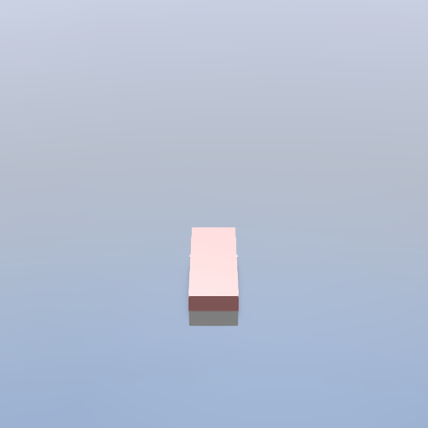
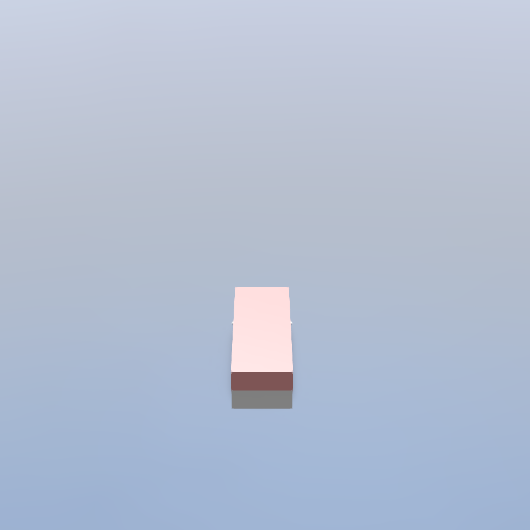
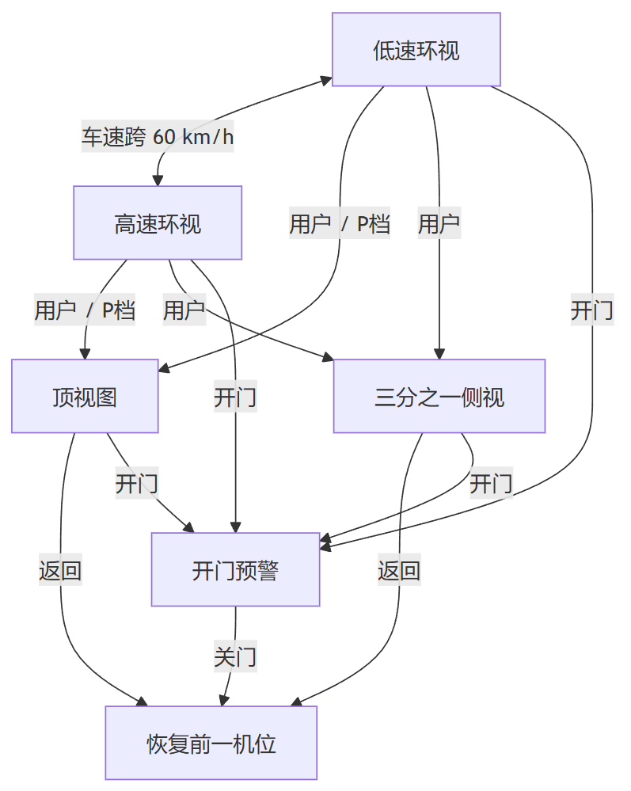
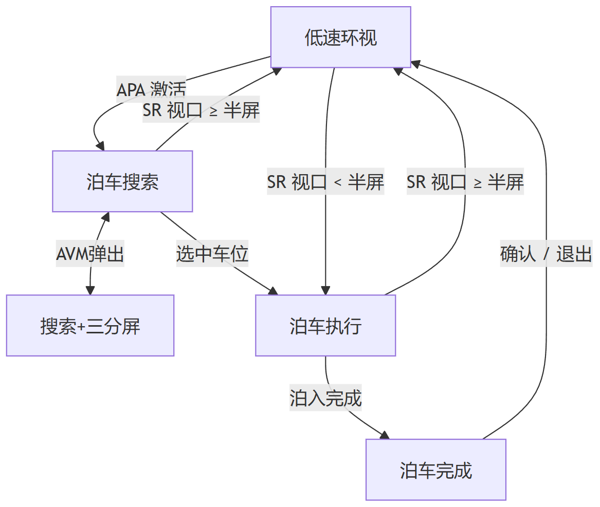
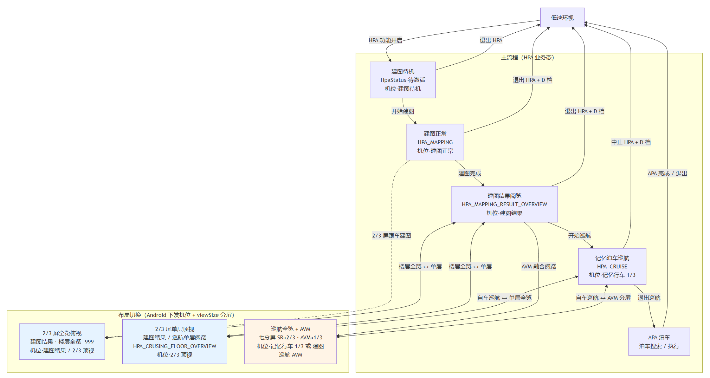

> SR—especially the driving-idling-parking integrated launcher—tends to require many camera-position states, because the driving/idling/parking needs are fairly complex. And as the business gets developed step by step, all kinds of camera-angle bugs keep coming up. So I want to sort out the SR-related camera positions. This article is limited to the business requirements I've personally encountered; I hope that when I revisit this area later, I can see the technical implementation more completely.

## 1. SR Camera Positions

SR camera positions fall into four business groups: **driving surround view**, **door-open warning (DOW)**, **APA auto parking**, and **HPA memory parking**. Some positions are reused across features (e.g. the "one-third-screen view" serves both driving and APA).

### 1.1 Driving Surround View


| Position | Business scenario | Picture characteristics |
| -------- | ----------------------------- | ------------------ |
| **Low-speed surround** | City car-following, regular low-speed driving (below roughly 60 km/h) | Near-field perspective, about 15 m visible front and rear |
| **High-speed surround** | Highway/expressway (about 60 km/h and above) | Distant top-down view, front/rear view pulled far, less perspective distortion |
| **Top view** | P-gear parking, surround-radar display, user-initiated switch to overhead | Vertical or near-vertical top-down, 360° surround |
| **One-third split screen** | Used when the AVM picture pops up; sometimes takes the left third of the frame, sometimes two-thirds | Picture center shifts left |


#### Low-Speed Surround

The default view for everyday driving, used when vehicle speed is below the threshold.

*[Figures omitted; see the original WeChat article]*

#### High-Speed Surround

Switches automatically once speed rises, keeping distant road conditions readable.

*[Figures omitted; see the original WeChat article]*

#### Top View

Entered in P gear, radar-related scenarios (PDC), or on the user's manual request; unlike the full-screen car-following view of low/high-speed surround, it emphasizes the panorama around the vehicle body.

*[Figures omitted; see the original WeChat article]*

#### One-Third Split-Screen View

The AVM picture pops up, and the SR picture's focal point shifts left. This shifted view can combine with the regular driving view, the long-range driving view, and the driving top view. The figure below shows only the split-screen view combined with the regular driving view:

*[Figures omitted; see the original WeChat article]*

---

### 1.2 Door-Open Warning (DOW)

When any door opens and there is a risk of approaching vehicles, **hard-cut** to the corresponding warning position; after the door closes, **return to the camera position from before DOW was entered**.


| Position | Trigger |
| -------- | ------ |
| **Front-left warning** | Front-left door opens |
| **Front-right warning** | Front-right door opens |
| **Rear-left warning** | Rear-left door opens |
| **Rear-right warning** | Rear-right door opens |
| **Left-side warning** | Multiple left-side doors combined |
| **Right-side warning** | Multiple right-side doors combined |
| **Both-sides warning** | Left and right doors open simultaneously |


DOW has the highest priority and can interrupt any current camera position in driving, APA, or HPA.

Left-side / front-left / rear-left warnings:

*[Figures omitted; see the original WeChat article]*

Right-side / front-right / rear-right warnings:

*[Figures omitted; see the original WeChat article]*

---

### 1.3 APA Auto Parking


| Position | Business scenario | Picture characteristics |
| ---------- | ------------ | ----------------- |
| **Parking search** | Scanning for spots after APA activates | Top-down/surround search, available spots highlighted |
| **Parking maneuver** | Auto park-in/park-out after a spot is selected | Top-down view of the park-in/park-out process |
| **Parking + split screen** | Any parking phase, with AVM popped up | Search or park-in/park-out process + 1/3 screen |
| **Parking complete** | Confirmation after park-in finishes | Completion-state top-down confirmation |


#### Parking Search

The viewpoint is a bit higher than the regular driving view, but not all the way to a full overhead view.



#### Search One-Third Side View


#### Parking Maneuver

Pure top-down, moderate viewing distance.


#### Parking Complete

The view zooms in, an oblique view from above

*[Figures omitted; see the original WeChat article]*

---

### 1.4 HPA Memory Parking

HPA has two tracks: **cruising** (driving along the memorized route) and **mapping** (learning the parking lot). Camera positions match the business-state signals.

**Cruising (supports the 1/3-screen layout)**

Very similar to the parking-search view; you can also design it to differ



**Mapping**


| Position | Business scenario |
| ------------- | -------------------- |
| **Mapping standby** | HPA feature on, vehicle stationary, waiting to start mapping |
| **Mapping normal** | Mapping cruise data collection |
| **Mapping 2/3 normal** | 2/3-screen layout during mapping |
| **Mapping 2/3 top view** | Top-view 2/3 screen during mapping |
| **Mapping cruise AVM** | Surround video fused with mapping cruise |
| **Mapping return** | After mapping completes, returning to the start point along the memorized route |
| **Mapping result** | Mapping complete, browsing the map in full view |
| **Mapping result AVM** | Mapping result + AVM fused browsing |


Mapping has no fixed viewpoint, so no diagrams are shown here. Two things to note:

1. With AVM and without AVM are different camera adjustment strategies.
2. Viewing the mapping result during cruising differs from viewing it after learning completes.

---

## 2. Camera-Position Transitions

### SR Driving



> DOW can cut in at any moment
>
> When APA/HPA activates, **leave the driving view**

---

### APA Parking



**Typical chain**

```
Low-speed surround → Parking search → Parking maneuver → Parking complete → Low-speed surround
              ↕ AVM pops up
         Search + one-third split screen
```

---

### HPA Memory Parking



**Typical closed loop**

```
Mapping standby → Mapping normal → Mapping result → Cruising → Exit cruise into APA
                ↕      layout switching      ↕
         2/3-screen full-view top-down / 2/3-screen single-floor top view / cruise full view + AVM
```

---

## Closing Thoughts

Camera state management is one of the more tedious 3D HMI modules, and one that demands alignment with many parties. Especially if you're also doing one-take transitions, the camera module will become the shared module of all 3D apps. Every app needs to feed its requirements to this module's developers, for unified development and implementation.

