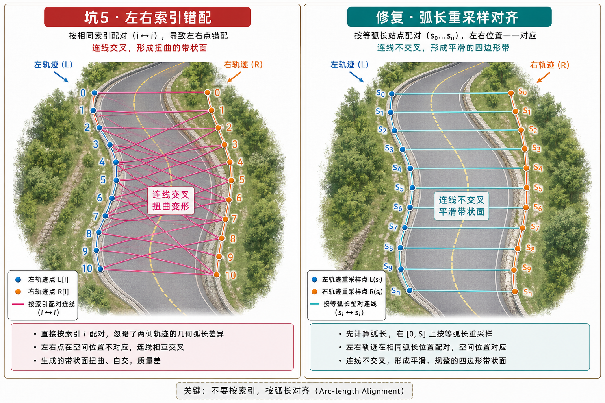

> 在智驾座舱SR（Surround Reality）开发中，根据中心线或者左右边界生成三维条带Mesh（用来做轨迹线、引导线、车道带等）是非常高频的需求，但很多时候会因为几何与数据质量的问题，出现一些意想不到的绘制状态。

本文整理五个最常见的“坑”：**纵坡扭转与褶皱、稀疏折线段、过密折线性能、折返尖刺、双边界索引错配**。把量产开发里这常见的五个坑和修复思路整理出来。

---

## 1. 转弯下坡路段，轨迹线有明显褶皱

*[配图见公众号原文]*

### 现象

在记忆泊车的建图结果中，随着进入地下车库的**下坡+转弯** ，路径出现 **褶皱/颠簸**，像有一张薄纸被折过。这个视觉感受是因为有多个三角面隆起和塌陷，当轨迹线的材质是半透的时候，还会看到有颜色上的深浅变化。

### 根因

如果直接用三维路径的切向计算侧向偏移，方向会带着明显的纵向分量，侧向就不会落在水平面，偏移后左右顶点Y值不一致，条带自然没法平整“贴”在路面上。因此 **同一点索引下左右顶点高度不齐**，多段一高一低，这个时候三角剖分容易出现有的面的往上拉，有的面往下走。

### 修复思路

把切向**投影到水平面**（比如XZ平面）重建，只保留水平分量再归一化，之后再用原来的公式计算偏移。这样同一个索引处**左右顶点都会继承中心线上的点的原本高度**，纵坡由中心线本身表达，不会因为侧向偏移产生高度差。

### 示例代码

```csharp
using UnityEngine;

/// <summary>示意：仅在水平面（XZ）内扩宽；左右缘与中心线同索引处 Y 相同，避免纵坡条带扭转。</summary>
static class RibbonExpandFlat
{
    static Vector3 FlattenXZ(Vector3 v) => new Vector3(v.x, 0f, v.z);

    const float FlatEps2 = 1e-10f;

    /// <summary>中间顶点：与常见 polyline Expand 相同的有向边约定（入段沿 prev→cur，出段沿 cur→next 的水平投影）。</summary>
    public static Vector3 OffsetPointInterior(Vector3 prev, Vector3 cur, Vector3 next, float signedHalfWidth)
    {
        Vector3 curIn = FlattenXZ(prev - cur);   // 指向前一点的水平方向
        Vector3 curOut = FlattenXZ(next - cur); // 指向下一点的水平方向
        if (curIn.sqrMagnitude < FlatEps2) curIn = curOut;
        if (curOut.sqrMagnitude < FlatEps2) curOut = curIn;
        curIn.Normalize();
        curOut.Normalize();

        float halfTurnDeg = Vector3.Angle(curIn, curOut) * 0.5f;
        Vector3 cross = Vector3.Cross(curIn, curOut);
        float signedHalfDeg = cross.y >= 0f ? halfTurnDeg : -halfTurnDeg;

        // 将「入段」绕竖轴旋转带符号半角，得到拐角平分方向上的单位法向（仍在水平面内）
        Vector3 nor = Quaternion.AngleAxis(signedHalfDeg, Vector3.up) * curIn;
        nor.y = 0f;
        if (nor.sqrMagnitude < FlatEps2)
            nor = Quaternion.AngleAxis(90f, Vector3.up) * curIn;
        nor.Normalize();

        float miter = Mathf.Abs(signedHalfDeg) < 1f
            ? 1f
            : 1f / Mathf.Sin(Mathf.Abs(signedHalfDeg) * Mathf.Deg2Rad);

        return cur - nor * (signedHalfWidth * miter);
    }

    /// <summary>起点：仅出段；法向为出段逆时针转 90°（与常见 Expand 首点约定一致）。</summary>
    public static Vector3 OffsetPointStart(Vector3 cur, Vector3 next, float signedHalfWidth)
    {
        Vector3 curOut = FlattenXZ(next - cur);
        if (curOut.sqrMagnitude < FlatEps2) return cur;
        curOut.Normalize();
        Vector3 nor = Quaternion.AngleAxis(-90f, Vector3.up) * curOut;
        nor.y = 0f;
        nor.Normalize();
        return cur - nor * signedHalfWidth;
    }

    /// <summary>终点：仅入段；法向为入段顺时针转 90°（与常见 Expand 末点约定一致）。</summary>
    public static Vector3 OffsetPointEnd(Vector3 prev, Vector3 cur, float signedHalfWidth)
    {
        Vector3 curIn = FlattenXZ(prev - cur);
        if (curIn.sqrMagnitude < FlatEps2) return cur;
        curIn.Normalize();
        Vector3 nor = Quaternion.AngleAxis(90f, Vector3.up) * curIn;
        nor.y = 0f;
        nor.Normalize();
        return cur - nor * signedHalfWidth;
    }
}

```

---

## 2. 引导线前端出现尖角

*[配图见公众号原文]*

### 现象

车身前的引导线的顶端偶然出现尖角，可以明确是智驾数据导致的，但是需要兜底修复。

### 根因

中心线的点数组，前面还是间距恒定的一个个点，但是突然出现 **若干米只有两个点**。条带挤出扩宽时，每个顶点处的侧向偏移方向，都依赖前后两段折线的切向共同计算——不管是角平分、miter斜接还是端点单侧切向 extrapolate 都是如此。当入段极短、出段极长（或者反过来）时：

1.顶点处的合成切向/法向几乎被超长段方向完全主导，短边对拐弯的贡献微乎其微

2.下一个顶点又会换成另一套长短比例，导致侧向方向逐点跳变

最终，网格左右轮廓线就会在局部出现方向突变，肉眼看到的就是突兀的几何尖角。哪怕材质贴图没有拉伸，轮廓本身已经歪了。

### 修复思路

核心目标就是让每个顶点两侧的几何对切向计算的贡献"势均力敌"，避免单侧超长完全主导方向：设置段长上限兜底：只要两点间距 ||P_{i+1}-P_i|| > L_max，就对这段做线性插值补点，保证每一段长度都不超过阈值。

### 示例代码

```csharp
using System.Collections.Generic;
using UnityEngine;

static class PolylineSubdivide
{
    /// <summary>任意两点超过 maxSegLen 则线性插值插入中间点。</summary>
    public static List<Vector3> LimitSegmentLength(IReadOnlyList<Vector3> src, float maxSegLen)
    {
        var dst = new List<Vector3> { src[0] };
        float maxSqr = maxSegLen * maxSegLen;
        for (int i = 0; i < src.Count - 1; i++)
        {
            Vector3 a = src[i], b = src[i + 1];
            Vector3 ab = b - a;
            float len = ab.magnitude;
            if (len < 1e-6f) continue;

            int cuts = Mathf.CeilToInt(len / maxSegLen);
            for (int k = 1; k < cuts; k++)
                dst.Add(Vector3.Lerp(a, b, (float)k / cuts));
            dst.Add(b);
        }
        return dst;
    }
}

```

---

## 3. 绘制轨迹线较多较长时，性能压力大

*[配图见公众号原文]*

### 现象

每一数据帧，无论线长线短，成百上千个顶点全部送去计算，构建Mesh。不管是后台线程还是主线程都会出现耗时尖刺，严重影响帧率稳定性。

### 根因

过多冗余顶点会徒增计算、存储和渲染成本，完全没必要。

### 修复思路

**抽稀**：相邻点距离小于阈值（一般0.1m）直接合并。

> 抽稀和上一步的插值细分顺序不要搞反：一般先去噪合并近点，再按最大段长补点，不然两个操作会相互抵消。

### 示例代码

```csharp
using System.Collections.Generic;
using UnityEngine;

static class PolylineDedup
{
    public static List<Vector3> DropNearDuplicates(IReadOnlyList<Vector3> src, float minDist)
    {
        var dst = new List<Vector3>(src.Count) { src[0] };
        Vector3 last = src[0];
        float minSqr = minDist * minDist;
        for (int i = 1; i < src.Count; i++)
        {
            if ((src[i] - last).sqrMagnitude >= minSqr)
            {
                dst.Add(src[i]);
                last = src[i];
            }
        }
        return dst;
    }
}

```

---

## 4. 泊车轨迹在折返处出现尖刺

*[配图见公众号原文]*

### 现象

真实驾驶中经常会有避让、揉库操作，出现“**前进→回退→再前进**”的局部折返，点序还是单调索引，但条带会生成极长的斜接或者**针状三角形**，视觉效果非常奇怪。

### 修复思路

**反复扫描检测，删除大折角折返的中间尖点**：连续扫描点列，只要连续三段点的前后方向点积小于阈值（对应折角大于100°，接近掉头），就删掉中间的尖刺点；反复扫描直到没有可删除的尖刺点，消除局部折返带来的针状三角形基础。

### 示例代码

```csharp
using System.Collections.Generic;
using UnityEngine;

static class PolylineFoldback
{
    const float DotThreshold = -0.3f; // 约 >100° 折角

    /// <summary>反复扫描，移除产生锐折返的中间点。</summary>
    public static void RemoveZigZagSpikes(List<Vector3> pts)
    {
        bool removed;
        do
        {
            removed = false;
            for (int i = 0; i < pts.Count - 2; i++)
            {
                Vector3 d1 = (pts[i + 1] - pts[i]).normalized;
                Vector3 d2 = (pts[i + 2] - pts[i + 1]).normalized;
                if (Vector3.Dot(d1, d2) < DotThreshold)
                {
                    pts.RemoveAt(i + 1);
                    removed = true;
                    break;
                }
            }
        } while (removed);
    }
}

```

---

## 5. S弯/大弯，构建的轨迹线扭曲错位



### 现象

智驾有时直接下发 **左右车道线 / 道路边界**，点数相同且 **语义上同索引**。在 **缓弯** 时这样配对没问题；遇到 **S弯/大弯**，同一索引的左右点可能在空间上 **相距很远**，仍硬连三角带会得到 **横穿弯道内部的细长三角形**，纹理与光照都很怪。

### 根因

把数组下标`i`当成了 **同一里程截面** 的对应关系，实际上我们需要的是 **弧长参数** 上的对应，不是索引对应。

### 修复思路

**分别计算累积弧长，按统一步长重新采样对齐左右边界:**

1. 先分别计算左右两条边界折线的累积弧长。
2. 从0开始按固定步长取采样点，每个步长位置分别在左右边界上插值得到对应顶点。
3. 用重新采样对齐后的顶点对构建条带，保证同一采样位置的左右顶点在弧长参数上对齐，而不是简单按数组索引配对。

### 示例代码

```csharp
using System.Collections.Generic;
using UnityEngine;

static class DualRailResample
{
    static float[] CumulativeLengths(IReadOnlyList<Vector3> poly)
    {
        var c = new float[poly.Count];
        for (int i = 1; i < poly.Count; i++)
            c[i] = c[i - 1] + Vector3.Distance(poly[i - 1], poly[i]);
        return c;
    }

    static Vector3 SampleAtArcLength(IReadOnlyList<Vector3> poly, float[] cum, float s)
    {
        // 二分或线性扫描找到所在段，再 Lerp —— 此处略写为线性扫描示意
        int seg = 0;
        while (seg < poly.Count - 1 && cum[seg + 1] < s) seg++;
        seg = Mathf.Clamp(seg, 0, poly.Count - 2);
        float t = Mathf.InverseLerp(cum[seg], cum[seg + 1], s);
        return Vector3.Lerp(poly[seg], poly[seg + 1], t);
    }

    public static void BuildMatchedStrip(
        IReadOnlyList<Vector3> left, IReadOnlyList<Vector3> right,
        float stepMeters, List<Vector3> outL, List<Vector3> outR)
    {
        outL.Clear(); outR.Clear();
        float[] lC = CumulativeLengths(left);
        float[] rC = CumulativeLengths(right);
        float total = Mathf.Max(lC[^1], rC[^1]);
        for (float s = 0f; s <= total; s += stepMeters)
        {
            outL.Add(SampleAtArcLength(left, lC, Mathf.Min(s, lC[^1])));
            outR.Add(SampleAtArcLength(right, rC, Mathf.Min(s, rC[^1])));
        }
    }
}

```

---

## 总结


| **坑**  | **核心问题**        | **修复思路**        |
| ------ | --------------- | --------------- |
| 纵坡褶皱   | 三维切向偏移导致左右顶点高度差 | 水平面内重建切向，水平扩宽   |
| 大间距尖角  | 几何欠采样，方向突变      | 最大段长限制，插值补点     |
| 过密性能差  | 冗余顶点徒增成本        | 保形抽稀，距离过滤       |
| 折返尖刺   | 局部锐角导致数值爆炸      | 折角检测+窗口裁剪，限制斜接长 |
| 双边错配扭曲 | 索引对齐≠弧长位置对齐     | 分别计算弧长，统一重采样对齐  |


---

## 结语

至此，我们已经把智驾SR里“线条”的基础逻辑和工程问题梳理完整了。然而SR还原真实驾驶环境，不止有路径、车道线这类线元素，还需要用占用栅格（OCC）表达可通行区域，也就是“面”，下一篇我们就来聊聊，绘制“面”的工程问题。