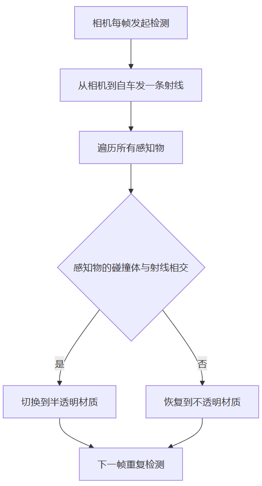
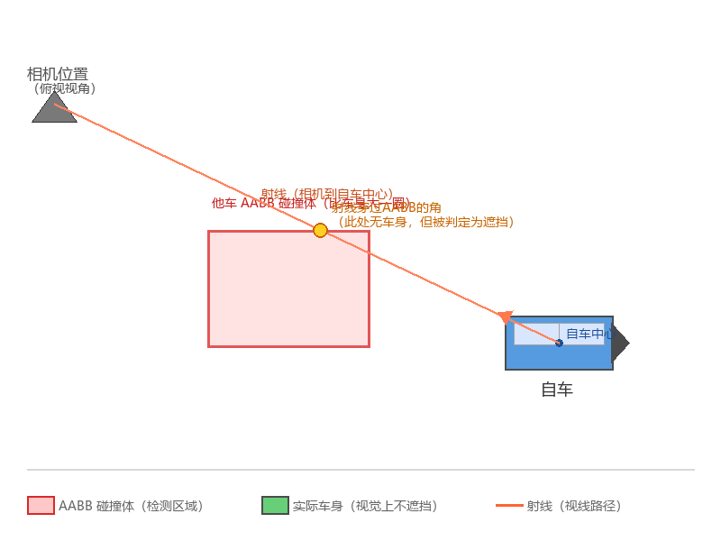

> 上一篇写了StyleCatalog怎么做SR换肤。今天聊一个更具体的小功能：SR相机在看向自车时，视线路径上如果有其他车辆或某些感知物，那么这些感知物需要变成半透明效果。

相机旋转到某个角度时，视线方向上可能有其他车辆或大型障碍物挡在自车前面。如果这些物体完全不透明，自车就被遮住了，用户看不到自车的状态。这是直接影响到关键信息传达的。

而要实现这个功能，在原理上比较明显，但是在开发中时常遇到比如已经遮挡了，却没变半透；或者明明还没遮挡，却先变成半透了的问题。这类问题可能和做法有关，但我认为任何一种在考虑了性能之后能上量产的方案，都很难避免所有极端的 Case。因此这项功能本身是可以有一点的容错范围的。

---

# 业务逻辑



---

# 检测逻辑

## **每帧执行**

1. **计算射线**：用`WorldToScreenPoint`把自车位置（世界原点）转换到屏幕坐标，再从相机位置朝这个屏幕坐标发一条射线。
2. **遍历检测**：对每个注册了遮挡检测的感知物，判断它的碰撞体包围盒是否与射线相交。
3. **设置状态**：相交就调用`SetOcclusion(true)`，不相交就`SetOcclusion(false)`
4. **清理休眠对象**：感知物进入休眠状态后，强制恢复不透明并从列表移除。

**示意代码：**

```csharp
public class OcclusionDetection : BaseController
{
    private List<PerceptionObject> _occlusionList;

    public void RegisterObject(PerceptionObject obj)
    {
        if (obj.EnableOcclusion && !_occlusionList.Contains(obj))
        {
            _occlusionList.Add(obj);
        }
    }

    public void CheckOcclusion()
    {
        Ray ray = sceneMgr.MainCamera.ScreenPointToRay(
            sceneMgr.MainCamera.WorldToScreenPoint(Vector3.zero));

        foreach (PerceptionObject obj in _occlusionList)
        {
            if (obj.Entity.sleep || !obj.EnableOcclusion)
            {
                obj.SetOcclusion(false);
                continue;
            }

            bool hit = obj.OcclusionBounds.bounds.IntersectRay(ray);
            obj.SetOcclusion(hit);
        }
    }

    private void Update()
    {
        CheckOcclusion();
    }
}
```

## 感知物注册

感知物在创建时通过下面的方式把自己注册到遮挡检测系统中：

```csharp
public void UpdateState(PerceptionObjectStatus status, PerceptionObjectDebugInfo debug)
{
    if (occlusionDetect == null)
    {
        occlusionDetect = SceneManager.Instance.GetController<OcclusionDetection>();
    }
    occlusionDetect.RegisterObject(this);
    // 其他状态更新
}
```

每个感知物上有一个开关 `EnableOcclusion`，根据产品设计的要求，可以在预制体上控制是否参与遮挡检测。不是所有感知物都需要遮挡透明，一般只有大型物体（车辆）才需要。

---

# 材质表现

## 感知物材质管理

每个感知物预制体上挂载了两个材质：`NormalMat`（不透明）和`OcclusionMat`（半透明）。

```csharp
[Header("Occlusion")]
public bool EnableOcclusion;
public MeshRenderer OcclusionBounds;
public Material NormalMat;
public Material OcclusionMat;

public void SetOcclusion(bool occlusion)
{
    if (!EnableOcclusion) return;
    if (this.InOcclusion == occlusion) return;

    this.InOcclusion = occlusion;

    if (_bodyRenderer != null)
    {
        _bodyRenderer.material = occlusion ? OcclusionMat : NormalMat;
    }
    if (_bodyRendererSub != null)
    {
        _bodyRendererSub.material = occlusion ? OcclusionMat : NormalMat;
    }
}
```

**状态去重**：`if (this.InOcclusion == occlusion) return;` 如果每一帧不管状态变没变都重新赋值材质，Unity会触发额外的材质实例化操作，增加GC压力。只有状态真正变化时才切换。

# UI遮挡检测

除了感知物，有时需求会要求如果有UI遮挡了，也需要半透。比如泊车按钮：

```csharp
// 对每个参与遮挡检测的感知物
// 判断其包围盒是否与按钮的包围盒相交
if (button.buttonRenderers[0].bounds.Intersects(obj.OcclusionBounds.bounds))
{
    obj.SetOcclusion(true);
}
else
{
    obj.SetOcclusion(false);
}
```

检测方式：靠UI的API，用包围盒相交检测，判断感知物的包围盒是否与按钮的包围盒在空间上重叠，挡住了就半透明。

---

# 从一个bug看bad case

## 问题现象

自车在等红绿灯时，正后方一辆距离至少有1.5米的车变成了半透明。但用肉眼判断，那辆车明明在自车后面，视线并没有遮挡。

## 根因分析

问题出在检测方法上。`bounds.IntersectRay(ray)`用的是**轴对齐包围盒**，不是精确的Mesh碰撞体。他车的碰撞体是一个矩形盒子，比车身实际轮廓大一圈。射线从相机射到自车地面中心点，即使他车实际车身没有挡住视线，但射线穿过了他车包围盒的**前顶部分**。这个区域在视觉上属于他车上方而不是他车车身，但由于检测只看包围盒，不计较车身形状，所以判定为遮挡。



> 至于怎么改，我的建议是不改。因为一方面，咱不会改成 MeshCollider 的，这可能导致性能爆炸。另一方面，也不会尝试改下碰撞体，因为无论改到什么程度，总能给你找到个bad case，毕竟这是方案本身的不足。

---

## 结语

自车视角的遮挡检测看起来是一个很小的功能，但涉及射线检测、材质切换、状态管理多个环节。最关键的的工程问题是精度与性能的权衡：用AABB包围盒做检测，性能好但精度有限，这里不要被测试定义为误判，它只是一种不精确判定的结果。

