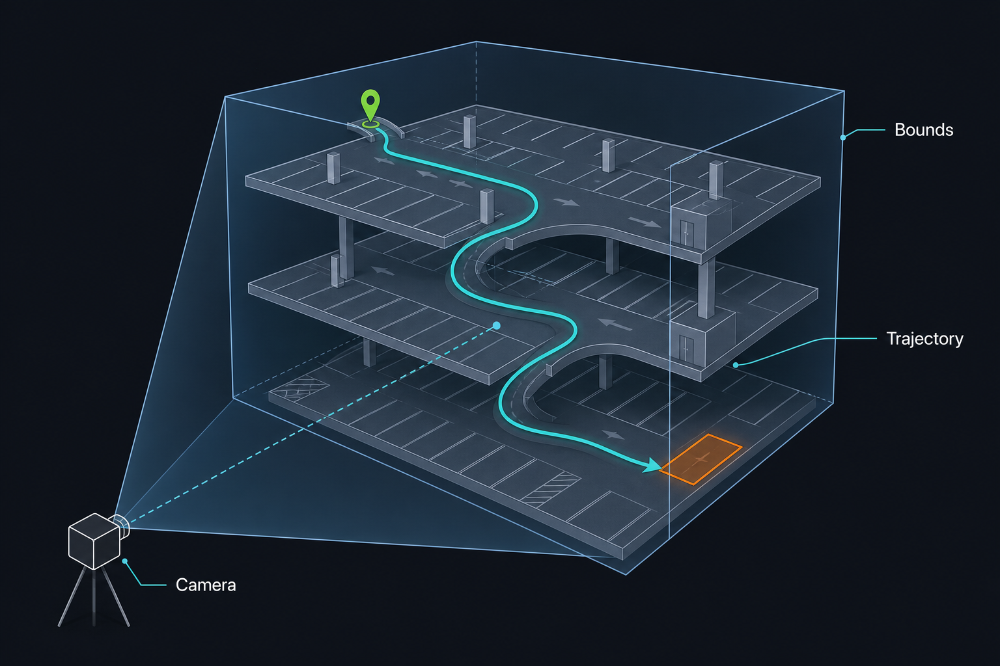

> When building memory parking, there's a rather interesting feature: display the perceived objects and trajectory lines from the memorized parking process, all visible in a single camera view. Generating these mapping-result objects isn't hard; the trouble is that this view must show all of the mapping results while still looking good—because you never know what kind of mapping situation you'll encounter.

Some parking lots are as flat as a corridor; some stack downward like a multi-layer cake. Some trajectories reach the parking spot after just two turns; others wind halfway around the basement. That means: nothing can be cropped, and the floor levels still have to be distinguishable.

This article shares an approach I once used: given a spatial extent, try to compute a set of stable, reproducible camera poses.



---

## Step 1: Build the Bounding Box (Bounds)

### Input

- Sampled points of each floor's **road centerline** (the body of the mapping trajectory)
- All **parking-slot corners** on the floor where the target slot is
- **Entrance / GPS-loss anchor points** (the anchor where GPS signal is lost)
- **Target slot center point**

### Algorithm

Merge all points into a single list, take the extremes along each axis, and get an axis-aligned bounding box (AABB):

$$
\text{center} = \frac{\min + \max}{2}, \quad \text{size} = \max - \min
$$

In overview mode, all floors' points participate in the calculation together, not split per floor. The goal is to let the camera cover **the entire space the mapping run traversed**.

### Output

- `Bounds.center`: the look-at center for the subsequent camera placement
- `Bounds.extents`: the size basis for the subsequent distance estimation and safety checks

### Sketch code

```csharp
Bounds CalcBounds(List<Vector3> points)
{
    Vector3 min = points[0], max = points[0];
    foreach (var p in points)
    {
        min = Vector3.Min(min, p);
        max = Vector3.Max(max, p);
    }
    return new Bounds((min + max) * 0.5f, max - min);
}

// Overview point set = road points + entrance anchors + target slot (+ optional Y padding)

```

---

## Step 2: Estimate the Viewing Distance

### Input

- The `Bounds` from step 1 (write `extents` as \(e_x, e_y, e_z\))
- The camera's **vertical FOV** \(\theta_v\) (from the Virtual Camera lens configuration parameters)
- The output camera's **aspect ratio** \(\text{aspect}\) (take the actual rendering camera's pixelRect; split-screen or UI layout requirements can change the effective aspect ratio)
- A distance fine-tuning coefficient (empirical, default 1.0)

### Algorithm

The overview uses an oblique view, so the bounding box enters the frame both in the XZ plane and in Y. The distance is estimated along two paths and the larger value is taken:

1. Convert the vertical FOV and aspect ratio into a horizontal FOV:
  $$
  \theta_h = 2\arctan\!\left(\tan\frac{\theta_v}{2} \times \text{aspect}\right)
  $$
2. XZ direction (ground span):
  $$
  d_{XZ} = \frac{\sqrt{e_x^2 + e_z^2}}{\tan(\theta_h / 2)}
  $$
3. Y direction (floor height difference):
  $$
  d_Y = \frac{e_y}{\tan(\theta_v / 2)}
  $$
4. Initial value: \(d_0 = \max(d_{XZ},\, d_Y) \times \text{adjust}\)

### Output

- The initial viewing distance \(d_0\) (the straight-line distance along the camera's view direction to the bounding box center)

### Sketch code

```csharp
float CalcOverviewDistance(Bounds b, float verFov, float aspect, float adjust = 1f)
{
    float horFov = Camera.VerticalToHorizontalFieldOfView(verFov, aspect);
    float tanHW = Mathf.Tan(horFov * 0.5f * Mathf.Deg2Rad);
    float tanHV = Mathf.Tan(verFov * 0.5f * Mathf.Deg2Rad);

    float dXZ = Mathf.Sqrt(b.extents.x * b.extents.x + b.extents.z * b.extents.z) / tanHW;
    float dY  = b.extents.y / tanHV;
    return Mathf.Max(dXZ, dY) * adjust;
}

```

*[Figures omitted; see the original WeChat article]*

---

## Step 3: Determine the Oblique Camera Position and Orientation

### Input

- The `Bounds.center` from step 1
- The distance \(d\) from step 2
- The downward tilt angle \(\alpha\) (about 35°)

> The default here is a **tilt angle of about 35°**. This is the overview's pitch angle, again an empirical value.

### Algorithm

**1. Distance decomposition**

Split \(d\) along the viewing direction into vertical and horizontal components:

$$
h = d\sin\alpha, \quad l = d\cos\alpha
$$

**2. Fixed-corner orientation**

Take the direction, projected onto XZ, from a **fixed-index corner** of the bounding box's bottom face (e.g., `(minX, minY, maxZ)`) pointing toward the center, and use it as the camera's horizontal orientation.

The benefit of this approach is that the direction is determined by the bounding box's geometry. No matter where the trajectory starts or ends, or where the target slot is, the same class of mapping result will always produce the same overview orientation.

> The first version originally tried to reproduce the HMI UI mockups as faithfully as possible—that is, always trying to keep the trajectory start at the upper left of the mapping-result view and the end at the lower right. The approach was roughly:
>
> 1. Build a heading vector from the trajectory start/end points (the code took end → start):
>
> ```
> direction = (start - end).normalized;
> ```
>
> 2. Find the longest axis-aligned edge on the bounding box's bottom/top face to get `longEdgeDirection` (only horizontal edges were compared, not vertical ones; the major axis approximated "should the whole picture lie horizontally or vertically").
>
> 3. Use a dot product to give the long edge a polarity: flip it if it points against `direction`, ensuring the long edge's positive direction sits on the same side as the trajectory heading.
>
> 4. Take the in-plane lateral direction perpendicular to the long edge, then `LookRotation`:
>
> ```
> perpendicular = Cross(longEdgeDirection, Vector3.up).normalized;
> return LookRotation(-perpendicular) * euler;
> // The camera stands on the long edge's side looking at the box; the long edge (and the aligned start/end heading) roughly lands on the screen's horizontal axis
> ```
>
> But this approach produced overview orientations differing by about 180° on the same mapping result. The root cause was that the orientation depended strongly on the trajectory start/end points: the mapping overview and the cruise overview pass in different point values (with possible nulls), flipping the long edge's polarity or the adjacent observed side, and the view came out reversed. So we later switched to the fixed corner and stopped deriving orientation from the trajectory.

**3. Placement**

The camera is placed by stepping back \(l\) from the center along the opposite of the horizontal orientation, then rising by \(h\):

$$
\text{position} = \text{center} - \hat{n}_{horiz} \cdot l + \text{up} \cdot h
$$

The rotation is set to look at the center: `LookRotation(normalize(center - position))`.

### Output

- `cameraPosition`: the candidate camera world position
- `cameraRotation`: the candidate camera rotation

### Sketch code

```csharp
void CalcObliquePose(Bounds bounds, float distance, float tiltDeg,
    out Vector3 position, out Quaternion rotation)
{
    float rad = tiltDeg * Mathf.Deg2Rad;
    float h = distance * Mathf.Sin(rad);
    float l = distance * Mathf.Cos(rad);

    // Fixed bottom-face corner → horizontal direction to the center
    Vector3 corner = /* fixed bottom-face corner, e.g. (minX, minY, maxZ) */;
    Vector3 horiz = (bounds.center - corner);
    horiz.y = 0;
    horiz.Normalize();

    position = bounds.center + Vector3.up * h + horiz * l;
    rotation = Quaternion.LookRotation((bounds.center - position).normalized);
}

```

---

## Step 4: Safety Distance Verification

### Input

- The candidate `cameraPosition` and `cameraRotation` from step 3
- The 8 corners of the `Bounds`
- \(\theta_v\) and \(\text{aspect}\)

### Algorithm

The formula distance is an approximation; with an oblique view, individual corners may still end up at the frame's edge or get cropped. The verification works like this:

1. Transform each corner into the camera's local coordinate system;
2. For each corner, compute the minimum depth it would need to be just visible within the horizontal and vertical half-frustums;
3. Take the maximum over all corners as `requiredDistance`;
4. If \(d < \text{requiredDistance}\), raise \(d\) to `requiredDistance` and re-place the camera as in step 3.

### Output

- The corrected final distance \(d\)
- The corrected `cameraPosition` and `cameraRotation`

### Sketch code

```csharp
float RequiredDistance(Bounds b, Quaternion camRot, float verFov, float aspect)
{
    float tanHW = Mathf.Tan(HorFov(verFov, aspect) * 0.5f * Mathf.Deg2Rad);
    float tanHV = Mathf.Tan(verFov * 0.5f * Mathf.Deg2Rad);
    Quaternion inv = Quaternion.Inverse(camRot);
    float required = 0f;

    foreach (var corner in GetCorners(b))
    {
        Vector3 local = inv * (corner - b.center);
        float needX = Mathf.Abs(local.x) / tanHW - local.z;
        float needY = Mathf.Abs(local.y) / tanHV - local.z;
        required = Mathf.Max(required, Mathf.Max(needX, needY));
    }
    return Mathf.Max(0f, required);
}

// If distance < required → distance = required, recompute position
position = bounds.center - (rotation * Vector3.forward) * distance;

```

---

## Single-Floor Viewing

That's the overview approach—but we also have a single-floor viewing requirement.

When the user switches to a particular floor, we no longer use the oblique overview; we switch to a straight top-down view. And the distinctive requirement is: when the floor being viewed is the floor containing the target parking slot, the target slot must be at the visual center, not simply "everything visible."

### Input

- The current floor's point set, i.e. the single-floor `Bounds`
- Whether this is the **target slot floor** (there's a slot-center override)
- For the target slot floor: slot center, slot-edge yaw angle, and a height cap (e.g. 50 m)

### Algorithm

Sketch code:

```csharp
// Distance: same FOV conversion as step 2, but XZ only, using half edge lengths (not the diagonal)
float horFov = Camera.VerticalToHorizontalFieldOfView(verFov, aspect);
float dW = (bounds.size.x * 0.5f) / Mathf.Tan(horFov * 0.5f * Mathf.Deg2Rad);
float dD = (bounds.size.z * 0.5f) / Mathf.Tan(verFov * 0.5f * Mathf.Deg2Rad);
float distance = Mathf.Max(dW, dD) * singleFloorAdjust;

Vector3 centerPoint = isTargetFloor ? parkingCenter : bounds.center;
if (isTargetFloor)
    distance = Mathf.Min(distance, maxHeight);   // height cap
else
{
    // Corner safety verification identical to step 4
    distance = Mathf.Max(distance, RequiredDistance(bounds, topDownRot, verFov, aspect));
}

// Position: directly above the center (not the oblique placement of step 3)
Vector3 position = centerPoint + Vector3.up * distance;
Quaternion rotation = TopDown(isTargetFloor ? slotYaw : 0f);
```


| Scenario    | Distance                | Look-at point       | Rotation           |
| ----- | ----------------- | --------- | ------------ |
| Ordinary single floor  | Fit X and Z extents separately, take the larger  | Bounds center | Straight top-down, yaw 0°    |
| Target slot floor | `min(computed distance, height cap)` | **Slot center**  | Straight top-down, yaw aligned to the slot edge |


The top-down rotation must not use `Euler(90, yaw, 0)`: at a 90° pitch the yaw falls onto roll—gimbal lock—and the picture's directions come out wrong. Instead, specify the camera facing downward with the screen's up direction pointing north:

```csharp
Quaternion TopDown(float yawDeg)
{
    Vector3 forward = Vector3.down;
    Vector3 up = Quaternion.Euler(0f, yawDeg, 0f) * Vector3.forward;
    return Quaternion.LookRotation(forward, up);
}
```

---

## Closing

I doubt this is the only way to compute an overview view, but I think every approach will run into some situations that just don't look great, for example:

- Multi-story buildings with low floor heights: in the top-down view, the road lines stack on top of each other and readability isn't great.
- The target slot's pin marker is occluded by road lines.
- A parking trajectory of nearly 3 km, so the overview is full of "ants."

Since the overview isn't currently a scene worth heavy polish, most of the time these issues are simply tolerated.
