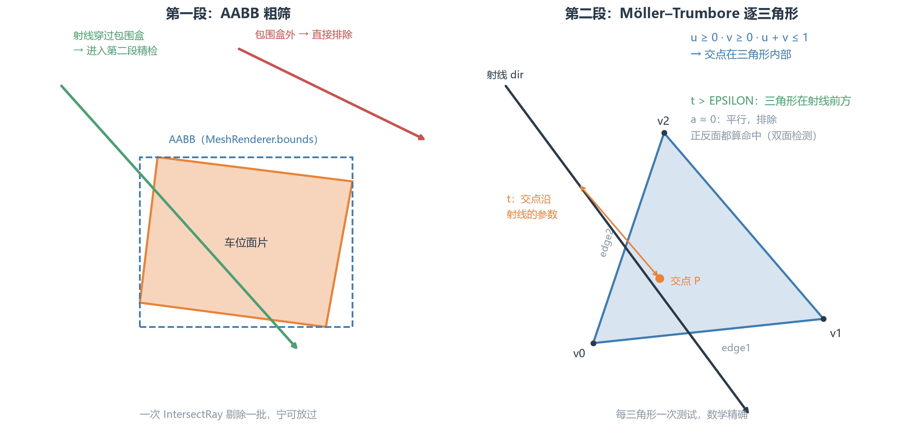

> 上一篇写了车灯的复用，这篇分享关于点击操作上的一些认知，我们知道在泊车流程中，当扫到了多个车位，用户可以通过点击选择想要泊入的车位。那么，这个点击交互是如何实现的，有没有不同的方案，可能存在什么隐患呢？

从处理流程上，链路大致如下：

*[配图见公众号原文]*

这些步骤是比较常见的，无非就是判断触摸事件，然后根据事件的坐标去模拟一条从相机视口发射出去的世界坐标系的射线，收集这条射线碰撞到了哪些东西，过一遍 tag 校验筛选出符合点击意图的对象，并最终将点选结果通过消息模块上报给安卓层或是智驾的服务。点中一个新车位是选择，在已经选中的车位上再点一下，是切换泊入方向。

这里值得分享的细节，是射线与检测这块。

---

## 射线结果检测

*[配图见公众号原文]*

AABB（轴对齐包围盒）的问题就是比包裹物大一圈，点在车位旁边的空地上也会算命中包围盒，所以它当不了最终裁判。到了点车位这里，同一套东西换了个用法，可以做第一道门卫：如果这条射线连包围盒都没碰到，后面不用查了，绝大多数无关车位在这一步直接筛选掉。包围盒命中的，才轮到精确检测。

```csharp
public static bool CheckSlotClick(Vector2 screenPos, out ParkingSlot slot) {
    Ray ray = SceneRoot.Instance.SrCamera.ScreenPointToRay(screenPos);
    float closestDist = float.MaxValue;
    ParkingSlot closestSlot = null;

    foreach (ParkingSlot s in slots) {
        // 组件不齐的车位直接跳过
        if (s.pickObject == null || s.pickMeshFilter == null || s.pickMeshRenderer == null) continue;

        var bounds = s.pickMeshRenderer.bounds;                  // AABB，来自 MeshRenderer
        var t = s.pickObject.transform;                          // 车位变换
        var mesh = s.pickMeshFilter.mesh;                        // 拾取面片的 mesh
        if (bounds != null && bounds.IntersectRay(ray)) {        // 第一段：包围盒粗筛
            if (RaycastMesh(ray, mesh, t, out float dist)) {     // 第二段：逐三角形精检
                if (dist < closestDist) {                        // 多个命中，取最近
                    closestDist = dist;
                    closestSlot = s;
                }
            }
        }
    }
    slot = closestSlot;
    return closestSlot != null;
}

```

车位对象随感知数据进出视野的边界，静态集合 slots 里难免残留失效对象。清理策略是  
遍历 slots 时，失效对象不能直接移除（HashSet / List 遍历中删元素会出问题），先记入待删清单。遍历结束后，再从集合中统一移除清单里的对象。

另外，手指点在两个车位交界时，两边都可能通过粗筛和精检。代码用 closestDist 变量记录当前最近距离，每次命中后比较：

```csharp
if (dist < closestDist) {
    closestDist = dist;
    closestSlot = s;
}

```

最终返回距离射线起点最近的车位，符合用户直觉。

---

## 手写Möller–Trumbore

第二段的核心是射线与三角形求交：先把射线变换到车位的本地空间，再对 mesh 的每个三角形做一次求交测试。

```csharp
static bool RaycastMesh(Ray ray, Mesh mesh, Transform t, out float distance) {
    distance = float.MaxValue;
    Matrix4x4 w2l = t.worldToLocalMatrix;    // 世界→车位本地空间
    Vector3 localOrigin = w2l.MultiplyPoint3x4(ray.origin);
    Vector3 localDir = w2l.MultiplyVector(ray.direction);

    Vector3[] vertices = mesh.vertices;
    int[] triangles = mesh.triangles;

    bool hit = false;
    for (int i = 0; i < triangles.Length; i += 3) {
        Vector3 v0 = vertices[triangles[i]];
        Vector3 v1 = vertices[triangles[i + 1]];
        Vector3 v2 = vertices[triangles[i + 2]];

        if (RayTriangleIntersect(localOrigin, localDir, v0, v1, v2, out float tDist) && tDist > 0) {
            // 把本地空间距离转回世界空间
            float worldDist = tDist * localDir.magnitude / ray.direction.magnitude;
            if (worldDist < distance) {
                distance = worldDist;
                hit = true;
            }
        }
    }
    return hit;
}

```

为了要计算精确的和三角面的相交，我们选择把射线搬到车位的局部坐标系去算碰撞，而非反过来。如代码中，我们获取了变换矩阵之后，将射线的起点和方向，分别做一次矩阵变换，就把射线映射到了本地空间。

RayTriangleIntersect 是图形学经典的 Möller–Trumbore 算法:

```csharp
static bool RayTriangleIntersect(Vector3 origin, Vector3 dir,
                       Vector3 v0, Vector3 v1, Vector3 v2, out float t) {
    const float EPSILON = 1e-8f;

    Vector3 edge1 = v1 - v0, edge2 = v2 - v0;
    Vector3 h = Vector3.Cross(dir, edge2);
    float a = Vector3.Dot(edge1, h);   // 行列式，正比于三向量体积

    if (a > -EPSILON && a < EPSILON) return false; // 射线平行于三角形

    float f = 1.0f / a;
    Vector3 s = origin - v0;
    float u = f * Vector3.Dot(s, h);
    if (u < 0.0f || u > 1.0f) return false;    // 交点在三角形外

    Vector3 q = Vector3.Cross(s, edge1);
    float v = f * Vector3.Dot(dir, q);
    if (v < 0.0f || u + v > 1.0f) return false;  // 交点在三角形外

    t = f * Vector3.Dot(edge2, q);
    return t > EPSILON;                        // 三角形在射线前方
}

```

这是一个工具函数，输入一条射线和一个三角形，输出射线有没有打中这个三角形，以及打中时的距离 t。a 判断平不平行、u/v 判断交点在不在形状内（重心坐标，权重全正才在里面）、t 判断在不在射线前方。

拿每个通过粗筛的车位的 mesh 三角形逐个调用这个函数，看射线到底落在哪个三角面上。



## 结语

回头看这个方案，还有一个有意思的选择是：既没用 Unity 的 Physics.Raycast，也没给车位挂 BoxCollider。

主要是考虑到：车位是纯视觉的，并没有物理职责。如果为了选泊车位这事，就要给每个车位都挂一个 Collider，使用物理引擎的碰撞检测，代价有点大。毕竟多一个碰撞体就多一份开销，而且车位的四角点随感知数据频繁更新，盒子的尺寸就得跟着每帧重算重同步，看到的车位和点中的车位才能对齐。

所以才会有这个纯几何的方案。好处是体感更可控，可以控制计算的成本。不依赖物理引擎，也不给物理管线添负担。对一个每帧可能发生交互的功能来说，这个量级的开销更有安全感。

