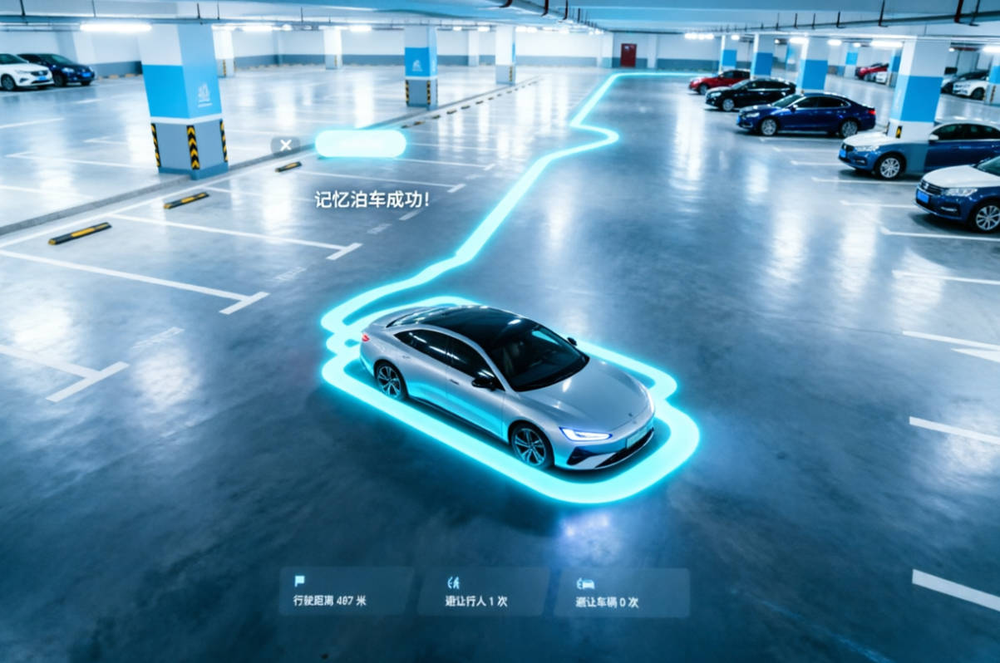

> SR apps have one particularly distinctive feature: memory parking. Once the vehicle enters an underground garage, it can start "memorizing". By the time it has driven all the way through to the completed parking maneuver, it has recorded the route from the garage entrance to the parking space, plus the static perception objects along that route. It then presents the entire "parking map" for the user to review.

This article focuses on how the virtual camera computes its way to a complete view of the mapping result produced by memory parking. It also covers the logic and performance problems I've run into in this high-load scenario.



---

## 1. Feature Requirements

After the AVP (Automated Valet Parking) feature finishes its **learning/mapping phase**, the user needs to see, on the cockpit screen, everything perceived during the memory-parking learning run: how the **driving trajectory line** goes, how **parking spaces** are distributed, the positions of **pillars, road signs, speed bumps and so on**, and where the **entrance and the target parking space** are. This is what we call the mapping result.

Viewing this mapping result comes in two modes:

- **Full-building overview**: the whole parking structure observed from a third-person perspective — every floor the car has traveled, with roads, parking spaces, and trajectories all in one view.
- **Single-floor view**: switching to a specific floor (say B1 or B2) looks straight down at that floor's roads, parking spaces, and trajectory.

---

## 2. Mapping Result Data

The mapping result travels over the communication link. Because it's usually large, it typically goes through shared memory; over a UDP socket you'd have to deal with packet fragmentation and reassembly. Here are the key fields of this data:


| Field                  | Type    | Meaning                                                                  |
| ---------------------- | ----- | ------------------------------------------------------------------- |
| `Floor`                | Object array  | Each floor contains sub-structures such as Road, ParkingSpace, RoadMark, and RoadObstacle |
| `TraceStart,TraceEnd`  | Point coordinates   | The start and end points of the parking route                                                          |
| `TargetParkingSpace`   | Point coordinate array | The 4 corner coordinates of the target parking space                                                        |
| `TargetParkingSpaceId` | Integer    | The target parking space's id                                                            |
| `ReferencePoint`       | Point coordinates   | A reference point used to switch between ENU and LLH coordinates                                             |
| `GpsSignalLossPoint`   | Point coordinates   | The GPS signal-loss point (the entrance anchor, where satellites drop out)                                                 |


This data drives the whole rendering pipeline: road meshes, parking-space quads, obstacle meshes, and trajectory lines are all generated after parsing the protocol frames. **How the lines and perception objects are generated** was covered in detail in previous articles: [Five Pitfalls to Avoid When Drawing Lines](https://mp.weixin.qq.com/s/tM4ImzAeRzhhxncgyaJGZQ), [A Complete Breakdown of Perception Objects](https://mp.weixin.qq.com/s/Wr4f9QYsIbsCWVjPMwRUYA)

---

## 3. Viewing Angles

### 3.1 Full-Building Overview

*[Figures omitted; see the original WeChat article]*

We chose a roughly **35° oblique view**. At this angle, the vertical stacking of floors reads naturally in the frame, and the height differences between B1 and deeper floors (if traveled), the entrance, and the target parking space are clearly presented.

**Consistent orientation**

If the camera orientation differed every time, the user would end up looking at the same mapping result from a different angle on each interaction — and that's not acceptable.

So we adopt a **fixed-corner viewpoint** strategy: we always take the direction from a fixed-index corner of the overall spatial bounding box, `bottomCorners[1]` (the `(minX, minY, maxZ)` corner), projected onto XZ toward the bounding box center, as the camera's horizontal heading.

This direction is determined entirely by the bounding box geometry — it doesn't depend on trajectory data and isn't affected by floor differences, which guarantees a consistent viewing angle for every overview.

### 3.2 Single-Floor View

The single-floor scenario no longer needs vertical stacking information. At this point the user cares mostly about the planar map, so a straight top-down view maximizes how much information fits on screen.

But there's one detail: **on the target parking space's floor, the camera center is not the bounding box center**. Focusing on the bounding box center would actually push the target parking space toward the edge of the frame. Since the user's intent at this point is to check the target parking space, the camera centers on the space; no matter how large the floor is, the viewing distance is capped at a fairly small maximum, and the yaw is computed from the direction of the parking space's entrance edge so the space appears **squarely aligned** in the frame — much more comfortable to look at.

*[Figures omitted; see the original WeChat article]*

---

## 4. Algorithm Implementation

### 4.1 Building the Bounding Box

Input: road centerline points from all floors + parking space corner points + positions of other perception objects that need to be displayed + the positions of the trajectory start/end UI icons.

Processing: iterate over all the points once, take the extremes on each axis, and you get an axis-aligned bounding box (AABB).

### 4.2 The Oblique Overview

Once we have the bounding box as the outer frame of the mapping result, note that the result usually doesn't fill the whole screen, isn't necessarily centered on screen, and may need to be shifted because of Android-side UI. So we need to compute the effective horizontal FOV of the final display area. The full-width horizontal FOV would be 2·arctan(tan(vertical FOV/2) × aspect ratio); now the content occupies only a fraction r of the screen width. The narrower the content area, the smaller the effective horizontal FOV — which makes the later camera-distance calculation easier:

$$
\theta_h = 2\arctan\left(\tan\frac{\theta_v}{2} \times \text{aspect}_{\text{screen}} \times r\right)
$$

Because we look at the whole building at a 35° oblique angle, content appears along the box's diagonal directions too — not just in the XZ plane. So we can't compute a planar distance only; it has to be 3D:

1. First compute the distance needed in the XZ plane (the ground plane): half the diagonal length (i.e. the bounding box's half extent) divided by the tangent of half the horizontal FOV.
2. Then compute the distance needed along Y (the floor-height direction): half the height divided by the tangent of half the vertical FOV.
3. Finally take the larger of the two as our initial camera distance estimate:

$$
d = \max\left(\frac{\sqrt{e_x^2 + e_z^2}}{\tan(\theta_h/2)},\; \frac{e_y}{\tan(\theta_v/2)}\right)
$$

With the total distance d computed, and knowing the camera looks down at 35°, we can split this slanted distance into two directional components:

- Vertical component: h = d * sin(35°) (the camera's vertical height above the bounding box center)
- Horizontal component: l = d * cos(35°) (the camera's horizontal distance from the bounding box center)

The horizontal heading is already fixed: looking from the box's fixed corner toward the center. So we simply align the horizontal direction with that heading, and finally place the camera at the position that backs off the total distance d from the center, along the direction toward the corner.

Core code:

```csharp
// The following is illustrative code — aligned with the production logic but not a verbatim copy.
float CalcOverviewDistance(Bounds b, float verFov, float vpRatio, float aspect)
{
    float vpAspect = aspect * vpRatio;
    float horFov = Camera.VerticalToHorizontalFieldOfView(verFov, vpAspect);
    float tanHW = Mathf.Tan(horFov * 0.5f * Mathf.Deg2Rad);
    float tanHV = Mathf.Tan(verFov * 0.5f * Mathf.Deg2Rad);
    float dXZ = Mathf.Sqrt(b.extents.x * b.extents.x + b.extents.z * b.extents.z) / tanHW;
    float dY  = b.extents.y / tanHV;
    return Mathf.Max(dXZ, dY);
}
```

### 4.3 Single-Floor Top-Down View

The single-floor top-down view only cares about the current floor's footprint; the camera distance takes the farther of the X/Z fit values to guarantee the whole floor is fully visible. The floor containing the target parking space gets three special treatments:

1. The camera focus point becomes the parking space's center, so the target is found at first glance.
2. The maximum viewing distance is capped at 50 m so the space doesn't render too small.
3. The camera direction is adjusted according to the parking space's edges so the space appears squarely aligned in the frame.

**Gotcha**: when aligning the camera to make the target parking space appear squarely in frame, don't use Quaternion.Euler(90, yaw, 0) for the top-down rotation. A 90° pitch breaks the yaw used for horizontal rotation and misaligns the direction. The correct approach is Quaternion.LookRotation(Vector3.down, rotatedForward), which directly specifies the camera's forward and up directions.

---

## 5. Problems We've Hit

### 5.1 Ground Height and Scale Following the View

**Symptom**: The mapping result gets occluded by the ground mesh while rendering. The lower hemisphere of the scene's skybox didn't meet the design requirements, so there's a dedicated mesh used purely as the ground. This mesh's y defaults to 0, but the mapping result's objects often sit at y < 0, so they end up occluded.

**Fix**: When rendering the mapping result, compute its lowest y value; when entering the memory-parking mapping display, move the ground mesh down accordingly.

### 5.2 One-Frame Flash When Showing the Overview

**Symptom**: When switching from SR's normal view to the overview mapping camera, the screen flashes white or jumps for one frame.

**Root cause**: The overview camera's pose calculation (bounding box construction, FOV computation, LensShift computation) and the camera animation initialization execute within the same frame. Part of the mapping result appears before the camera has settled into place.

**Fix**: Compute the target camera pose first, wait one frame before driving the camera, listen for the camera animation's completion event, and only then show the mapping result objects.

---

## 6. Optimizations

### 6.1 Switching Parking Spaces to Quads

Originally, the parking spaces in the mapping result used the prefab meant only for APA. In the full-building overview, several hundred 3D parking-space meshes meant a large number of draw calls — yet at that distance, the depth of these objects is barely perceptible.

Optimization: replace the parking spaces with a simplified **quad + texture** representation. In the overview the visual difference is negligible.

### 6.2 Showing Parking Spaces Only on the Target Floor

If the full-building overview displayed every parking space on every floor, the frame would become extremely dense. Parking spaces and other rendered objects would occlude each other, actually hurting readability.

Optimization: **show parking spaces only on the floor containing the target space**; other floors show just roads and trajectories. Parking spaces are what the user cares about most, so showing only the target floor both cuts the render load and keeps the picture focused and clean.

---

## 7. Closing Thoughts

Intelligent driving is still a work in progress: vendor capabilities vary, features keep evolving, and in the race to outdo one another some of them aren't yet stable or robust enough. So when developing an application like SR — balancing product and design demands for features and experience against the "quirks" of each ADAS vendor's data — it often falls to the 3D team to take the lead and negotiate the engineering trade-offs. Memory parking is a case in point.
