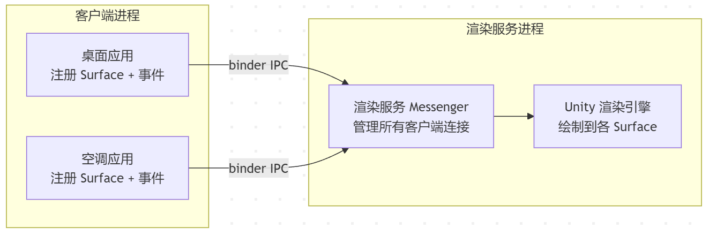

> 从这篇开始，分享一些稳定性问题的处理。比如黑屏、卡死等。
>
> 由于内容已是历史，解决方案的有效性受限于当时的魔改系统，服务架构和引擎版本，不可照搬。

3D HMI最多最烦的就是黑屏问题，尤其还是偶现问题。

# 问题表现

> "3D 界面偶发黑屏，黑了之后，服务化渲染进程被系统重启，起来又黑，反复几次后画面正常。"

---

# 背景

这个用的团结引擎 1.5.3，采用**服务化渲染架构**。3D 渲染跑在一个独立进程，其他系统应用（桌面、空调等）通过 binder 跨进程把 Surface 和事件投递给渲染服务。



每个客户端注册时，渲染服务侧的 `TuanjieC2SMessenger` 会：

1. 把客户端的 `ITuanjieS2CMessenger` 引用存进 `mAllS2CMessenger` 
2. 调 `linkToDeath` 给这个 binder 注册死亡回调

当客户端进程意外死亡（被系统杀、crash、ANR 被杀），binder 驱动会回调 `binderDied()`。渲染服务收到回调后要清理该客户端的 Surface、View、连接状态。

**问题就出在"清理"这一步。**

---

# 锁陷阱

引擎自带的 `TuanjieC2SMessenger.java` 里，binder 死亡回调是这样写的：

```java
// Tuanjie 1.5.3 PlaybackEngines/HMIAndroidPlayer/Source/com/unity3d/renderservice/TuanjieC2SMessenger.java

@Override
public void binderDied() {
    synchronized (this) {           // ← 持锁
        cleanUpAllS2CMessenger(false);
    }
}

public void cleanUpAllS2CMessenger(boolean isForceRemove) {
    synchronized (this) {           // ← 同一把锁
        Iterator<Map.Entry<String, ITuanjieS2CMessenger>> iterator =
            mAllS2CMessenger.entrySet().iterator();
        while (iterator.hasNext()) {
            Map.Entry<String, ITuanjieS2CMessenger> entry = iterator.next();
            try {
                IBinder binder = entry.getValue().asBinder();
                if (binder.isBinderAlive() && !isForceRemove)
                    continue;

                iterator.remove();
                // 以下 5 步全在锁内执行
                TuanjieViewManager.getInstance().cleanupViewWhenClientDied(entry.getKey());
                TuanjieViewManager.getInstance().onClientConnectionChange(entry.getKey(), false);
                TuanjieAppViewManager.getInstance().OnClientDisconnect(entry.getKey());
                notifyClientConnectStatus(false, entry.getKey());
                binder.unlinkToDeath(this, 0);
            } catch (Exception e) {
                e.printStackTrace();
            }
        }
    }
}
```

看起来没啥毛病，binder 死了，持锁清理，清理完释放锁。

**但"清理"可能会是很重的任务：**

- `cleanupViewWhenClientDied`：遍历 View 树、释放 Surface、回收 Display
- `onClientConnectionChange`：通知引擎内部状态变更，可能触发渲染重建（不确定）
- `OnClientDisconnect`：通知客户端断连
- `notifyClientConnectStatus`：广播连接状态变更给所有监听者
- `unlinkToDeath`：解除监听

这 5 步全在 `synchronized(this)` 里同步执行。其中第一步一看就知道是最重的那个，可能几百毫秒。

---

# 黑屏原因

渲染服务的 `this` 锁同时被以下线程竞争：

- 每帧从消息队列 `poll` 数据，遍历 `mAllS2CMessenger.values()` 发给客户端。这个遍历也持有 `synchronized(this)`。
- 客户端注册/注销 Surface 等操作走 `RemoteBinder`，也持有 `synchronized(this)`。

`binderDied()` 是在 Binder 线程上回调的，当 binder 死亡清理持着 `this` 锁跑了几百毫秒，数据发送线程被堵住 → 渲染服务这帧没法把数据推给客户端 → 客户端 Surface 拿不到新帧 → 黑屏。

如果系统重启了客户端进程，新 binder 注册又来抢 `this` 锁（`registerS2CMessenger` 也持锁），但清理还没跑完 → 更长的阻塞 → 继续黑屏。

---

# 修复

给锁内的任务减负：

*[配图见公众号原文]*

## 1. 锁内

```java
    // stage1：锁内只收集要清理的 target，不做重活
    synchronized (this) {
        Iterator<Map.Entry<String, ITuanjieS2CMessenger>> iterator =
            mAllS2CMessenger.entrySet().iterator();
        while (iterator.hasNext()) {
            Map.Entry<String, ITuanjieS2CMessenger> entry = iterator.next();
            try {
                IBinder binder = entry.getValue().asBinder();
                if (binder.isBinderAlive() && !isForceRemove)
                    continue;
                iterator.remove();
                cleanupTargets.add(new Pair<>(entry.getKey(), binder));
            } catch (Exception e) {
                e.printStackTrace();
            }
        }
    }
```

在锁内遍历、判断 `isBinderAlive`、`iterator.remove` + 收集到列表。这三步都是轻量操作，锁持有时间极短。

## 2. 锁外

```java
    // stage2：锁外逐个清理
    for (Pair<String, IBinder> target : cleanupTargets) {
        try {
            String pkgName = target.getFirst();
            IBinder binder = target.getSecond();

            TuanjieViewManager.getInstance().cleanupViewWhenClientDied(pkgName);
            TuanjieViewManager.getInstance().onClientConnectionChange(pkgName, false);
            TuanjieAppViewManager.getInstance().OnClientDisconnect(pkgName);
            notifyClientConnectStatus(false, pkgName);
            binder.unlinkToDeath(this, 0);
        } catch (Exception e) {
            e.printStackTrace();
        }
    }
```

在锁外执行真正的重活：Surface 回收、View 清理、状态通知。**不再阻塞其他线程**。数据发送线程和 IPC 注册线程能拿到 `this` 锁，渲染不会中断。

> 可以再做一个修改：数据发送线程的列表可以在锁内拷贝，锁外遍历，规避遍历时被改。

---

# 结语

**这个修改改的是引擎自带的 Java 源码模板**，不是 Unity C# 脚本。修改后需要确认升级引擎版本时不会覆盖。

3D HMI 的稳定性不止要看业务代码有没有问题，还要看引擎 Android 侧的线程操作是否健壮。而往往这类问题，都是发生在 Android 侧，发生在 3D 开发不那么熟悉的地方。