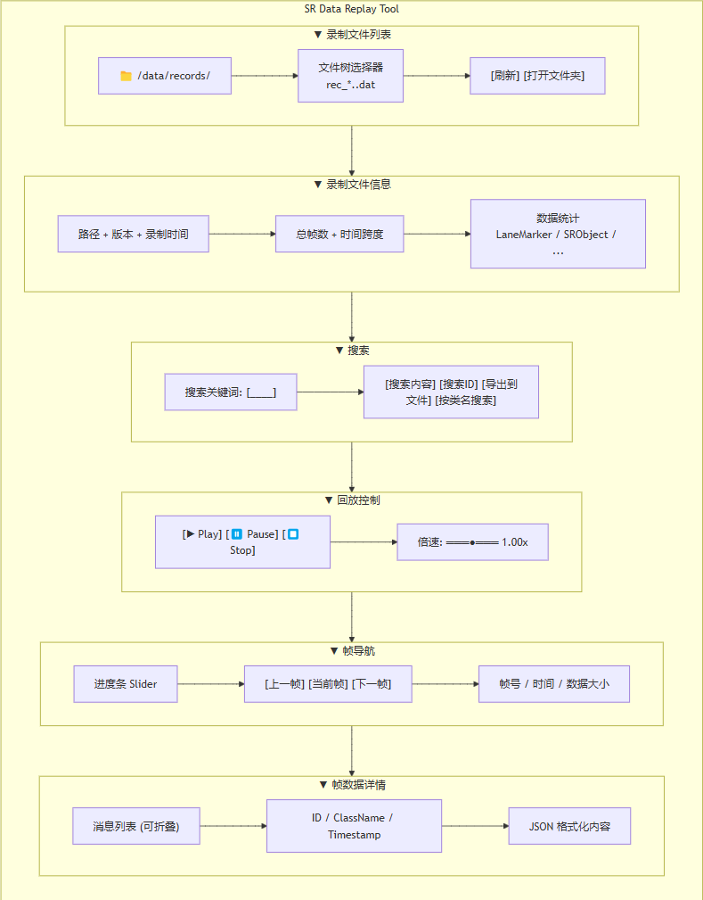
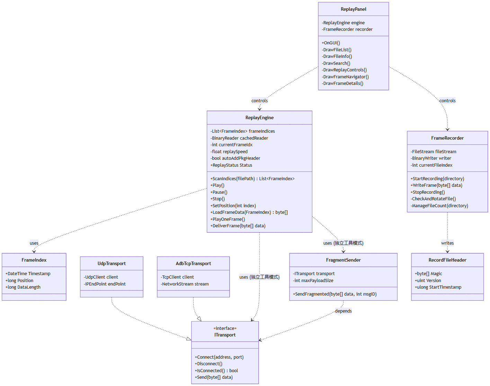
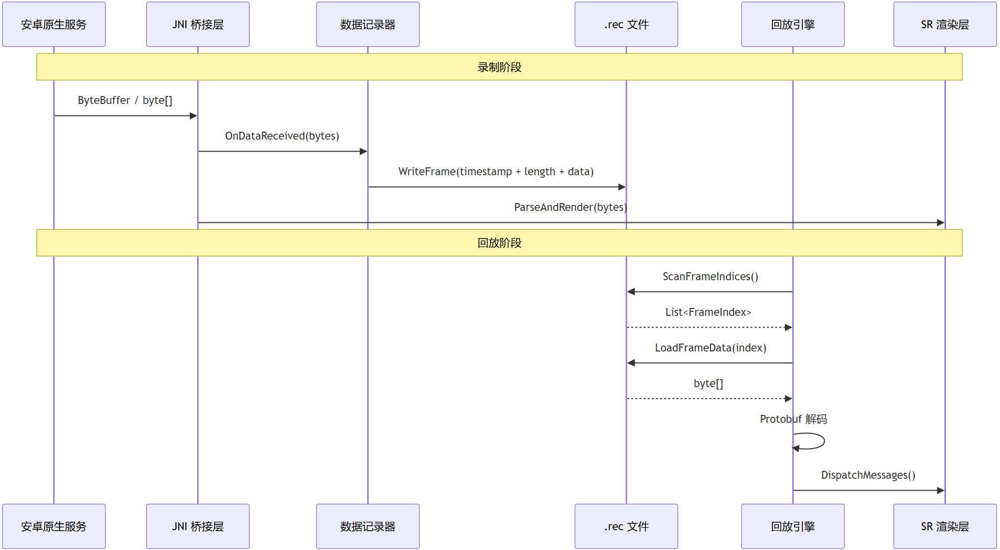

> Cockpit SR (Surround Reality) is usually the app with the most bug tickets. Analyzing these bugs depends heavily on replaying and simulating ADAS data. So you need a data recording–replay toolset that brings the real on-vehicle data back and reproduces it frame by frame in the editor — that alone makes troubleshooting dramatically more efficient.

This article shares the design thinking and practical solutions from when I built such a replay tool. A complete replay tool has to answer three questions: **how to store the data**, **how to read the data**, and **how to parse and inject the data**.

What this article covers:

- **The recording side**: how to capture data on the Android platform, and with what strategy to write it to files.
- **File format definition**: design goals, format selection, and a timestamped variable-length frame binary format.
- **The replay tool**: the optimization path from full loading to on-demand reading, plus how time-driven playback is implemented.
- **The data transport layer**: the trade-offs between in-process injection and cross-process network transport.
- **Interaction design**: control layout and key interaction logic.

---

## 1. Overall Architecture

The whole toolchain consists of three core modules: the **data recorder** (runs on the Android side, writes SR data to files), the **replay tool** (reads the recorded files and drives the rendering), and the **interaction panel** (provides human control over playback).

Their relationship:

*[Figures omitted; see the original WeChat article]*

### The Form of the Replay Tool

Should it be a standalone 3D project that gets shipped as an exe in the future? Or should it live inside the 3D project's editor as a tool panel? The decision criterion I recommend is: **the communication link determines the tool's form**.

**Scenario 1: Android side and engine side communicate over Socket**

If your SR main program on the Android device receives data from the native service over a Socket, the replay tool should be a **standalone executable** that likewise sends the recorded data to the SR main program over the network.

Reason: the replay tool should stay **close to the real communication link**. Only by going through the same Socket channel can you expose problems that only appear in real communication.

> For example: fragmentation and reassembly when a single frame exceeds 65,535 bytes, behavior under UDP packet loss, parsing behavior when packets stick together (TCP粘包). These network-layer problems can't be reproduced with in-process injection.

**Scenario 2: Android side and engine side communicate over JNI**

If your SR main program receives data through JNI mechanisms like `AndroidJavaProxy` or `DirectByteBuffer`, the communication itself is bound to the business module. In that case, the replay tool has to live inside the engine process, and an **editor panel** is the natural choice. After data is read from the file, you directly call the scene's parsing API to inject it into the rendering pipeline.

#### A Complete Comparison of the Two Forms


|            | Editor panel                                                              | Standalone executable                                                                                                                                                      |
| ---------- | ------------------------------------------------------------------------- | -------------------------------------------------------------------------------------------------------------------------------------------------------------------------- |
| **Principle** | Inside the Unity Editor, inject frame data directly into the scene's parsing pipeline. | Exported as a standalone exe; sends data over the network to the running SR main program.                                                                                  |
| **Pros**   | Easy to debug; protocol updates sync automatically with version iterations. | Fully decoupled from the main program; can validate problems in the communication link itself; can be **distributed to testers** who use a laptop to connect to the head unit and reproduce issues. |
| **Cons**   | Less convenient for external demos or bench debugging; if your workstation has **only one monitor**, the panel fights for screen space — sigh. | The standalone program needs updating when the protocol changes. For instance, if a timestamp is added to the packet header, you have to change it. But protobuf changes in the packet body don't matter, because you don't care about the byte[] internals — it's just a sender. |
| **Best for** | Daily development and debugging in JNI communication scenarios.           | Socket communication scenarios; testers need it too.                                                                                                                       |


Choose the form based on the communication link — Socket communication calls for a standalone program, JNI communication calls for a panel. If both links exist, build both, sharing the same file-reading logic; the only difference is how the data is output.

In daily development, the panel sees more use because it makes inspecting data structures and searching through data easier; the standalone program is more valuable for validating communication issues and for handing to testers.

---

## 2. The Recording Side

Recording can happen at different points along the link; where exactly depends on your debugging needs. I've used two approaches:

### 2.1 Approach 1: Recording on the Android Native Side

This is the most direct and most reliable recording method. Data gets written to file at the native layer, right after it's produced in the Android native service and before it's sent to Unity. Since the recording point is at the data source, there's no risk of errors that the Unity-side receiving process might introduce.

```csharp
// Recorder on the Android native side (Java, illustrative)
public class PacketRecorder {
    private static final String RECORD_DIR = "RecordData";
    private static final long MAX_FILE_SIZE = 50 * 1024 * 1024;  // 50MB
    private static final int MAX_FILE_COUNT = 50;
    private static final int FLUSH_BUFFER_THRESHOLD = 1024 * 1024; // 1MB
    private static final int FLUSH_TIMEOUT_MS = 2000;              // 2 seconds
    private LinkedBlockingDeque<byte[]> writeQueue;
    private Thread writerThread;
    private BufferedOutputStream outputStream;
    private long lastFlushTime;
    private int bufferedBytes;

    // Called on the send path: record a copy of every packet sent
    public void record(byte[] packetData) {
        if (writeQueue == null) return;
        writeQueue.offer(packetData);  // Non-blocking enqueue
    }

    // Asynchronous disk-writing thread
    private void writerLoop() {
        while (isRecording) {
            byte[] data = writeQueue.poll(2, TimeUnit.SECONDS);
            if (data != null) {
                // Write timestamp + data length + data body
                outputStream.write(longToBytes(System.currentTimeMillis()));
                outputStream.write(intToBytes(data.length));
                outputStream.write(data);
                bufferedBytes += 12 + data.length;
            }
            // Buffer flush: data volume above threshold, or flush timeout elapsed
            if (bufferedBytes >= FLUSH_BUFFER_THRESHOLD
                || System.currentTimeMillis() - lastFlushTime >= FLUSH_TIMEOUT_MS) {
                outputStream.flush();
                bufferedBytes = 0;
                lastFlushTime = System.currentTimeMillis();
            }
        }
    }

    // File rotation: when the current file exceeds the limit, close it, compress it to zip, and create a new file
    private void checkAndRotateFile() {
        if (currentFileSize < MAX_FILE_SIZE) return;

        outputStream.flush();
        outputStream.close();

        // Compress the old file
        zipFile(currentFilePath, currentFilePath + ".zip");
        deleteFile(currentFilePath);

        // Manage the total file count
        manageFileCount();

        // Create a new file
        currentFilePath = generateNewFilePath();
        currentFileSize = 0;
        outputStream = new BufferedOutputStream(new FileOutputStream(currentFilePath));
        lastFlushTime = System.currentTimeMillis();
    }

    // File count management: delete the oldest zip when the cap is exceeded
    private void manageFileCount() {
        File[] files = new File(RECORD_DIR).listFiles((d, n) -> n.endsWith(".zip"));
        Arrays.sort(files, Comparator.comparingLong(File::lastModified));
        while (files.length >= MAX_FILE_COUNT) {
            files[0].delete();
            files = Arrays.copyOfRange(files, 1, files.length);
        }
    }
}

```

**Design points**:

1. **Asynchronous writing**: data frequency is high and volume is large, so writes must happen on an async thread.
2. **Buffered flush**: don't flush every frame. Instead, flush when the buffered data exceeds a threshold (e.g., 1MB) or when a certain time has passed since the last flush (e.g., 2 seconds). This avoids frequent I/O.
3. **File rotation**: 50MB per file, with a cap of 50 files. When the cap is exceeded, old files get compressed to zip archives — a balance that preserves historical data.

### 2.2 Approach 2: Recording on the Unity Side

In some scenarios (for example, when what you want to record is the data Unity received after JNI processing, not the raw packets the Android native side sent), you can record on the Unity side. The recording point is then in the JNI bridge layer's callback, with writes done using a synchronous BinaryWriter.

**Recording trigger point — the JNI callback**:

```csharp
// Handling logic for receiving a Direct ByteBuffer
private unsafe void ProcessData(IntPtr nativePtr, int dataLength)
{
    // Wrap the native pointer in an unmanaged memory stream for zero-copy reading
    using (var stream = new UnmanagedMemoryStream(
        (byte*)nativePtr.ToPointer(), dataLength))
    {
        // Recording path: a copy is required here, because native memory
        // becomes invalid as soon as the callback returns
        if (isRecording)
        {
            byte[] buffer = new byte[dataLength];
            stream.Read(buffer, 0, dataLength);
            stream.Position = 0; // Reset stream position for subsequent parsing
            Recorder.WriteFrame(buffer);  // Recorder is the FrameRecorder instance defined below
        }
        // Parsing path: read directly from the stream, no extra copy
        Parser.ParseStream(stream);
    }
}

```

**Write implementation — FrameRecorder**:

The write strategy of `Recorder.WriteFrame(buffer)` is **synchronous writing + a buffered BinaryWriter**.

```csharp
public class FrameRecorder
{
    private FileStream fileStream;
    private BinaryWriter writer;
    private const float MaxFileSizeMB = 100f;
    private const int MaxFileCount = 10;
    private int currentFileIndex;

    public void StartRecording(string directory)
    {
        ManageFileCount(directory); // Clean up old files
        string filePath = GetNewFilePath(directory);
        fileStream = File.OpenWrite(filePath);
        writer = new BinaryWriter(fileStream);

        // Write the file header
        writer.Write(Encoding.UTF8.GetBytes("REC"));  // Magic number, 3 bytes
        writer.Write((uint)1);                         // Format version
        writer.Write((ulong)GetCurrentTimestampMs());  // Recording start timestamp
    }

    public void WriteFrame(byte[] frameData)
    {
        if (writer == null) return;

        CheckAndRotateFile(); // Check file size, rotate if necessary

        writer.Write(DateTime.Now.Ticks);   // Frame timestamp (Int64, 8 bytes)
        writer.Write((uint)frameData.Length); // Frame data length (UInt32, 4 bytes)
        writer.Write(frameData);              // Raw frame data
    }

    public void StopRecording()
    {
        writer?.Flush();
        writer?.Close();
        fileStream?.Close();
        writer = null;
        fileStream = null;
    }
}

```

> Prefer recording on the Android native side. It captures the rawest, most complete data, which makes replay much less of a headache.
>
> But if your communication service uses different protocols for the 3D side and the ADAS side, then use Unity-side recording as a supplement.

---

## 3. File Data Definition

The soundness of the file format directly determines the difficulty of implementing the replay side and its performance ceiling. Four goals the file format should satisfy:

1. The file header carries enough information that version info doesn't have to rely on file-name conventions.
2. Supports streaming reads.
3. Can quickly seek to frame N without scanning all preceding frames.
4. Remains compatible with old files as versions evolve.

### 3.1 Format Selection

Skip pure JSON — the files it produces are way too large. In general, use a custom binary format with Protobuf wrapped inside:

- Custom packet header (header string + version number + timestamp).
- Protobuf handles serialization of the message body; the two layers stay decoupled.

### 3.2 File Structure

```
[FileHeader: "REC"(3B) + version(4B) + startTimestamp(8B)]
[Frame0: timestamp(8B, DateTime.Ticks) + length(4B) + data]
[Frame1: timestamp(8B, DateTime.Ticks) + length(4B) + data]
...

```

- The first 8 bytes of each frame are a timestamp using `.NET DateTime.Ticks` (the number of 100-nanosecond intervals since `0001-01-01 00:00:00`). The replay side uses this to reconstruct the real inter-frame timing. The length field is a `uint32` (4 bytes). Since the field positions in the frame header are fixed, you can locate every frame without parsing the actual data if you want to scan frames by skipping.
- The data is the complete Protobuf-serialized byte stream. In an SR scenario, a single frame packet may contain multiple message types (lane lines, obstacles, trajectory lines, etc.)

### 3.3 Big-Endian vs. Little-Endian

I recommend standardizing on Little-Endian. .NET's `BinaryWriter` / `BinaryReader` default to little-endian anyway. If some scenario requires exchanging data with a big-endian service (for example, Java's `DataOutputStream` on the Android side writes big-endian by default), do the byte-swap accordingly — but never mix byte orders within the file format.

---

## 4. The Replay Tool

The replay tool needs to solve three problems: **how to load large files quickly**, **how to drive playback by time**, and **how to support random seeking during playback**.

### 4.1 Loading Strategy

Forget full loading. Debugging bugs is a life-or-death rush, large files make you wait forever, and you'll be reloading constantly anyway.

So we definitely want **index scanning + on-demand reading**.

On first read, scan only the frame index (each frame's offset in the file, data length, timestamp) without reading the actual frame data. The actual data gets read on demand during playback.

```
File header → scan all frame indices (read only 12 bytes per frame: 8B timestamp + 4B length, skip the data area)
    → List<FrameIndex> (tiny memory footprint; the index of a 3GB file is roughly a few dozen MB)
    → when replaying/viewing a frame, Seek to the corresponding offset and read the data

```

```csharp
// Frame index structure (metadata only, no data)
public struct FrameIndex
{
    public DateTime Timestamp;
    public long     Position;    // Frame data's offset in the file
    public long     DataLength;  // Frame data length
}

// Index scanning
public List<FrameIndex> ScanFrameIndices(string filePath)
{
    var indices = new List<FrameIndex>();
    using (var br = new BinaryReader(File.OpenRead(filePath)))
    {
        // Skip the file header
        br.ReadBytes(3);  // "REC"
        uint version = br.ReadUInt32();
        br.ReadUInt64();  // start timestamp

        long fileLength = br.BaseStream.Length;

        while (br.BaseStream.Position < fileLength)
        {
            long remaining = fileLength - br.BaseStream.Position;
            if (remaining < 12) break; // Not enough for a frame header

            var idx = new FrameIndex();
            idx.Timestamp = new DateTime(br.ReadInt64());  // 8 bytes
            idx.DataLength = br.ReadUInt32();                 // 4 bytes
            idx.Position = br.BaseStream.Position;           // Data start position

            // Sanity-check the data length
            if (idx.DataLength == 0 || idx.DataLength > remaining - 12)
                break;

            br.BaseStream.Position += idx.DataLength; // Skip the data area
            indices.Add(idx);
        }
    }

    // Sort by timestamp (ensures time increases monotonically during playback)
    indices.Sort((a, b) => a.Timestamp.CompareTo(b.Timestamp));
    return indices;
}

```

```csharp
// Read a single frame's data on demand
public byte[] LoadFrameData(string filePath, FrameIndex index)
{
    using (var br = new BinaryReader(File.OpenRead(filePath)))
    {
        br.BaseStream.Position = index.Position;
        return br.ReadBytes((int)index.DataLength);
    }
}

```

**Optimization 1: Cache the BinaryReader**

If playback creates a `new BinaryReader` for every frame, the file open/close overhead becomes significant. Cache one `BinaryReader`, keep it open during playback, and close it only when playback stops:

```csharp
private BinaryReader cachedReader;
private string cachedReaderPath;

private BinaryReader GetCachedReader(string filePath)
{
    if (cachedReader == null || cachedReaderPath != filePath)
    {
        cachedReader?.Close();
        cachedReader = new BinaryReader(File.OpenRead(filePath));
        cachedReaderPath = filePath;
        // Skip the file header
        cachedReader.ReadBytes(3);
        cachedReader.ReadUInt32();
        cachedReader.ReadUInt64();
    }
    return cachedReader;
}

```

**Optimization 2: Next-frame preload**

While playing the current frame, you can read the next frame's data into memory ahead of time. That way, when playback advances to the next frame, the data is already in memory — eliminating I/O waits during playback. Trigger the next frame's async read immediately after sending the current frame:

```csharp
// After sending the current frame, preload the next one
byte[] nextFrameData = null;
if (frameIdx + 1 < recordFrames.Count)
    nextFrameData = LoadFrameData(recordFrames[frameIdx + 1]);

```

**Optimization 3: Index caching**:

Index scanning only reads 12 bytes per frame, but for multi-GB files the scan still takes seconds. You can persist the index results (e.g., into `EditorPrefs` or a separate index file) and restore directly from the cache the next time the same recording is opened, achieving "instant open."

```csharp
bool IsCacheValid(string filePath, CachedIndex cache)
{
    var info = new FileInfo(filePath);
    return info.Length == cache.FileSize
        && info.LastWriteTimeUtc == cache.LastModified;
}

```

**Optimization 4: Spread the scan across frames for large files**

For recordings of 1GB+, even scanning only the frame index will briefly stall the editor if done synchronously. Spread the scan across multiple `EditorApplication.update` ticks — scan a batch of frame indices per tick and yield, keeping the editor responsive. When the scan completes, fire a callback to notify the UI to refresh.

### 4.2 Playback Approaches

#### **(1) Thread + Sleep**

This is generally the approach for a standalone data-simulation sender program: as the data sender, spin up a dedicated thread to loop over the data and send it over the socket. The sleep controls playback speed.

```
// Replay thread of the standalone program
private Thread replayThread;
private volatile bool isReplaying;
private volatile bool isPaused;
private ManualResetEvent pauseEvent = new ManualResetEvent(true); // Initially signaled (not paused)

public void StartReplay()
{
    isReplaying = true;
    isPaused = false;
    replayThread = new Thread(ReplayLoop);
    replayThread.IsBackground = true;
    replayThread.Start();
}

private void ReplayLoop()
{
    DateTime recordStart = frameIndices[0].Timestamp;
    DateTime replayStart = DateTime.Now;
    int frameIdx = 0;

    while (isReplaying && frameIdx < frameIndices.Count)
    {
        // Block while paused, resume when released
        pauseEvent.WaitOne();

        TimeSpan elapsed = DateTime.Now - replayStart;
        TimeSpan frameOffset = frameIndices[frameIdx].Timestamp - recordStart;

        if (frameOffset > elapsed)
        {
            // Time not reached yet, Sleep and wait
            int sleepMs = (int)(frameOffset - elapsed).TotalMilliseconds;
            Thread.Sleep(Math.Max(1, sleepMs));
            continue;
        }

        // Send all frames whose time has arrived
        while (frameIdx < frameIndices.Count &&
               frameIndices[frameIdx].Timestamp - recordStart <= elapsed)
        {
            byte[] data = LoadFrameData(frameIndices[frameIdx]);
            DeliverFrame(data);
            frameIdx++;
        }
    }
}

public void Pause()  { isPaused = true;  pauseEvent.Reset(); }  // Block the thread
public void Resume() { isPaused = false; pauseEvent.Set(); }    // Release the thread

public void StopReplay()
{
    isReplaying = false;
    pauseEvent.Set();       // Make sure the thread isn't stuck in WaitOne
    replayThread?.Join();   // Wait for the thread to exit cleanly; don't use Thread.Abort
}

```

**Design points**:

1. **Pause/resume**: implemented with ManualResetEvent — Reset() blocks the thread, Set() lets it through.
2. **Exit mechanism**: isReplaying is volatile to guarantee cross-thread visibility. When stopping: set the flag first, then Set() to release the pause block, then Join() to wait for the thread to exit on its own.
3. **Time alignment**: this replay is also "catch-up replay": compute the elapsed time and send every frame that's due. Waiting is done with Thread.Sleep.

#### **(2) Unity Coroutine + Time Alignment**

The coroutine approach is designed for the editor-panel form of the replay tool. It's also "catch-up replay": instead of trying to precisely control inter-frame intervals, it uses Unity frames as the unit, checks each frame "where should playback be by now," and sends all due frames in one go. The benefits: pause/resume comes for free (just flip a state flag); you can call Unity APIs inside the coroutine; and speed control only requires multiplying `elapsed` by a speed factor.

```csharp
private IEnumerator ReplayLoop()
{
    DateTime recordStart = recordFrames[0].Timestamp;
    DateTime replayStart = DateTime.Now;

    int frameIdx = 0;
    bool playing = true;

    while (playing && frameIdx < recordFrames.Count)
    {
        // Compute the time elapsed since playback started
        TimeSpan elapsed = DateTime.Now - replayStart;
        TimeSpan frameOffset = recordFrames[frameIdx].Timestamp - recordStart;

        // If the current frame's time hasn't arrived yet, wait
        if (frameOffset > elapsed)
        {
            yield return null; // Check again next frame
            continue;
        }

        // Send all frames whose time has arrived (several may come due at once)
        while (frameIdx < recordFrames.Count &&
               recordFrames[frameIdx].Timestamp - recordStart <= elapsed)
        {
            var frame = recordFrames[frameIdx];
            byte[] data = LoadFrameData(frame);
            DeliverFrame(data); // Inject into the scene
            frameIdx++;
        }

        playing = frameIdx < recordFrames.Count;
        yield return null;
    }
}

```

Speed-multiplied playback:

```csharp
TimeSpan elapsed = (DateTime.Now - replayStart) * replaySpeed;

```

---

## 5. Interaction Design

### 5.1 Panel Layout

Below is a mockup of the editor panel layout. I won't show the UI code — in this day and age, that kind of code is easy to produce:



**Design intent**:

- **File list area:** at the top; supports switching recording files directly inside the panel, avoiding an external file picker every time. For testers who frequently switch between different road-test recordings, this area is far more efficient than the traditional "open file" dialog.
- **Search area:** supports searching by content, by ID, and by class name — the key entry point for tracking down specific data.
- **Playback control area:** only active in Play mode, since replay requires the Runtime environment.
- **Frame navigation area:** a Slider for drag-to-seek. Playback pauses while dragging, then resumes from the target frame on release.
- **Frame data detail area:** each message can be collapsed/expanded; when expanded, it displays as JSON. `JsonConvert` handles the formatting, making Protobuf's `ToString()` output readable.

---

## 6. Class Diagram

Below is the class diagram of the replay tool's core modules, showing the division of responsibilities and how the modules cooperate:



**Responsibilities**:

- `FrameRecorder`: only writes frame data to file; doesn't care where the data comes from.
- `ReplayEngine`: the replay tool. In the editor-panel form, it calls the development framework's message handlers directly; in the standalone-program form, it hands frames to FragmentSender for chunked dispatch.
- `FragmentSender`: chunks and sends large frames; only appears in standalone-program mode.
- `ITransport`: the transport layer abstraction. The panel mode needs no transport layer; the standalone program goes over Socket.
- `ReplayPanel`: the UI layer; only handles display and user input, delegating all operations to ReplayEngine.

---

## 7. The Complete Flow

The complete flow from recording to playback:



---

## 8. Closing Thoughts

This article covered the complete design of a cockpit SR data replay tool, from recording to playback. If you're working on something similar, I hope these design ideas give you some reference. Writing this brought back memories of using it to develop and debug SR, so a few additions are in order:

- If you chose the **editor panel** form, going along with the app:
  - When debugging on a bench or head unit, think through what the runtime **UI control panel** should offer — you can't only consider the editor panel.
  - The .rec files need to be `adb push`ed to the device — get your bat scripts ready.
- If you chose the **standalone replay program** approach:
  - When debugging on a bench or head unit, you'll need **ADB port forwarding to bypass the original socket link and build a separate path.**
    - Run the replay program on the laptop, and set up forwarding with `adb forward tcp:45558 tcp:45558`.
    - The replay program connects to `127.0.0.1:45558`, and the data travels over USB to port `45558` on the bench device.
    - On the Android side of the SR app, you'll need to write a TCP Server listening on the forwarded data — dedicated to receiving this simulated data stream.
    - The actual operating sequence: first use a bat script to kill the SR app → the replay program establishes the ADB forwarding → relaunch the SR app. Once started, the SR app finds the ADB forwarding already in place, so it pulls data through the TCP replay channel instead of connecting to the real data service.
