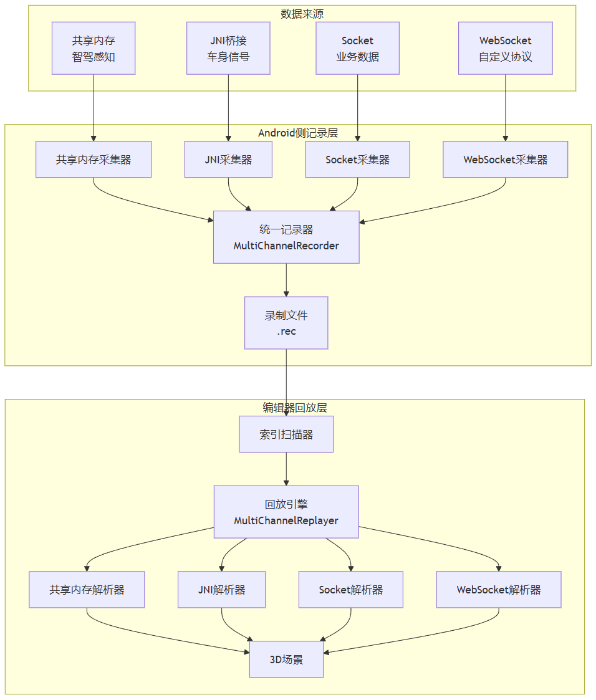

> 之前写了一篇文章分享了 SR 的数据回放工具：[座舱 SR 数据回放工具：从录制到回放的完整设计](https://www.xxx.com/)。专门写了针对 SR 的感知数据如何记录，记录的文件如何使用起来去做模拟发送。本文是在此基础上做的方案上的扩展论述。

最近总是会被一些混合型的 bug 所困扰，比如这个：当档位切换到 R 档的时候，车模桌面的视角往自车后方拉高，然后显示出了满屏的 AVM 画面。当档位再切换回 D 档的时候，AVM 画面立即消失，车模桌面视角在回到平视自车角度的过程中，出现了一次抖动，且自车旁边的感知车辆遮挡了自车（未做透明化处理）。

这个 bug 一看就会发现，我无法在编辑器内去模拟还原：

1. 档位数据走的是JNI通信，信号日志记录在 logcat 文件中，编辑器内有专门的 logcat 信号日志回放工具。
2.  感知数据记录在 SR 录制文件中，用的是专门的 SR 回放工具去做回放。

> 还有3. AVM 画面全屏，3D 线程被 Pause， AVM 画面消失， 3D 线程 Resume，这个在 logcat 里面，但是当时没有工具去做提取和模拟。

也就是说，SR 的一些bug，如果和共享内存数据、车身信号、云端数据信号（比如车衣数据）耦合的时候，如果咱们的模拟工具是分离的，就给复现 bug 加大了难度，降低了解决效率。

所以本文尝试梳理一下解决这个问题的方案。

---

## 问题 | 单链路的局限

实际场景中，座舱 SR 应用接收和处理的数据流是多类型的：

- **中间件**：档位、“四门两盖”等车身信号、云端数据，通过 JNI 通道 传进 3D，并在消息处理模块里面进行了 adb logcat  打印。
- **建图结果、OCC**：通过 共享内存(mmkv)通道 传进 3D，要么是也只在 logcat 打印了一些关键信息且不包含完整数据体，要么是只在专为MMKV写的保存和回放链路中记录。
- **感知规划数据**：经由 FDBus 订阅到的数据，SR 主要显示的数据。在之前的文章中，通过安卓侧的 FileLogger 类进行了文件存储。

如果每个链路都单独跑，**维护成本高，时间戳不统一，而且直接影响回放工具的复杂性，**同时，PC端回放工具有通信链路模拟能力的局限性，比如模拟不了 JNI 链路。

所以自然而然想到的就是，由于数据来源分散，链路不同，咱们需要做一个统一的数据录入入口，一个统一的数据模拟发送的出口。

---

## 设计思路

1. 无论数据从哪来（共享内存、JNI、Socket、websocket...)，在Android侧做一个统一的信号汇聚。每个通信渠道有对应的采集器，但它们都往同一个汇聚器里吐数据。
2. 回放时，不模拟通信链路，而是直接在编辑器内根据渠道类型分发数据给对应的解析器。



**优先选择编辑器面板**，因为不需要模拟任何通信链路，只需要文件IO，解析逻辑100%复用，PC端可以做并不依赖任何硬件或Android环境。当然缺点也很明显，就和之前的文章中说的一样，链路本身的问题暴露不出来，比如包体大小问题，比如效率延时问题等等。

---

## 数据记录端

在Android侧设计一个统一记录入口，每条记录包含：渠道类型、时间戳、原始二进制数据。

### **渠道定义**

```csharp
/// <summary>
/// 数据渠道枚举，用于区分不同通信链路的数据来源
/// </summary>
public enum DataChannel : uint
{
    /// <summary>
    /// 共享内存渠道，用于智驾感知等高频数据
    /// </summary>
    SharedMemory = 1,
    
    /// <summary>
    /// JNI桥接渠道，用于车身信号等中间件数据
    /// </summary>
    JNI = 2,
    
    /// <summary>
    /// Socket渠道，用于业务数据传输
    /// </summary>
    Socket = 3,
    
    /// <summary>
    /// WebSocket渠道，用于自定义协议或实时交互数据
    /// </summary>
    WebSocket = 4
}
```

### **协议格式**

```
[4字节渠道enum][8字节时间戳][4字节数据长度][N字节数据]
```

### **文件结构**

在上一篇文章的代码基础上，帧头增加渠道字段：

```
[FileHeader: "REC"(3B) + version(4B) + startTimestamp(8B)]
[Frame0: channel(4B) + timestamp(8B) + length(4B) + data]
[Frame1: channel(4B) + timestamp(8B) + length(4B) + data]
...
```

### **帧索引结构**

```csharp
/// <summary>
/// 帧索引结构，仅包含元信息，不包含实际数据
/// </summary>
public struct FrameIndex
{
    /// <summary>
    /// 数据渠道类型
    /// </summary>
    public DataChannel Channel;
    
    /// <summary>
    /// 帧时间戳
    /// </summary>
    public DateTime Timestamp;
    
    /// <summary>
    /// 帧数据在文件中的偏移量
    /// </summary>
    public long Position;
    
    /// <summary>
    /// 帧数据长度
    /// </summary>
    public long DataLength;
}
```

### 记录器

基于之前的代码，这一版只是在 Record 方法中 多加一个渠道的记录：

```
writer.Write((uint)channel);  // 渠道类型 4字节
```

相应地调整拼接的位置和尺寸。

本身没有多大变化，更多是要在不同渠道给 3D 执行'发'这个动作之前，使用这个类进行记录。

### 采集器

负责从不同数据源获取数据，是数据的入口，拿到数据后调用 recorder.Record() 传给记录器。比如**共享内存采集器：**

```csharp
// 记录器：统一写入文件
private readonly MultiChannelRecorder recorder = new MultiChannelRecorder("recording.rec");

// 采集器：从不同渠道获取数据并调用记录器
public class SharedMemoryCollector
{
    private readonly MultiChannelRecorder recorder;
    
    public void OnDataReceived(byte[] data)
    {
        recorder.Record(DataChannel.SharedMemory, data);
    }
}
```

---

## 回放工具

### 索引扫描

在单链路索引基础上增加渠道字段。

在读文件进行帧扫描的时候，构建 Dictionary<DataChannel, List<FrameIndex>>，支持按渠道快速定位。

### 渠道分发

回放时不再模拟通信链路，直接在编辑器内分发数据。定义 IDataParser 接口，每个渠道实现自己的解析器：

```
public interface IDataParser
{
    void Parse(byte[] data, long timestamp);
}
```

MultiChannelReplayer 根据渠道类型查找对应解析器并调用。

### 时间轴同步

所有渠道使用统一时钟源（UTC毫秒），回放时按时间戳排序后依次分发。

---

## 扩展

假设未来要加新链路（比如MQTT），那么需要：

1. 在`DataChannel`枚举中添加新类型
2. 写一个采集器，调用`MultiChannelRecorder.Record()`
3. 写一个解析器，实现`IDataParser`接口
4. 在回放引擎的`parsers`字典中注册

业务代码、记录逻辑、回放逻辑都不用动。

---

## 结语

软件开发有时会遇到这种“**哎呀，我当时没考虑到**”的时刻：写个 SR 的回放工具，没考虑到我们最终要的不是一个 SR 回放工具，而是一个全数据模拟回放工具。

但我想也无需自责，我们做的东西，本就是在适应变化，迎合需求。值得推敲的是当时所做的设计是否为变化预留了入口。有朝一日回过头要来改动的时候，不至于有一种“**改不动**”的无力感。